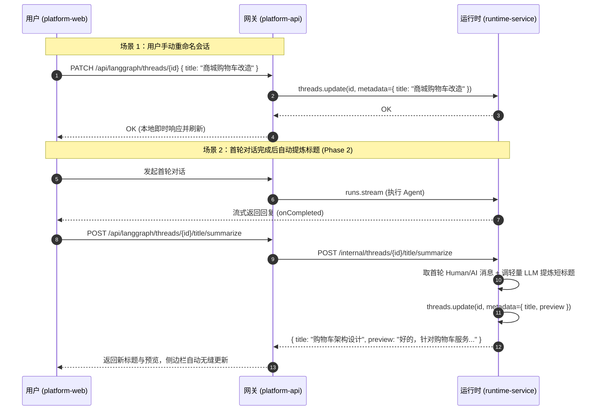

# 会话标题识别与消息预览优化 - 整体方案

## 背景
用户在进行对话时，侧边栏出现两处交互体验缺陷：
1. **所有会话标题千篇一律**：如果用户多次点击欢迎页快捷卡片（如“设计功能方案：根据业务需求给出优雅的架构与接口设计”），会话标题直接被截取为该提示词的前80个字符，导致侧边栏全是相同的文字，根本无法根据标题识别具体对话；
2. **副标题显示“(无内容)”**：列表项原本预留了第二行用于展示消息摘要（`item.preview`），但由于系统在创建和运行期间从未向 `thread.metadata.preview` 写入任何内容，触发保底显示为硬编码的 `(无内容)`。

## 目标
1. 彻底修复 `(无内容)` 视觉噪点，将其转化为有实际价值的最新消息预览（Preview）；
2. 提供会话标题的手动重命名能力，允许用户自定义辨识度高的标题；
3. 清洗推荐模板引导语对标题的污染，并在首轮对话完成后通过大模型（LLM）智能提炼不超过 12 字的高信息量标题。

## 架构与分工

### 为什么涉及 runtime-service？
- **若仅做手动改名与规则截取**：不需要涉及 runtime-service，由 `platform-api` 开放元数据更新接口即可。
- **若做 LLM 智能总结标题**：必须涉及 `runtime-service`。
  - 模型实例（`build_model` / `ChatOpenAI`）内聚在 `runtime-service`，`platform-api` 是纯控制面网关，不具备大模型执行基础设施；
  - 会话底层 Checkpoint 与历史消息只在 `runtime-service` 挂载的存储中。

### 整体架构

## 实施计划
- **Phase 1：基础建设与手动重命名（P0）**
  - 后端：`platform-api` 在 `runtime_gateway` 增加 `PATCH /threads/{id}` 接口，支持更新 metadata；
  - 前端：`session.service.ts` 接入 update 接口；
  - 前端：`ChatThreadSidebar.vue` & `DearAgentThreadSidebar.vue` 增加 Inline 编辑重命名交互；
  - 前端：优化预览内容渲染，提取首条/末条消息前 60 字符写入 preview，消除 `(无内容)` 噪点。
- **Phase 2：LLM 智能提取标题（P1）**
  - `runtime-service`：新增 `/internal/threads/{id}/title/summarize` 端点；
  - `platform-api`：网关增加对该端点的鉴权转发；
  - `platform-web`：在会话首轮交互结束后后台静默触发生成，并保留手动重提炼按钮。
