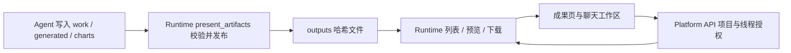

# 01 目标、参考源码与分层边界

## 本文目标与责任

本版按用户最新要求修订：本方负责 Platform API、Runtime 后续实现与后端验证；platform-web 的全部生产代码、组件测试和浏览器自动化由前端同事负责。本轮仍仅编写规划。本文中的前端方案是交接要求，不是本方开发任务。

本文负责产品范围与源码对照；Runtime 施工见 [02](02-runtime-server.md)，Platform API 施工见 [03](03-platform-api.md)，前端独立交接见 [04](04-frontend-handoff.md)，后端验收与交付批次见 [05](05-backend-verification.md)。

## 1. 证据范围与 400 根因

本轮读取两个本地工作树，未修改业务代码、未启动服务、未重放用户现场请求。用户提供的 request_id 为 `eae3f734fd4b4a50b47ed4d8fcd18917`；未通过日志关联它，以下是可直接核查的静态代码因果链。

参考仓库：`deer-flow`，读取时 HEAD 为 `44ae750545caff29506906f4b0b1ebf79cb23fa7`。结论针对该本地版本，不代表其他 DeerFlow 版本。

| 环节 | 当前代码 | 结论 |
|---|---|---|
| 页面入口 | `apps/platform-web/src/router/routes.ts`：`projects/:projectId/dear-agent-artifacts` | 路由已有项目参数 |
| 服务创建 | `apps/platform-web/src/modules/dear-agent/pages/DearAgentArtifactsPage.vue`：`service` computed | 调用 `createSessionService(createLanggraphAuthorizedFetch())`，漏了第二参数；computed 也未读取项目响应式值 |
| 会话请求 | `apps/platform-web/src/services/threads/session.service.ts:createSessionService` | 第二参数 `projectId` 才会进入 SDK `defaultHeaders` 与 `read()` 请求头 |
| 授权包装 | `apps/platform-web/src/services/langgraph/client.ts:createLanggraphAuthorizedFetch` | 管理登录 token、刷新与错误归一，不自动补项目 |
| 平台校验 | `apps/platform-api/src/platform_api/modules/runtime_gateway/presentation/http.py:_require_project_id` | 从中间件解析的 `request.state.platform_context.project.project_id` 读取项目；空值报 `project_id_required` |

最可能首先失败的是 `loadThreads()` 的 `POST /api/langgraph/threads/search`。后续 `history()` 同样缺头。精确失败 URL 仍需浏览器 Network 或日志核对，不把推断写成现场复现。

修复位置是页面服务装配：传当前项目，并让服务实例随项目变更。不要关闭后端校验、写死默认项目或在全局 fetch 偷读路由。

已搜索所有 `createSessionService()` 调用：DearAgentPage、ChatPage、overview、governance 等已有显式项目参数；`useDearAgentSession` / `useChatSession` 虽只传 fetch，但使用 `createRunActions()` 包装后的 transport，后者补项目头。不能机械地将所有单参数调用判为同一个 bug。

## 2. 成果页预期应该是什么

定位为**当前项目内、按 Dear 会话浏览正式交付物**，与聊天右侧工作区共享事实源。不是全部工作目录文件，也不是把消息中出现的路径都当成已生成文件。

核心验收体验：

1. 进入页面，读取当前项目 Dear 会话；无项目时提示选择项目，不发送缺头请求。
2. 选择会话，展示服务端 `/artifacts` 返回的已发布文件。会话、成果均可加载更多；刷新后仍可读。
3. 搜索与分类作用于已加载成果，明确显示“已加载 N 项”；不伪称全项目全文检索或全量统计。
4. 点击成果在页面内预览；保留下载、SHA256、文件大小、所属会话、返回会话入口。
5. 空列表、加载失败、无权限、不支持预览分别呈现。无权限绝不显示成“暂无成果”。
6. 切项目/线程立即清空旧预览，旧请求即使迟到也不能覆盖新状态；浏览器返回/前进同步 query。
7. 聊天发布后的成果能出现在聊天面板与独立页；独立页提供刷新，返回页面/恢复焦点触发有界刷新，不另建后台常驻轮询。

**真实信息边界：** 当前 ArtifactRef 无业务文件名、发布时间、来源 run/message、PPT 页图关系。首批显示 hash 文件名，不用 checkpoint ID 伪造日期，不将历史 metadata.step 当作确定的产物来源，不填假的 runId。已有“图片型 PPTX”只是格式提示，不代表已能预览任意 PPTX。

## 3. DeerFlow 怎样做，什么值得借鉴

下表参考路径均相对参考仓库根目录。

| 能力 | DeerFlow 实现 | 我们现状与采用决策 |
|---|---|---|
| 明确发布 | `backend/packages/harness/deerflow/tools/builtins/present_file_tool.py:present_file_tool`（工具名 `present_files`）将 outputs 路径写入 state.artifacts；`agents/thread_state.py:merge_artifacts` 合并去重 | 我们 `present_artifacts` 已将校验后的字节发布到哈希路径并返回引用。借鉴“明确发布”的产品语义，直接读取已有列表，不再引入第二份 state reducer/索引 |
| 数据发现 | `frontend/src/core/artifacts/utils.ts:extractArtifactsFromThread` 读 `thread.values.artifacts`；`core/threads/stream-state.ts` 合并流中 artifacts 更新 | 我们独立页扫描 checkpoint 消息；替换为 `/artifacts`。参考版 state 列表也不等于不可变历史文件快照 |
| 卡片到预览 | `components/workspace/artifacts/artifact-file-list.tsx`、`context.tsx` 管理选择、打开状态、下载 | 我们聊天已有 WorkspacePanel，独立页另写路径分类和弹窗预览；统一共享状态与 WorkspacePreview，保留不同页面布局 |
| 类型预览 | `artifact-file-preview.tsx`、`artifact-viewer.tsx`、`core/artifacts/preview.ts` 提供 Markdown、HTML、表格、源码及降级 | 借鉴预览/源码切换、下载降级；先支持我们的 preview_kind，Office/媒体能力不从参考 UI 反推已支持 |
| 大内容 | `core/artifacts/loader.ts` 有有界读取；`hooks.ts` 区分完整加载并在 run 结束 refetch；网关使用 FileResponse/Range | 我们已有文本 256 KiB、文件 20 MiB 边界，先保留。Runtime 当前会先读文件再截断，不宣称已有流式读取/Range |
| 运行中预览 | `core/artifacts/preview.ts`、`loader.ts` 从 write_file 工具调用提供临时预览，正式读取在工具/运行完成后回源 | 本期先确保正式成果与终态刷新；增量草稿预览后置，不能把未写完草稿当已发布成果 |
| 授权下载 | `backend/app/gateway/routers/artifacts.py:get_artifact` 做 owner/权限与受限路径校验，主动内容下载保护；前端 URL 基于其认证体系 | 我们必须携带平台认证和项目头，经网关签名委托 Runtime。不能复制裸 a/img URL 到本平台绕过自定义头 |
| 编辑 | 同文件 `update_artifact` 校验 expected_sha256，限制 UTF-8/大小，预留线程写操作并原子替换 | 与我们哈希不可变成果冲突。本期不支持原位编辑；以后编辑需写工作文件并重新发布新版本 |
| 批量下载 | `frontend/src/core/artifacts/api.ts`、`backend/app/gateway/artifact_archive.py` 使用 run 成果清单 | 我们 `/workspace/zip` 包括上传与中间文件，不是成果集合。禁止直接把它标为“下载全部成果” |

参考实现也有边界：`present_files` 的路径规范化本身不等于完整文件存在性、内容格式和摘要校验。保留我们 `ArtifactWorkspace.publish/read` 的内容校验，不因“对齐”退化。

## 4. 当前差距，按优先级处理

| 优先级 | 代码证据 | 用户影响 | 方案 |
|---|---|---|---|
| P0 | 成果页服务创建漏项目参数 | 一进页 HTTP 400 | 修装配、补真实 transport 断言 |
| P1 | `loadSessionArtifacts()` 调 history，history 默认 20；解析 extras 与正则 | 历史窗口/消息裁剪漏文件；仅提及或伪造路径也能上榜；没有完整消费发布引用 | 删除正式列表的消息扫描，调用已有 getArtifacts |
| P1 | 页面按路径 Map 去重、checkpoint ID 格式化时间、runId 未填 | 元数据不可靠；读取顺序可能覆盖较新的来源标签 | 只显示契约真实字段，来源增强另做 |
| P1 | `list()` 固定 20，页面没有下一页；路由 threadId 仅首屏匹配 | 老会话不可达，深链失效 | offset 加载更多；深链用 get 校验 scope/graph 后展示，不为找一个线程遍历所有页 |
| P1 | 页面的 handlePreview 遇二进制直接下载 | 图片缺少统一预览、Markdown 走另一套实现 | 按 preview_kind 复用 WorkspacePreview；下载型直接显示文件信息 |
| P1 | `useThreadWorkspace` 创建 AbortController 却未传到请求；selectFile 只比 path | 跨项目/线程同一路径的迟到结果串台 | 所有异步结果检查 scope generation，实际传 signal；预览独立序号；卸载取消 |
| P1 | composable 吞掉列表/下载错误；capabilities 失败降为 false | 网络/权限故障显示成空列表或无能力 | 明确 artifactsError/capabilityError/downloadError 和重试；失败保留可恢复状态 |
| P1 | `WorkspacePreview` Markdown 图片异步替换无任务代际保护 | 旧文档图片覆盖新文档，Blob URL 泄漏风险 | 与 project/thread/path 绑定任务，丢弃旧结果时释放新建 URL |
| P2 | `DearAgentSession` hasArtifacts 仍看 `stream.values.ui`；busy 终态已有 refresh | 成果提示与实际产物不一致 | 接入共享成果状态/通知；保留现有终态刷新，不另建 SSE 协议 |
| P2 | W3 mock 工厂丢弃参数，唯一用例只检查文字 | 缺头与真实 hash 引用没有被测出来 | HTTP 边界断言 + 实际发布/读取链路 + 浏览器回归 |

## 5. 分层职责与具体代码边界

### 5.1 platform-web 做什么

- `apps/platform-web/src/modules/dear-agent/pages/DearAgentArtifactsPage.vue`：项目上下文、会话列表/分页、query 深链、分类/搜索、选中项、错误展示与回到会话。
- `apps/platform-web/src/services/threads/session.service.ts`：复用 list/get 与现有项目参数；不为成果扫描新增历史解析。
- `apps/platform-web/src/services/threads/workspace.service.ts`：复用 getArtifacts/getWorkspaceCapabilities/getWorkspacePreview/getWorkspaceContentBlob/triggerBlobDownload，已有 signal 参数真正接入。
- `apps/platform-web/src/composables/useThreadWorkspace.ts`：统一分页、刷新、scope 与异步生命周期、错误状态。为独立页增加一个默认开启的目录加载开关（例如 includeTree，独立页关闭），只避免无用目录请求，不新增通用数据框架。
- `apps/platform-web/src/components/workspace/WorkspacePreview.vue`、`SandboxedHtmlFrame.vue`：统一渲染、Blob 生命周期、安全 iframe。保留 Markdown 渲染/源码切换；支持下载型卡片，无须对已知 download 类型请求 preview 再报 415。
- `apps/platform-web/src/components/workspace/WorkspacePanel.vue` 与 `apps/platform-web/src/modules/dear-agent/components/DearAgentSession.vue`：同步共享错误/分页与新成果通知。新成果用 path 集合差异判断，不能仅比较条数。

列表唯一键：`projectId + threadId + path`；同字节不同扩展名可共享 artifact_id，不能仅以 artifact_id 去重。显示分类可按 MIME/扩展名，预览策略以 preview_kind 为准。

### 5.2 platform-api 做什么

- `apps/platform-api/src/platform_api/modules/runtime_gateway/presentation/http.py`：已有 `thread_artifacts`、workspace preview/content 与项目必填校验，继续作为公开入口。
- `apps/platform-api/src/platform_api/modules/runtime_gateway/application/service.py:thread_workspace`：现有 `_load_thread`、项目/线程读取授权、graph 目标允许检查、`workspace-file-read` 委托继续复用。
- `apps/platform-api/src/platform_api/adapters/langgraph/runtime_gateway_upstream.py`：沿用 workspace_json/workspace_file 转发；测试参数、错误码、Content-Type、Content-Disposition、ETag 与安全响应头。
- **首批不要求新增业务 endpoint、数据库表或服务。** 补 Dear graph 的真实双服务验证；若发现已有代理契约丢字段/丢头，只在原函数修复。

不能只验证“携带某项目头返回 200”：仍须验证操作者有权限且线程属于该项目。前端筛选 graph 只是体验，不能替代后端授权。

### 5.3 runtime-service 做什么

- `apps/runtime-service/src/runtime_service/tools/artifacts.py:build_artifact_tool`：已有 `present_artifacts` 工具；Dear 服务私有 `tools/artifacts.py` 只是兼容导入，不在两处分别写逻辑。
- `apps/runtime-service/src/runtime_service/services/dearflow_agent/agent.py`、`prompts.py`：现有工具装配与逐文件发布要求。验收真实运行确实能调用工具，不能为了测试通过绕过工具策略。
- `apps/runtime-service/src/runtime_service/workspace/artifact_refs.py:ArtifactWorkspace`：负责格式/大小校验、发布 hash 文件、列表与下载摘要复核。
- `apps/runtime-service/src/runtime_service/workspace/browser.py:WorkspaceBrowser`：目录游标、内容读取、有界文本预览及下载降级；`workspace/html_preview.py` 负责静态净化。
- `apps/runtime-service/src/runtime_service/http/workspace.py`、`http/documents.py:_auth` 与 `workspace/scoped.py`：受信委托绑定租户/项目/线程/graph 与本地工作区；不信任浏览器传宿主路径。
- **首批沿用已有实现与 schema，补正式成果/普通文件分离、重启恢复、异常与隔离回归。** 不新建 http/artifacts.py，也不引入另一套 ArtifactRef。

interaction-data-service 当前不是这条文件字节链路的存储服务，本期无需改动。不要为了成果列表新建结果域附件表。

## 6. 首批冻结契约

公开前缀 `/api/langgraph/threads/{thread_id}`，所有调用由平台认证客户端携带 `x-project-id`。

| 请求 | 返回/消费方式 |
|---|---|
| `POST /api/langgraph/threads/search` | `{limit:20, offset, metadata:{graph_id:"dearflow_agent"}, ...}`；会话列表可加载更多；全页时允许继续取到空页，不虚构 total |
| `GET /capabilities` | workspace 开关；请求失败与真实 workspace=false 区分 |
| `GET /artifacts?limit=100&cursor=...` | `{items: ArtifactRef[], next_cursor: string|null}` |
| `GET /workspace/preview?path=...` | 文本 JSON / 图片字节 / 已净化 HTML；由 Content-Type 解码 |
| `GET /workspace/content?path=...` | 原字节 attachment，ETag 与安全头保留 |

ArtifactRef 保留 `version, artifact_id, path, file_name, mime_type, size_bytes, sha256, kind, preview_kind`。无新增必填字段。目录 cursor 是可失效游标；409 `workspace_directory_changed` 清除旧分页并重取第一页，自动恢复最多一次，反复变化交由用户刷新；409 摘要不匹配则阻断展示/下载，不能按游标冲突处理。

| 格式 | 首批预览 | 下载 |
|---|---|---|
| TXT / JSON / YAML / 代码 / CSV | 有界文本；CSV 暂不承诺表格 | 原字节 |
| Markdown | 渲染/源码，授权获取内部图片；切换清理 URL | 原字节 |
| PNG / JPEG / WebP | 经过后端校验的 Blob 图片 | 原字节 |
| HTML | 后端净化 + sandbox 空权限 iframe，禁止脚本/外链 | 原始 HTML |
| SVG / XML | 只读源码，不当作可执行浏览器文档 | 原字节 |
| PDF / XLS / XLSX / PPTX / ZIP | 文件详情与“暂不支持预览”；不自动触发下载 | 用户点击下载 |
| 音频/视频、未支持类型 | 不声称可发布/播放；沿原 deferred 范围 | 不扩大白名单 |

当前列表通过 outputs 的 hash 形状文件名识别产物，读内容时才验证摘要；不是独立的发布审计日志。不能声称列表每个文件都已在列举时重新校验，也不能从列表推导发布人/发布时间。

## 7. 后续增强，明确何时才做

这些是与参考体验的剩余差距，不是首批完成条件，也不自动开工。

| 增强 | 补充位置与建议方案 | 前置门槛与验证 |
|---|---|---|
| 友好名称与来源 | `ArtifactWorkspace.publish`、`workspace/schemas.py`、`types/workspace.ts` 增加可选 display_name/published_at 与受信来源；元数据侧文件由服务端有界读取、原子落盘；旧成果无记录时回退 hash 名 | 先评审持久模型；同内容重复发布命名规则、并发、崩溃一致性、分叉/备份、旧引用兼容必须冻结；不能从模型参数信任 run/user |
| CSV/TSV 表格 | 后端受限结构化解析，前端 WorkspacePreview 增加表格分支 | 引号换行/转义、编码、超宽列、行数上限、截断告知；不复用按行 split 的简易 CSV 解析冒充完整支持 |
| PDF/Office/PPT 页图 | 后端 preview schema 增类型，复用已有解析/生成能力；PPT 明确发布页图与 manifest 关系，前端展示页图 | 任意 PPTX 无页图时仍下载降级；恶意 ZIP/XML、资源预算、真实样本与版式验收 |
| 成果包下载 | 基于已授权的成果 path 集合/确定 run 清单生成 ZIP，网关代理；复用安全 I/O，而不是全工作区 ZIP | 明确集合范围、文件数/总量、并发变化、流式或临时文件资源清理；不包含 uploads/work |
| 流式草稿预览 | 聊天工具调用的增量投影与正式 ArtifactRef 分开标识 | 草稿未提交/失败/中断时不得进入正式列表；重连不丢结果、不重复发布 |
| 动态 HTML / 原位编辑 | 独立安全/版本化设计 | 改变现有信任边界，必须人工评审；不加入本专项核心范围 |

## 8. 风险、依赖与实施顺序

1. 本方先冻结 Runtime/Platform 接口事实、补后端错误消息与验证；交付 04 的接口和联调证据后，前端同事完成请求头修复、正式列表与共享预览；双方最终联合验收。前端可按现有成功契约先并行开发，不必等待与其无关的后置增强。
2. 共享 composable 修改会影响 Showcase 与 Dear 聊天，必须两者回归；只修成果页局部 race 不够。
3. 工作树存在其他任务未提交变更，尤其数据库迁移、原工作区文档与 FEATURES；本专项只增补自身文档/对应索引，不覆盖其他任务。
4. 实际模型工具是否可用依赖项目策略、catalog、运行环境；与 `20260920-runtime-optional-tool-resolution` 可能关联，但不将“缺成果”一概归因于页面，不在本期顺带改工具授权。
5. 本期不涉及 LangGraph 新 API 用法。后续若设计新 state/reducer 或改变工具注入，先按仓库要求查询 langchain-docs/langchain-reference，再写实现。

## 9. 可定位的参考源码阅读清单

参考根目录为 `deer-flow/`。以下是具体阅读顺序；函数名比行号更稳定，前文 HEAD 可用于锁定版本。仅借鉴逻辑，不整段搬运 React、state 或鉴权实现。

| 顺序 | 参考文件与符号 | 具体读什么 | 本仓对应位置 | 是否采用 |
|---|---|---|---|---|
| D01 | `backend/packages/harness/deerflow/tools/builtins/present_file_tool.py:_normalize_presented_filepath / present_file_tool` | outputs 范围、thread context、Command 更新 artifacts；一组文件显式发布 | Runtime `tools/artifacts.py:build_artifact_tool`、`workspace/artifact_refs.py:publish` | 采用显式发布，保留本方内容校验与逐文件返回 |
| D02 | `backend/packages/harness/deerflow/agents/thread_state.py:merge_artifacts` | dict.fromkeys 保序去重，None 处理 | Runtime 列表 + 前端按 path 去重 | 不复制 reducer，本方已有持久目录事实源 |
| D03 | `backend/app/gateway/routers/artifacts.py:get_artifact / _read_artifact_payload` | owner 权限、路径限制、文件存在、MIME 分支、FileResponse | Platform `thread_workspace` + Runtime `WorkspaceBrowser` | 学习职责边界，不把鉴权迁进模型工具 |
| D04 | 同文件 `_is_active_content_mime_type / _build_content_disposition` | HTML/XML/SVG 主动内容、RFC 5987 下载名称 | Platform `_workspace_response`、Runtime `safe_html` | 保留本方更严格的静态预览 |
| D05 | 同文件 `update_artifact / _load_editable_artifact / reserve_artifact_write` | expected_sha256 并发检查、2 MiB 编辑限制、线程操作租约 | 未来编辑专项 | 本期不采用，不能覆盖 hash 成果 |
| D06 | `backend/app/gateway/artifact_archive.py:build_artifact_archive` | 受控成员、总量、期限、描述符复制、归档清单 | 未来仅成果 ZIP | 后置，不替换成整工作区 ZIP |
| D07 | `frontend/src/core/artifacts/utils.ts:extractArtifactsFromThread / urlOfArtifact` | 正式列表与资源 URL 分开 | `services/threads/workspace.service.ts:getArtifacts` | 采用分离，使用平台授权客户端 |
| D08 | `frontend/src/core/artifacts/loader.ts:loadArtifactContent` | 1 MiB Range、206/416、UTF-8 截断、ETag | `getWorkspacePreview` + Runtime 256 KiB preview | 采用截断提示；本期不声称支持 Range |
| D09 | `frontend/src/core/artifacts/hooks.ts:useArtifactContent / useStandaloneArtifactContent` | thread/path cache key、run settled refetch、独立窗口无 thread context | `useThreadWorkspace` + 独立成果页 | 采用 scope 与刷新规则，不引入 React Query |
| D10 | `frontend/src/core/artifacts/preview.ts:buildWriteFileDraftContent / getArtifactViewState` | 临时 write_file 草稿与最终存储文件的区别 | 未来流式草稿 UI | 后置 |
| D11 | `frontend/src/components/workspace/artifacts/context.tsx:ArtifactsProvider` | selected/open 状态、路由切换重置、sessionStorage 分区 | 独立页与 WorkspacePanel | 采用路由隔离；不持久化敏感文件内容 |
| D12 | 同目录 `artifact-file-list.tsx:ArtifactFileList`、`artifact-file-preview.tsx:ArtifactFilePreview` | 卡片选择、下载、预览/错误降级 | `DearAgentArtifactsPage.vue` + `WorkspacePreview.vue` | 前端同事按 Vue 现有组件实现 |
| D13 | `backend/tests/test_artifacts_router.py`、`backend/tests/test_artifact_archive.py` | 文件访问与打包负例测试组织 | 本方 workspace/http/gateway tests | 借鉴测试维度，断言按本方契约重写 |
| D14 | `frontend/tests/e2e/artifact-preview.spec.ts`、`artifact-stream-state.spec.ts`、`artifact-viewer-window.spec.ts` | 用户动作链、流状态、独立预览恢复 | 前端拟新增成果页 E2E | 前端同事执行，不算本方后端完成条件 |

D13/D14 已确认文件存在；本轮主要核对生产函数，不将参考测试套件的存在或命名当成其已通过或覆盖完备的证明。

## 10. 分层任务、验证与状态

- [x] 对照当前源码，定位项目头/列表接入问题；区分参考实现与本方能力。
- [x] 明确本方后端与外部前端责任，建立分层文档入口。
- [ ] 本方 Runtime R01—R05：见 02 的任务与逐项验收。
- [ ] 本方 Platform B01—B05：见 03 的任务与逐项验收。
- [ ] 前端同事 F01—F08：见 04；本方不编写这些业务代码。
- [ ] 后端交付门禁 G1/G2、前端 G3、联合 G4：见 05。

状态：规划中，源码核查完成；后端/前端实现及功能测试均未开始。元数据、Office 和动态内容增强仍为后置项。

