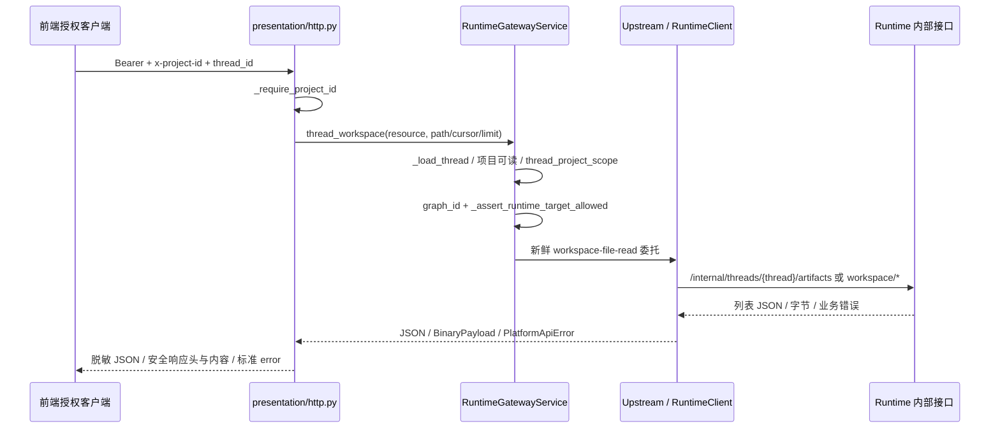

# 03 Platform API：网关施工与前端可见契约

## 1. 目标与责任

本方负责本层。继续提供项目级授权的成果列表/预览/下载，不新增成果业务表，不将浏览器转向 Runtime 内部 API。

已有成功接口继续复用。本期确定的生产修补候选为 **Runtime 嵌套错误 message 提取**；错误码当前已能保留，不要误报为“全部错误码丢失”。先以回归证明，再改共享映射函数。其余生产修改由缺口测试结果决定。

## 2. 当前代码目录

```text
apps/platform-api/
├── src/platform_api/
│   ├── entrypoints/http/middleware/auth_context.py
│   ├── entrypoints/http/middleware/request_context.py
│   ├── core/errors/
│   │   ├── base.py                      # PlatformApiError
│   │   ├── payload.py                   # 标准 error/request_id 响应
│   │   └── handlers.py                  # 业务异常/422/HTTP 错误映射
│   ├── modules/runtime_gateway/
│   │   ├── presentation/http.py         # 公开路由、_require_project_id、_workspace_response
│   │   └── application/
│   │       ├── service.py               # _load_thread、thread_workspace、capabilities
│   │       └── ports.py                 # BinaryPayload
│   └── adapters/langgraph/
│       ├── runtime_gateway_upstream.py  # workspace_json/workspace_file、委托转发
│       ├── runtime_client.py            # HTTP、read_file、MIME/大小检查、关闭流
│       └── sdk_client.py                # create_runtime_upstream_error 与错误脱敏
└── tests/
    ├── test_runtime_gateway_workspace.py
    ├── test_runtime_gateway_files.py
    ├── test_runtime_gateway_http_matrix.py
    └── test_runtime_gateway_sdk_adapters.py
```

新增测试优先放这几个现有文件；确需独立定位错误映射，可拟新增 `tests/test_runtime_upstream_errors.py`，不新增生产 service/factory。

## 3. 每个请求如何流转



逐层约束：

1. `_require_project_id` 取中间件 project context，缺项目抛 400；不可偷偷选默认项目。
2. `_load_thread` 先 `_prepare_project_scope(write=False)`，再取 thread 检查 metadata.project_id；跨项目 `thread_project_denied`。
3. `thread_workspace` 读取服务器 thread.metadata.graph_id，缺失 `graph_id_required`；检查可用 graph/agent 目标。浏览器不传可信 graph 或租户来选文件根。
4. 委托缺失 `runtime_delegation_not_configured`，不降级成匿名读文件。
5. `workspace_json` 只允许 tree/artifacts，`workspace_file` 只允许 content/preview；thread_id 按 URL segment 编码，path 放 query 参数。
6. `_workspace_response` **重建** no-store/nosniff/CSP/referrer-policy/Content-Disposition，并用 payload 的 content_type/content_length/etag；不是把上游所有 header 原样透传。

## 4. 公开与内部接口映射

| 公开接口（Platform 前缀 /api/langgraph） | 服务方法/资源 | Runtime 内部路径 |
|---|---|---|
| GET /threads/{id}/capabilities | get_thread_capabilities | /internal/capabilities/graphs/{受信 graph_id} |
| GET /threads/{id}/artifacts | thread_workspace(resource=artifacts) | /internal/threads/{id}/artifacts |
| GET /threads/{id}/workspace/preview | thread_workspace(resource=workspace/preview) | /internal/threads/{id}/workspace/preview |
| GET /threads/{id}/workspace/content | thread_workspace(resource=workspace/content) | /internal/threads/{id}/workspace/content |
| GET /threads/{id}/workspace/tree | thread_workspace(resource=workspace/tree) | /internal/threads/{id}/workspace/tree |

前端成果页核心只需前四个；树接口用于共享工作区。现有 `/files/content` 可兼容已有聊天附件，但本期成果页统一用 workspace/content，不混图片/文档两套路径。没有 `POST /artifacts` 给浏览器发布文件，发布由运行时工具负责。

## 5. 本期补充实现

### B01 固定真实接入合同

- 用测试锁定 04 的请求/响应字段；`limit` 1—200、cursor 最多 8192、path 最多 4096。
- 当前列表做 `_redact_runtime_private_fields`；确保字段不误删且不暴露 `_runtime_*`。
- 列表无 `total`、名称无 display_name、排序非发布时间，这些直接写入前端交接，不增加占位假字段。

### B02 修复嵌套错误 message

当前 `sdk_client.py:create_runtime_upstream_error` 已从 `detail.detail.code` 取业务 code，但 `_runtime_upstream_message` 只接受顶层 message 或字符串 detail；Runtime 常返回 `{"detail":{"code":"...","message":"..."}}`，这类消息会退化为 fallback。

建议实现形状（文档伪代码，保留既有优先级与兜底）：

```python
# 在现有 _runtime_upstream_message 内增加一层读取，不新增异常框架。
# 先保留非空字符串 detail 和顶层 message 优先级。
inner = detail.get("detail")
if isinstance(inner, str) and inner.strip():
    return inner.strip()
if isinstance(inner, Mapping):
    message = inner.get("message")
    if isinstance(message, str) and message.strip():
        return message.strip()
# 无消息则继续原 fallback；不得把任意嵌套对象直接 str() 展示给用户。
```

- 不改变 code/status/extra 的语义，不把所有 409 写成同一种错误。
- 测试顶层字符串、顶层 message、嵌套 message、空消息、非字典、脱敏字段；同 helper 的 SDK adapters 回归必须跑。
- 这里的修补是错误信息保真，不做跨系统国际化/全局错误重构。

### B03 扩展 Dear 双服务 HTTP 验证

`WorkspaceGatewayTest.test_real_two_service_http` 当前 seed、scope 与测试环境偏 Showcase，且夹有 Terminal 测试。实施建议：

1. 保留既有 Terminal 验证，不将 Dear 参数化强行绑定不相关 terminal 行为。
2. 在同测试文件增加专注成果的 Dear 双服务测试，复用现有启动/清理模式；只在明显重复时提取局部测试 helper。
3. Dear 子进程设置临时 `RUNTIME_WORKSPACE_ROOT`，用 resolve_thread_workspace('tenant-a','project-a','thread-1','dearflow_agent') 写 work 并 publish。
4. Platform fixture thread.metadata.graph_id 改为 dearflow_agent；签名 scope 由同一 graph 派生，禁止根目录来自浏览器输入。
5. 调列表→预览→下载→Runtime 重启→再次读取，保留字节/sha256 断言。

**证据边界：** 现有测试把 actor、catalog、project scope 方法替换为固定值，真实的是两服务 HTTP、委托验签与 workspace I/O；不是完整真实账号权限验收。G2 的真实平台 HTTP smoke 另补。

### B04 资源和错误出口验收

`runtime_client.py:read_file`：白名单 MIME；声明 Content-Length 超 20 MiB 拒绝；无长度时累计字节上限；异常和流结束通过 shield 关闭 response/client。

- 增加/复用 tests/test_runtime_gateway_files.py 中流关闭、坏 MIME、超限断言。
- 对“响应头已发送后发生流错误”只保证终止并关闭资源；不承诺浏览器还能收到整齐的 502 JSON。前端将截断下载视为失败，不能 toast 成功。
- CSP 与附件响应头以平台实际重建值断言，不测试“所有上游头一模一样”。

### B05 生成给前端的交付包

完成后更新 04：实际 backend commit/构建标识、可用测试项目/thread、成功样本、错误样本、限制、环境、命令结果。实际 ID 去敏共享，token 不写 Markdown；前端自己登录获取会话。当前只有静态合同草案，不能填写“后端验收通过”。

## 6. 任务、逐项验证与状态

| 任务 | 文件/函数 | 完成条件 | 当前状态 |
|---|---|---|---|
| B01 合同锁定 | http.py/thread_artifacts、tests/test_runtime_gateway_workspace.py | DTO、查询边界、列表脱敏断言 | 待开始 |
| B02 嵌套消息保真 | sdk_client.py/_runtime_upstream_message | 修前失败/修后通过，其他 mapper 分支回归 | 待开始 |
| B03 Dear 双服务专测 | tests/test_runtime_gateway_workspace.py | 真 HTTP/验签/I/O/重启；明确替身边界 | 待开始 |
| B04 字节代理验证 | runtime_client.py/read_file、tests/test_runtime_gateway_files.py | MIME/长度/断流/资源关闭/安全头 | 待开始 |
| B05 前端交付资料 | 本项目 04 与 implementation/ | 接口可用证据、版本、限制齐全 | 待开始 |

本方后端完成不要求本方修改任何 Vue/TypeScript 文件。前端页面仍可能保留缺头 bug，必须在交接状态中明确“前端待接入”，不能据后端成功标整个成果页完成。

状态：规划中；本节没有任何新增实现或测试执行记录。
