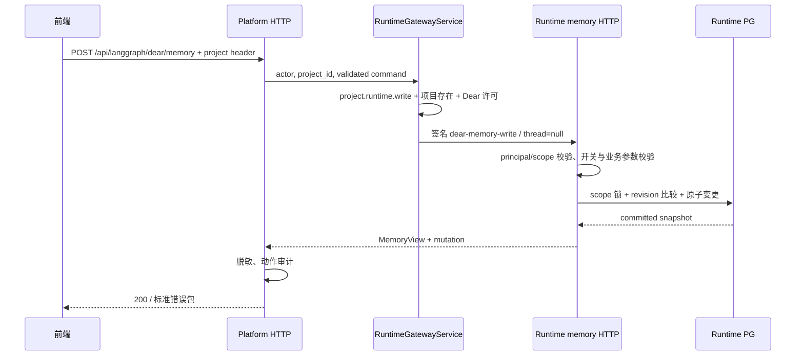

# 03 Platform API：实施方案与前后端唯一接口契约

## 目标、版本与责任

**负责人：后端开发者。状态：规划草案 v0.2，未上线。** 本文是推荐公开 HTTP 契约的唯一事实源；04 只解释前端如何使用，不另定字段。实施评审后冻结，交接时用真实响应替换示例并记录版本。

当前已经能调用的是线程版 `/api/langgraph/threads/{thread_id}/dear/memory`。本文无线程接口、新 envelope、计数和提取状态都属于拟开发，不能通知前端“现在已可用”。

## 1. 目录与逐层调用

根目录：`apps/platform-api/`。

```text
src/platform_api/
├── modules/runtime_gateway/
│   ├── presentation/http.py     # 新 GET/POST 路由、请求体、审计信息、已有 DI 工厂
│   └── application/
│       ├── service.py          # 新 dear_memory；权限、project、Dear 目标与委托
│       └── ports.py            # 新 upstream.dear_memory 接口声明
├── adapters/langgraph/
│   ├── runtime_gateway_upstream.py  # 新私有路由 adapter
│   ├── runtime_client.py        # 复用 require_json；不另造 HTTP client
│   └── sdk_client.py            # 复用 Runtime 错误提取；验证隐私脱敏
├── core/
│   ├── security/tokens.py       # create_runtime_delegation_token 白名单必须增加
│   ├── errors/payload.py        # 已有公开错误 {request_id,error:{...}}
│   ├── errors/handlers.py       # 已有异常处理器，测试应用必须安装
│   └── schemas.py              # 已有公共错误 schema，不改全站形状
└── modules/audit/http_resolution.py  # 新路径/动作归类
tests/
├── test_runtime_gateway_memory.py      # 拟新增；本专题主要 Platform 测试
├── test_runtime_gateway_skills.py      # 已有；复用其 HTTP/PG 测试范式
├── test_runtime_gateway_sdk_adapters.py # 已有；新 adapter 请求断言
└── test_runtime_gateway_http_matrix.py # 已有；补路由覆盖矩阵
```



## 2. 具体实现步骤

### 2.1 application/service.py

拟增 `dear_memory(*, actor, project_id, payload=None)`，参考当前同文件 `dear_skills()` 的无线程模式：

1. `write = payload is not None`，不是依据是否含 fact_id；settings/clear 也是写。
2. `_prepare_project_scope(actor, project_id, write)` 同时检查权限与项目存在；同步 DB/policy 操作用已有 run_in_threadpool。
3. `_assert_runtime_target_allowed(project_id, assistant_id="dearflow_agent")`，保持 agent catalog/项目许可门禁。
4. 委托工厂不可用时明确 503，不使用 API key 假扮用户。
5. 从已有 `get_runtime_gateway_service()` 的 `delegation_headers_factory` 签发新操作 token，thread_id=None；身份完全来自 ActorContext/PlatformRequestContext。
6. `upstream.dear_memory(payload=payload)` 调用 Runtime；GET 额外用现有 `_authorize(write=True)` 判定 can_write，捕获 ForbiddenError 收敛为 false，不能吞掉数据库/系统故障。
7. 不缓存跨用户 document；不补查他人的所有者，不因项目管理员权限放开 user_id。

### 2.2 路由与 adapter

`presentation/http.py` 拟增 `read_dear_memory/write_dear_memory`。GET 无 query 参数（页面取完整有界集合）；POST 接严格命令 schema，可放该模块现有 schema 位置，避免复制 Runtime 全套业务规则。Runtime 仍是最终业务校验者。

body 大小上限 1,500,000 UTF-8 bytes，避免只在 json.loads 后才有无限体积保护；优先检查全站现有入口限制，缺失时对此路由加有界读取，别全站修改中间件。body 只允许 action 对应字段；不能传 scope/user_id/tenant_id/source/origin。

`ports.py` 与 `runtime_gateway_upstream.py` 新增 `dear_memory(*, payload=None)`；`payload is None` 发 GET，否则 POST 到 `/internal/dear/memory`，复用 require_json。旧 `dear_governance(thread_id,...)` 保留至前端切换确认。

`core/security/tokens.py:create_runtime_delegation_token` 的 operation 白名单与 Runtime `_parse_scope` 同步增加 dear-memory-read/write。只改一边会导致请求根本到不了业务逻辑，这是必须联动的契约改动。

### 2.3 错误包与审计

既有链路为 `Runtime HTTPException(detail={code})` → `sdk_client.create_runtime_upstream_error` → `PlatformApiError.to_payload` → `core/errors/payload.build_error_payload`。**最终公开字段是 error.code，不是顶层 code，也不是 detail.code。**

422 需归一化为 `validation_failed`，details 只保留 loc/message/type，不透传 Pydantic 的 input 原文；当前 RuntimeClient 可能把上游整个 detail 放 extra.upstream_detail，新路由必须确认并剥除其中原始事实正文。复用现有错误基础设施，在 memory adapter/路由边界定向规范化即可，不能改全站响应格式。

路由写入 `request.state.audit_action` 及安全 audit_metadata；`http_resolution.py` 按 runtime.dear.memory.{action} 映射，resource_type 使用个人记忆域标识，不把无 thread 的请求硬记成 thread。不能让客户端提交任意 audit action。

审计允许：request_id、actor/project、action、fact_id、expected_revision、结果 revision、added/skipped 计数。禁止：text、quote、导入数组、搜索词、委托 token、原始模型提示。审计与业务事务独立，写审计失败不得伪造记忆回滚；日志按现有失败机制暴露。

## 3. 请求总览（拟开发）

| HTTP | URL | 请求 | 响应 |
|---|---|---|---|
| GET | `/api/langgraph/dear/memory` | Authorization，x-project-id；无 thread/query | 200 MemoryView ready/disabled；无权 401/403 |
| POST | 同上 | 相同 headers；MemoryCommand JSON | 200 MemoryView+mutation；错误见第 7 节 |

保留现有前端 `platformHttpClient` 的登录续期机制，不手工传用户 token到 Runtime。不新增独立导出端点：GET 全量后浏览器生成便携 facts JSON；导入使用 restore。导出不包含候选、墓碑、trace 或 checkpoint。

## 4. 响应模型（推荐冻结稿）

采用新 endpoint 的 envelope，使 disabled 时 `document=null`，避免拿假空数组冒充数据库已经读取。旧线程 endpoint 不改为此 envelope。

```typescript
type FactInput = {
  text: string; // strip 后 1..1000 Unicode 字符，后端为最终判定
  category?: "preference" | "fact"; // 缺省 preference；非法值不自动纠正
  expires_at?: string | null; // 带时区 ISO-8601，必须晚于服务端当前时间
};
type MemoryFact = Required<FactInput> & {
  id: string;
  origin: "user" | "confirmed" | "inferred";
  revision: number; // 单事实版本，不用于 expected_revision
  created_at: string;
  updated_at: string;
  source_kind: "management" | "user_message" | "tool" | "legacy";
  source_thread_id: string | null;
  source_message_id: string | null;
  source_call_id: string | null;
  quote: string | null;
};
type MemoryDocument = {
  schema_version: 1;
  revision: number; // 所有命令 expected_revision 使用这个值
  epoch: number; // 内部竞态隔离信息，界面不要求用户理解
  automatic_candidates: boolean; // 用户设置，不等于当前提取一定可运行
  facts: MemoryFact[];
  candidates: MemoryFact[];
};
type ExtractionStatus = {
  status: "never" | "running" | "succeeded" | "no_candidates" |
          "failed" | "skipped" | "interrupted";
  updated_at: string | null;
  source_thread_id: string | null;
  candidate_count: number;
  error_code: string | null;
  pause_reason: "source_limit" | "tombstone_limit" | null;
};
type MemoryView = {
  status: "ready" | "disabled";
  scope: { kind: "project_user"; project_id: string; user_id: string };
  capabilities: { memory_enabled: boolean; can_read: boolean; can_write: boolean };
  limits: { fact_text_chars: 1000; facts: 100; candidates: 100; restore_items: 100; request_bytes: 1500000 };
  document: MemoryDocument | null;
  counts: { facts: number; candidates: number } | null;
  extraction: ExtractionStatus | null;
  mutation: { action: string; changed: boolean; added: number; updated: number; removed: number; skipped: number } | null;
};
```

这是文档类型，尚未生成前端代码。后端建议定义 Pydantic response_model，使 OpenAPI 与字段 nullability 可检查。`status=ready` 时 document/counts/extraction 非 null；disabled 时三者 null，memory_enabled/can_read/can_write 均 false；已通过项目权限的人仍可读到不可用状态。权限不足直接 403，不返回他人 scope 摘要。

### 4.1 ready GET 示例

```json
{
  "status": "ready",
  "scope": {"kind": "project_user", "project_id": "11111111-1111-4111-8111-111111111111", "user_id": "22222222-2222-4222-8222-222222222222"},
  "capabilities": {"memory_enabled": true, "can_read": true, "can_write": true},
  "limits": {"fact_text_chars": 1000, "facts": 100, "candidates": 100, "restore_items": 100, "request_bytes": 1500000},
  "document": {
    "schema_version": 1, "revision": 7, "epoch": 3, "automatic_candidates": true,
    "facts": [{
      "id": "fact-001", "text": "偏好简洁中文回答", "category": "preference", "expires_at": null,
      "origin": "confirmed", "revision": 2,
      "created_at": "2026-09-20T01:00:00Z", "updated_at": "2026-09-20T01:02:00Z",
      "source_kind": "user_message", "source_thread_id": "thread-001",
      "source_message_id": "message-001", "source_call_id": null, "quote": "我喜欢简洁中文回答"
    }],
    "candidates": []
  },
  "counts": {"facts": 1, "candidates": 0},
  "extraction": {"status": "succeeded", "updated_at": "2026-09-20T01:01:00Z", "source_thread_id": "thread-001", "candidate_count": 1, "error_code": null, "pause_reason": null},
  "mutation": null
}
```

extraction.candidate_count 是该次生成数量；counts.candidates 是当前待确认数量，采纳后一个为 1、一个为 0 合法。counts 对有效全量计数，不随客户端搜索变化。

### 4.2 disabled 示例

```json
{
  "status": "disabled",
  "scope": {"kind": "project_user", "project_id": "11111111-1111-4111-8111-111111111111", "user_id": "22222222-2222-4222-8222-222222222222"},
  "capabilities": {"memory_enabled": false, "can_read": false, "can_write": false},
  "limits": {"fact_text_chars": 1000, "facts": 100, "candidates": 100, "restore_items": 100, "request_bytes": 1500000},
  "document": null, "counts": null, "extraction": null, "mutation": null
}
```

ready 且只读只改变 can_write=false；ready 空库为 revision=0、facts/candidates=[]、automatic_candidates=false、extraction.status=never；不能把 disabled 文案写成“尚无记忆”。

## 5. 所有写命令与字段限制

每次请求都是**独立示例**，下面 revision=7 不可按顺序复制执行；真实调用每次从最新响应取 document.revision。

```json
{"action":"save","expected_revision":7,"fact":{"text":"偏好简洁中文回答","category":"preference","expires_at":null}}
```

```json
{"action":"save","expected_revision":7,"fact_id":"fact-001","fact":{"text":"偏好先给结论再解释","category":"preference","expires_at":null}}
```

```json
{"action":"delete","expected_revision":7,"fact_id":"fact-001"}
```

```json
{"action":"accept","expected_revision":7,"fact_id":"candidate-001"}
```

```json
{"action":"accept","expected_revision":7,"fact_id":"candidate-001","replace_fact_id":"fact-001"}
```

```json
{"action":"reject","expected_revision":7,"fact_id":"candidate-001"}
```

```json
{"action":"settings","expected_revision":7,"automatic_candidates":true}
```

```json
{"action":"restore","expected_revision":7,"facts":[{"text":"使用 Python","category":"fact","expires_at":null}]}
```

```json
{"action":"clear","expected_revision":7}
```

| action | 必填 | 可选 | 特殊约束 |
|---|---|---|---|
| save | fact | fact_id | 有 id 是编辑；不存在 404；省略 id 是新增 |
| delete | fact_id | 无 | 仅当前 facts |
| accept | fact_id | replace_fact_id | fact_id 指候选；replace 指当前 facts；二者事务内验证 |
| reject | fact_id | 无 | 仅当前 candidates |
| settings | automatic_candidates | 无 | 严格 boolean；true 不能解除配额维护锁 |
| restore | facts | 无 | 数组 1—100；只接受 FactInput；全部验证后一次写 |
| clear | 无 | 无 | 明确清事实、候选并关闭自动提取；提升 epoch |

公共 action/expected_revision 必填，revision 为非负整数且不接受 boolean；其余未知/错配字段返回 422。管理端不能上传 id/origin/quote/source_thread_id；这些由 Runtime 确定，便携导入不能伪造来源。

成功响应始终完整 MemoryView，mutation 举例：restore 添加 2、跳过 1 为 `{action:"restore",changed:true,added:2,updated:0,removed:0,skipped:1}`。计数统一指正式 facts 的变化，reject 以 changed=true 表示候选移除；候选数量以 counts 为准。clear.removed=清除的有效 facts 数，不能包含墓碑。无实质变更 revision 保持，changed=false；错误不带假成功 mutation。

## 6. HTTP、revision 与不确定结果

- 成功只用 200，不对 save 新增返回另一种空 body；前端据完整 snapshot 替换本 scope 数据。
- 409 revision conflict 不能自动用新 revision 再写。GET 最新→保留草稿→用户核对→再次提交。
- 503/网络断开不等于写入必定未发生。重新读取核对；restore/save 的规范化重复策略降低误重放影响，但仍不声称所有命令支持通用 idempotency key。
- 管理 document revision 与单条 fact revision 分开；提取观察状态改变不更新管理 revision，新增候选会更新。
- GET 不做分页，因为服务端硬限制各 100 条；如果未来上限提升，需另行升级分页契约，不悄悄截断。

## 7. 错误契约与前端行为

当前真实公共错误包形状如下；message 为可读说明，逻辑以 error.code 与 HTTP 状态判定：

```json
{
  "request_id": "req-memory-example",
  "error": {
    "code": "memory_revision_conflict",
    "message": "Memory has changed. Reload before saving.",
    "details": []
  }
}
```

request_id 可能缺省；error.extra 可能出现安全上游元数据，前端不依赖或直接渲染。不要把 message 固定英文内容当契约。

| HTTP/code | 当前/拟增 | 含义与处理 |
|---|---|---|
| 401/not_authenticated 或现有登录错误码 | 复用 | 走现有 session 续期/登录，不在记忆页自造登录逻辑 |
| 403/forbidden、project_role_missing | 复用 | 无权限，不当空列表；写权撤销后立即禁用写 |
| 403/dear_memory_scope_denied | 拟增内部 | 委托资源不匹配；公开返回安全说明和 request_id |
| 404/project_not_found | 复用 | 项目失效，停止记忆操作 |
| 404/memory_not_found | 复用 | fact/candidate 已不存在，刷新并保留未提交草稿 |
| 409/memory_revision_conflict | 复用 | 拉新版本、保留草稿、明确用户再次确认 |
| 409/dear_governance_disabled | 复用 | POST 时能力关闭，重新 GET status |
| 409/memory_capacity_exceeded | 复用 | 有效 facts/candidates 上限，不能提示重复提交 |
| 409/memory_expired | 复用 | 候选过期，刷新候选列表 |
| 409/memory_duplicate_fact | 拟增 | save 同文本冲突，引导编辑已有条目；restore 则跳过计数 |
| 409/memory_maintenance_required | 拟增 | 提取元数据耗尽，允许人工管理，说明维护流程 |
| 422/validation_failed | 新路由统一 | details.loc/message/type；定位字段，不泄露整个事实输入 |
| 400/invalid_memory_fact | 旧入口兼容 | 旧实现空白/过期业务校验；新入口统一 422，旧客户端过渡仍可遇到 |
| 400/dear_payload_too_large | 复用语义 | body 超上限；网关更早拦截为 413 时按体积错误兜底 |
| 503/memory_storage_unavailable | 拟增 | PG 不可用，不返回空数据；写入结果需重新核对 |
| 502/langgraph_upstream_unavailable、504/langgraph_upstream_timeout | 复用 | Runtime 不可达/超时，保留草稿并允许读取重试 |

## 8. 与 deer-flow 的后端对应关系

`deer-flow/backend/app/gateway/routers/memory.py` 的 get/create/update/delete/export/import/status 是参考入口：学习薄路由、IO offload、错误映射和状态读取；不照搬 `/api/memory` 全局 scope、覆盖导入或 backend_config 暴露。

更应复用本仓 `RuntimeGatewayService.dear_skills()`、`http/dear_skills.authorize()`、`test_runtime_gateway_skills.py:SkillsGatewayTest`。前者已经解决跨服务身份与无线程请求，deer-flow 不是我们拆层架构的替代品。

## 9. 任务、验证与交付条件

- [ ] B01：冻结 MemoryView/MemoryCommand Pydantic schema 与 OpenAPI 示例；响应 ready/disabled 的不变量测试。
- [ ] B02：新路由/service/port/adapter、双端 operation 白名单；匿名/外人/只读/目标禁用测试。
- [ ] B03：标准错误包、422 脱敏、request_id、503 映射；真实 middleware exception handler 测试，不能只 mock service 返回。
- [ ] B04：新审计 path/action 和正文脱敏；确认 audit 模块真正处理了 memory 路由。
- [ ] B05：与 Runtime 的真实 HTTP+独立 PG schema 验证、重启和 CAS；参考 SkillsGatewayTest 的测试子进程，不向业务数据库写测试数据。
- [ ] B06：给前端输出交接清单：已部署版本、公开 OpenAPI、成功/失败真实包、read-only/disabled fixture、测试项目及权限、可用模型、旧接口支持状态；交接状态写入 04。

本轮未实现 B01—B06；示例均为拟定契约。Backend ready 需要 05 的后端门禁通过，不要求我们替前端同事写页面，但也不能因此把整体用户闭环标 done。

## 10. 交接时可执行的最小人工联调

前置：新接口已部署，使用专用空白测试项目；通过现有登录机制准备 `MEMORY_TEST_PLATFORM_URL`、`MEMORY_TEST_PROJECT_ID`、`MEMORY_TEST_ACCESS_TOKEN`，不把实际token写入文档或测试报告。下面是待接口交付后的操作，不是本轮已运行命令。

```bash
curl --fail-with-body -sS "${MEMORY_TEST_PLATFORM_URL}/api/langgraph/dear/memory" \
  -H "Authorization: Bearer ${MEMORY_TEST_ACCESS_TOKEN}" \
  -H "x-project-id: ${MEMORY_TEST_PROJECT_ID}"
```

先断言status=ready、document.revision=0、facts为空。**只有这个前置成立**才可使用下一条revision=0样例；其他情况换成刚读到的revision，不清空现有项目来迎合示例。

```bash
curl --fail-with-body -sS -X POST "${MEMORY_TEST_PLATFORM_URL}/api/langgraph/dear/memory" \
  -H "Authorization: Bearer ${MEMORY_TEST_ACCESS_TOKEN}" \
  -H "x-project-id: ${MEMORY_TEST_PROJECT_ID}" \
  -H "Content-Type: application/json" \
  --data '{"action":"save","expected_revision":0,"fact":{"text":"我的测试标记是青松七号","category":"fact","expires_at":null}}'
```

首次响应应为revision=1、mutation.added=1、facts含合成标记。原样重复这次POST应返回409且error.code=memory_revision_conflict，不增加事实；这是一条最小并发保护验收。随后执行GET，确认仍只有一条，再由03第5节命令进行编辑/删除，但每次先用最新revision。

联调不满足这些断言时，先收集HTTP状态、error.code、request_id和部署版本。若仍返回顶层facts，说明命中了旧接口或旧服务；若404，说明新接口尚未部署，不能要求前端靠猜测兼容。
