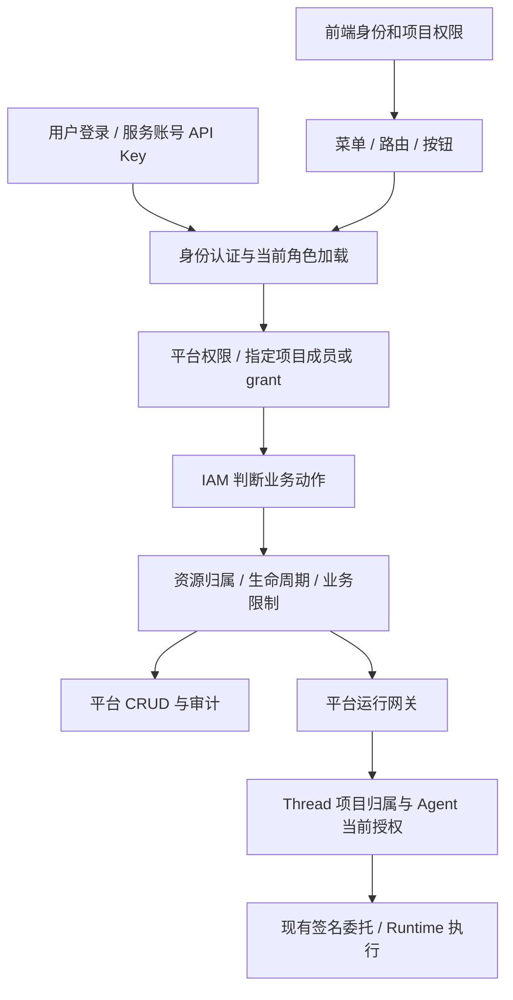

# 01 现状链路与成熟设计对照

## 目标

回答三个问题：当前有什么、哪里不合理、是否需要重建。本文是 2026-09-21 的静态代码分析，不是渗透测试或已通过的安全验收。所有推荐均待人工评审。

## 方案设计

### 1.1 结论

平台角色与项目角色分离、后端集中 IAM、资源归属检查、服务账号 grant、显式项目接管，方向合理。主要欠缺是动作权限粒度、资源作用域一致性、前端权限失效、对话所有权，以及授权变更的治理闭环。

“更规范”不等于更多角色、更多表或引入权限引擎。先把每次请求的主体、动作、资源、作用域和约束说清楚。固定角色足够时继续使用；出现真实职责组合缺口才引入自定义角色。

### 1.2 现有完整主链

| 环节 | 已核查的代码位置与函数 | 当前行为 |
|---|---|---|
| 前端会话 | `apps/platform-web/src/stores/auth.ts` → `hydrate()`、`fetchCurrentUser()` | 获取身份；有会话 epoch 防止旧请求覆盖新登录 |
| 项目上下文 | `apps/platform-web/src/stores/workspace.ts` → `hydrateContext()`、`setProjectId()` | 项目列表、当前项目、后端返回的项目权限；有切换竞态保护 |
| 菜单与路由 | `apps/platform-web/src/composables/useNavigation.ts`、`apps/platform-web/src/router/guards.ts` | 菜单读取路由元数据；守卫处理 all/any 和项目来源 |
| 页面动作 | `apps/platform-web/src/composables/useAuthorization.ts` → `can()` | 平台权限本地映射，项目权限使用后端结果 |
| 请求作用域 | `apps/platform-api/src/platform_api/core/context/runtime.py` → `build_request_context()` | 从路径、header、query 解析 scope；输入的项目 ID 本身不是授权证明 |
| 身份加载 | `apps/platform-api/src/platform_api/entrypoints/http/middleware/auth_context.py`、`apps/platform-api/src/platform_api/modules/identity/actors.py` → `load_user_actor()` | 按请求加载当前用户状态、平台角色与项目成员关系；路径/header 项目冲突拒绝 |
| 服务账号 | `apps/platform-api/src/platform_api/modules/service_accounts/service.py` → `authenticate_api_key()` | 校验账号、令牌、有效期，加载项目 grant |
| 权限核心 | `apps/platform-api/src/platform_api/modules/iam/application/policies.py` → `IamPolicyEngine.evaluate()`、`require()` | 固定权限映射；平台超级管理员不隐式获得项目内容权限 |
| 项目权限输出 | `apps/platform-api/src/platform_api/modules/projects/service.py` → `get_access()` | 根据真实角色输出项目权限；无成员身份返回空权限 |
| 运行入口 | `apps/platform-api/src/platform_api/modules/runtime_gateway/application/service.py` → `_authorize()`、`_load_thread()`、`create_thread_run()`、`send_thread_command()` | 运行读写授权、Thread 项目归属、Agent/模型当前限制 |
| 后续再授权 | `apps/platform-api/src/platform_api/modules/runtime_catalog/application/service.py` → `_authorize_model_reference()`、`authorize_message()` | 模型兑换和消息消费相关授权也依赖 Runtime 写权限，拆分时不能漏掉 |
| 审计 | `apps/platform-api/src/platform_api/modules/audit/service.py`、`http_resolution.py`、`http_writer.py` | 已有动作、主体、项目、结果等审计基础，需核对敏感动作覆盖 |

### 1.3 发现分级

“代码事实”表示源码确认该行为，不表示业务方已经认定为缺陷；“待复现”表示尚未执行真实请求。

| 编号 | 事实与影响 | 证据入口 | 处理章节 |
|---|---|---|---|
| F01 | executor 不含 `project.runtime.write`，而创建 Thread/运行要求它；执行角色实际只能读 | `policies.py` 的 `PROJECT_PERMISSION_MAP`；网关 `_authorize()` | 02 |
| F02 | 同一写权限覆盖运行、模型配置、策略和终端等；放开运行可能连带放开管理 | 网关 `_authorize()`；catalog `create_model()`；policy `_require_project_access()` | 02 |
| F03 | 模型连接表没有 project_id，更新按模型 ID 操作全局记录，却只检查项目写权限 | `apps/platform-api/src/platform_api/modules/runtime_catalog/infra/sqlalchemy/models.py` → `RuntimeCatalogModelRecord`；catalog `update_model()` | 02、04 |
| F04 | 运维有全局公告写权限，但管理列表对非超级管理员要求项目范围 | `AnnouncementsService.list_admin_announcements()` | 04 |
| F05 | 公告 PATCH 只授权更新后的 scope，没有先授权原记录；存在跨范围修改路径，待 HTTP 复现 | `AnnouncementsService.update_announcement()` | 04 |
| F06 | 高权限服务账号的更新/撤销保护弱于用户治理；是否允许属于待确认规则 | `ServiceAccountsService.update_service_account()`、`revoke_service_account_token()` | 04 |
| F07 | 全局审计查询可含多项目记录，但指定项目过滤改用项目审计权限 | `AuditService.list_events()`、`SqlAlchemyAuditRepository.list_events()` | 04 |
| F08 | 前端平台角色映射与后端重复维护；身份/项目权限没有统一的撤权刷新闭环 | `permissions.ts`、`auth.ts`、`workspace.ts`、`client.ts` | 03 |
| F09 | Thread 查询注入 project_id，单条检查项目，未见 owner 授权 | 网关 `_inject_project_metadata()`、`search_threads()`、`_load_thread()` | 05 |
| F10 | 文档称 executor 可写 Runtime，当前实现和测试不允许；20260918 专项曾收紧该权限 | `apps/platform-api/docs/standards/permission-standard.md`；`apps/platform-api/tests/test_iam_policy_engine.py`；`docs/projects/20260918-agent-tool-ui-overhaul/README.md` | 02、07 |

补充纠正上轮讨论：模型连接不能直接按“项目管理员管理自己的模型”设计，因为当前它是全局共享记录。需先决定归属，再设计权限。工具策略也已在另一专项改为项目/用户禁用记录，本专项不再按旧工具 allowlist 规划。

### 1.4 其他成熟系统如何设计

以下资料于 2026-09-21 读取官方公开页面。借鉴的是原则，不声称它们与本平台具有相同的角色、套餐或数据隐私规则。

| 参考 | 官方设计要点 | 对本项目的启示 | 不直接照搬的内容 |
|---|---|---|---|
| [OWASP Authorization Cheat Sheet](https://cheatsheetseries.owasp.org/cheatsheets/Authorization_Cheat_Sheet.html) | 最小权限、默认拒绝、每次请求授权；关注资源关系、静态资源和可猜测 ID | 角色只能表达动作资格；还要校验项目、所有者、共享关系，文件下载同样需要授权 | 不因建议 ABAC/ReBAC 就立即引入外部策略系统 |
| [Kubernetes RBAC](https://kubernetes.io/docs/reference/access-authn-authz/rbac/) | Role/ClusterRole 与 binding 分离，binding 决定范围；权限为加法；角色创建和绑定有提权防护 | 自定义角色应区分“定义权限包”与“授予某人”；平台角色与项目绑定分开 | 不复制完整集群层级，也不把纯加法套到已有工具拒绝规则 |
| [GitHub 仓库角色](https://docs.github.com/en/organizations/managing-user-access-to-your-organizations-repositories/repository-roles-for-an-organization) | Read/Triage/Write/Maintain/Admin 按职责区分；Maintain 不等于拥有敏感破坏性操作；自定义角色属于额外能力 | 编辑、使用、治理可分开；固定角色可以是成熟产品的基础 | GitHub 组织所有者的访问规则不能替代本平台个人对话隐私决策 |
| [Azure RBAC 概览](https://learn.microsoft.com/en-us/azure/role-based-access-control/overview) | role assignment 由主体、角色定义、scope 三部分构成 | “张三是管理员”不完整，必须说明“哪个项目、哪些动作” | 不提前加入组织树、复杂继承或 Azure 全套权限条件 |

推荐概念：**RBAC 动作资格 + 项目作用域 + 必要资源关系检查**。例如“项目执行者可以运行”与“这是他的私有 Thread”需要同时成立；再与账号状态、项目状态、Agent 限制及工具禁用相交。

### 1.5 RBAC/权限体验复盘的纳入与校正

来源：[20260920 RBAC 与权限体验复盘](../../decisions/20260920-rbac-governance-and-permission-ux-gap-analysis.md)。用户要求将其中的问题与解决建议纳入本专项讨论。原文保留为历史问题来源；本专项负责当前方案、任务和验收。纳入不代表各项方案已批准。

| 原文内容 | 本次核查与处理 | 讨论/任务落点 |
|---|---|---|
| Test 只有平台运维身份却无法聊天 | 历史现场记录，本轮未重放该账号；仅有平台身份不应自动获得项目执行权，仍需检查真实项目成员关系和动作权限 | 02 D29；03 C3 |
| 双层 RBAC 的合理性 | 保留治理/业务分离和最小权限原则；不能由这种分层直接推导已符合 ISO 27001/SOC 2，项目也不能直接等同于完整租户隔离 | 01 D01/D02、02 |
| 缺陷一：控件无解释置灰 | 补“无项目/未加入/缺执行权限/加载失败/Agent 停用”等原因与恢复路径；不把所有禁用状态都解释为权限不足 | 03 D30、C3 |
| 缺陷二：开户与项目授权割裂 | 当前 `UserCreatePage.vue` 已提示“项目级权限仍需在项目成员页单独分配”，但提交后直接返回用户列表；缺的是可执行的关联/交接流程 | 03 D31/D32、C4 |
| 缺陷三：邮箱为空显示“暂不可用” | 当前 `UserMenu.vue` 已使用“未绑定邮箱”；保留修复，不重做，补回归验证 | 03 C3；07 Final E2E |
| 阶段一：Tooltip、Banner、申请/切换 | 并入权限透明化；无项目资格者不能以“只读访客”名义展示项目内容；没有申请 API 时先提供真实的联系/切换引导 | 03 D30、C3 |
| 阶段二：开户关联默认项目 | 可选授权步骤，不默认授予；能创建账号不等于能管理项目成员，逐项目校验；失败结果与重试必须明确 | 03 D31/D32、C4 |
| 阶段二：公共沙箱/体验项目 | 本期不建设；用无项目空态、开户交接和明确联系路径解决 onboarding | 03 D36、C5；05 D17/D20 |
| 阶段三：运维首页与健康拨测 | 首页优先复用 Control Plane/System Probes；本期只保留控制面健康状态，真实 Agent 拨测需另行批准并具备独立主体、数据、额度和审计 | 03 D34/D35、C3/C5 |

**当前代码与原文术语的差异：** 平台枚举实际是 `platform_super_admin/platform_operator/platform_viewer`；项目枚举实际是 `project_admin/project_editor/project_executor`，没有已实现的 `owner/developer/project_viewer`。权限码使用点号（如 `project.runtime.write`），原文的 `project:threads:write` / `project:runs:execute` 不是当前 API 契约。认证入口是 `modules/identity/` 与 `modules/iam/`，不能照原文的 `modules/auth/` 寻找实现；本专项范围仍只有平台前后端。原文提到额度/账单的隔离属于设计理由，本轮没有验证完整计费或配额能力，不能据此标为已实现。

**问题归因不能只停在体验：** 无项目角色的运维不能聊天与现有边界一致；已经加入项目的 executor 仍因总写权限收紧而不能执行，则属于 F01/F02。全局模型作用域、公告源资源校验等后端缺口也仍需治理，不能用“只补 UX”替代。

增补追踪项（历史观察与本次源码核查分开）：F11 运维权限认知与默认入口；F12 开户后项目关联闭环；F13 禁用原因与下一步引导；F14 已修复邮箱文案回归；F15 沙箱与健康拨测的可选产品方案。本期不建设公共沙箱，Agent 拨测后置；F15 是需求选项，不是当前系统的安全缺陷。

### 1.6 待讨论

| 决策 | 推荐 | 替代及代价 | 状态 |
|---|---|---|---|
| D01 是否保留 IAM 与双层角色 | 保留；补齐动作、资源、项目范围和对象关系语义 | 重建引擎需迁移全部调用点，收益不足 | 已确认：保留 |
| D02 权限系统是否负责多租户/组织树 | 本期仅负责现有平台与项目层级 | 扩展组织树/多租户会引入继承、跨租户边界和迁移，不纳入本期 | 已确认：本期不做 |

## 任务拆分

### Task A1：冻结行为基线
- **改动内容：** 人工确认 F01—F15 的期望行为，形成角色/动作/资源/范围矩阵；D01 保留现有 IAM 与双层角色，D02 将范围限定为平台/项目两层；静态发现、历史现场与真实复现分开；纳入复盘文档的体验与开户问题。
- **代码位置：** 上述表格中的完整路径和函数；本任务先评审，不改代码。
- **预期结果：** 没有“管理员默认全能”“隐藏按钮等于安全”等含糊约定。
- **验证项：** 对每个发现指定复现身份、请求入口和预期拒绝/允许；对照 02—06 的决策编号。
- **状态：** `[x]` 已完成 2026-09-22：用户已明确批准按七章规划实施，D24—D28 随自定义角色后置；代码实现及安全验收分别见 02—07。
- **合规检查：** [x] 基线决策已确认；[x] 已对照用户批准与各章决策；[x] 本章状态已更新；[x] CONTEXT.md 已更新。

## 验证要求与记录

### Phase 验证记录

A1（2026-09-22）：核对用户实施批准、D01—D36 与各章任务范围；保留 IAM/双层角色，仅平台前后端，自定义角色/BYOK/公共沙箱/拨测不进入本期。此为基线核对，不作为业务安全测试证据。

### Final 验证记录

安全与真实链路最终验收已执行，统一见 07；本章静态分析本身不替代运行证据。

## 状态

行为基线已确认（done）；01 不单独构成可发布功能。整个项目仍在实施验证，见 07。
