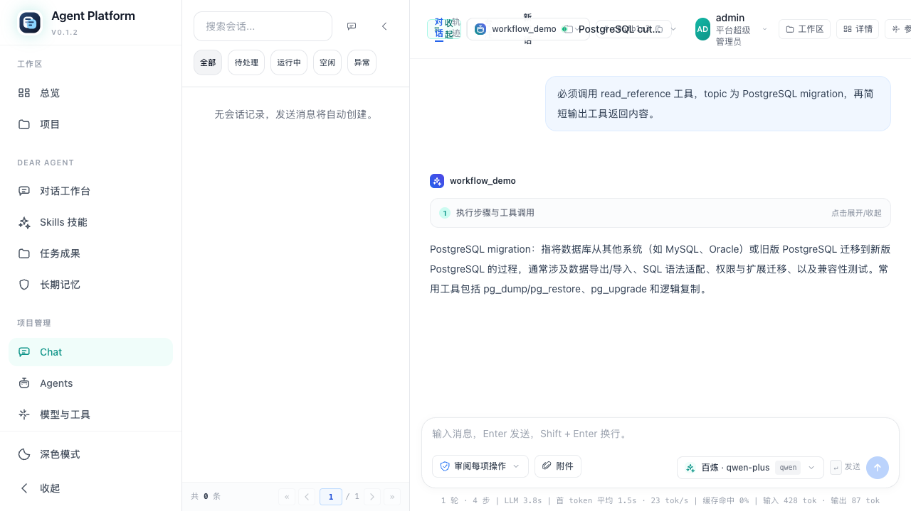

# 真实切换与完整验收

## 授权及当前状态

用户于 2026-09-20 明确要求立即真实切换和完整验收。已按停写、备份、专用角色建库、Alembic、全量复制、摘要校验、配置切换、启动的顺序完成本地迁移。本轮验收已完成（done），最终结果以 ../verification.md 最新记录为准。

## 真实切换

- 本地 PostgreSQL 17.11，独立数据库及非超级用户角色均为 `platform_api`；Runtime 仍使用原独立数据库。
- 20 张业务表完整保留，逐表归一 SHA256 相同；7 组模型凭据用原 master key 解密成功。
- 数据复制耗时 55.405 秒；切换完成时间为 2026-09-20 01:46:01 +08:00。
- 实际更新 `apps/platform-api/.env` 的数据库 URL、启用数据库和关闭自动建表三项；不提交秘密配置。
- 通过 `scripts/local-stack.sh` 恢复服务后，真实 API/浏览器已产生新写入。旧 SQLite 仅作为源快照，不能直接作为无损回退目标。
- 私有备份在 `apps/platform-api/.data/backups/20260919T174506Z-postgresql-cutover/`，包括原配置、SQLite backup、Runtime dump、校验报告；不提交业务数据、密码或 token，不自动删除备份。

## 验收时修正

- `tests/test_model_connection_lifecycle.py` 原先给 executor 授权却期待可兑换需要 editor/admin 的模型凭据。增加 executor 拒绝断言，再使用 editor 验证兑换及撤销，不修改业务鉴权。
- `apps/platform-web/e2e/chat-refactor.spec.ts` 对齐现行审批按钮及确认按钮名称；截图失败不再掩盖原始测试失败。
- `apps/platform-web/Dockerfile` 安装前复制已有 patches，修复锁文件声明补丁而镜像中缺文件的问题。
- 两份全栈 Compose 对齐镜像 GraphHarbor 的 serve 子命令、DATABASE_URI、现有 /ok 探针及模型凭据兑换地址；显式传入平台模型 master key。

## 已取得证据

- 平台全量 198 项：193 通过，5 个环境门控跳过；配置真实 HTTP 后额外 5 项集成通过。真实 PG 迁移专项 3 项通过，包括反向外键依赖阻断清理。
- 浏览器真实登录、16 个管理路由的桌面/手机检查通过；聊天初次失败来自陈旧审批定位器，后续修正并复测通过。
- 真实 workflow 工具返回存在；相同幂等键得到同一 run，不同内容复用键返回 409；保留独立验收项目及会话供恢复核验。
- 密码错误、库不存在、不可达、权限不足、未迁移均阻断；平台业务角色不能读取 Runtime runs。
- 本机 Homebrew PG 的本地认证为 trust：错误密码场景在启用密码认证的隔离 PG16 中验证，本机密码字段不代表已启用密码认证。
- 首轮 2 worker / 10 客户端 / 各 300 秒负载，PG 无错误、2864 条 HTTP 创建项目全部持久化；P95 比值 1.224 高于 1.2，保留失败事实，构建停止后按相同门槛复测。

## 补充修正与恢复证据

- 浏览器验收发现 `buildChatMessageMetadata()` 从最新重复消息快照取 parent，导致编辑第一条消息仍保留旧消息。现在独立定位首次出现的快照，保留原分支展示定位；4 项单测及桌面/手机完整链路通过。
- Skills 外部集成原就绪轮询最多 150 次短请求，在本机冷启动下不足。就绪等待改为与本地栈一致的 120 秒实际时钟上限，业务断言不变，复测结果见验证记录。
- 停写快照的实际数据为 projects=108、agents=127、refresh_tokens=324、audit_logs=5；与最初只读盘点相比新增 1 个 token、5 条审计，全部按停写基线迁移。服务账号、公告和源 Runtime runs 均为空，明确区分空表校验与真实历史业务验收。
- [切换摘要](../evidence/cutover.json)、[真实调用](../evidence/http.json)、[故障矩阵](../evidence/faults.json)、[取消重提](../evidence/cancel.json)、[双库恢复](../evidence/recovery.json)、[恢复 HTTP](../evidence/recovery-http.json)、[SQLite 快照验证](../evidence/sqlite-snapshot.json)。
- 原 SQLite 副本能够登录并读取项目，源 SHA256 未变；未将真实服务回指 SQLite。
- 实际恢复停写窗口 363.46 秒，控制面及 Runtime dump/restore 分别约 4.48/8.42 秒；剩余时间主要是 Worker 停止及服务冷启动。恢复副本未启动 Worker。

## 容器验证边界

完整 Compose 的 PG、Redis、Runtime、Platform API、Web、interaction-data-service 使用独立项目、端口和数据卷，不改原业务卷。API/Web/结果域镜像实际构建；Runtime 复用与现行 Dockerfile 相同的 GraphHarbor post20 依赖镜像，覆盖当前 src 和 langgraph.json 并设置 PYTHONPATH，避免用旧缓存源码的 401 冒充当前版本结果；未将这份验收覆盖镜像作为生产发布物。

实际发现并修正的部署遗漏：前端安装前缺 patches；Runtime 缺 serve 子命令、仍用 POSTGRES_URI、旧 healthcheck 路径、缺 GraphHarbor/inbox 初始化；模型/消息授权回调及容器自调用地址未传入。两份 Compose 统一修正，平台仍先 Alembic 后启动。部署配置模板补充模型 master key。

当前注册 Runtime 源码没有 interaction-data-service 生产者调用，因此结果域验收为独立真实 HTTP 写入/查询及重启持久化，并核对项目 ID；不声称覆盖不存在的 Runtime → 结果域自动产物链路。主机 Web → Platform API → Runtime 的实际模型、工具、审批、分支链路另有通过证据。

最终收尾：性能复测通过（PG/SQLite P95=0.914），Skills 外部 2 项通过，完整容器创建线程/结果域写读及已有卷重启通过。所有原始失败保留在验证记录，私有运行日志与临时验收脚本保留在备份目录，脱敏结论位于 evidence/。
