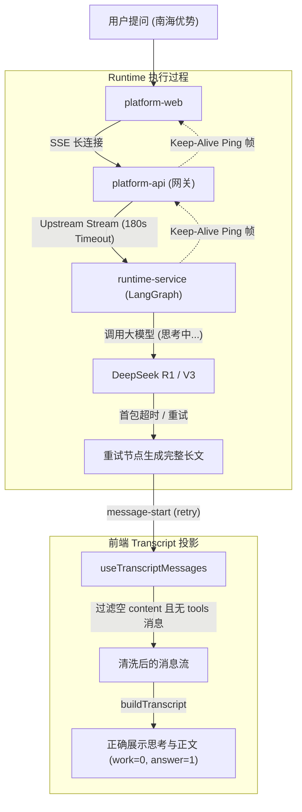

# 对话流式超时容错与 Transcript 解析优化 - 整体方案

## 背景

在 2026-09-21 的真实线上/调试测试中，用户在对话界面输入高复杂度问题（“南海应该有哪些优势？”），智能体执行完毕后，前端界面出现了反直觉现象：
- **界面未展示正文回复**；
- 界面展示了 **“1 执行步骤与工具调用（点击展开/收起）”**；
- 刷新页面后，长篇正文又正常出现，“1 执行步骤”消失。

### 底层排查还原（精确到秒的事实证据）

通过检索数据库 `graphharbor_acceptance` 的 `runtime_events` 与 `threads` 表（Run ID: `caf994d4-e819-46f7-af30-8a3912247635`），还原出全链路执行事实：

```text
15:46:04  Run 启动，处理用户输入“南海应该有哪些优势？”
15:46:48  [Seq 3915] 第 87 步：调用 model 节点，向前端发出首个 message-start（id: 01a0c2ee）
          ⚠️ 大模型陷入 2924 tokens 的深度思考推理，整整 30 秒未向外吐出任何可见字符！
15:47:18  [Seq 3917] 整整 30 秒无响应！后端的模型客户端首包超时，抛出 TimeoutError()！
          系统捕获到超时，自动触发节点重试机制（lifecycle: retry）
15:47:34  [Seq 3923] 重试启动，向前端发出第二个 message-start（id: 01a0c2ef）
15:47:53  [Seq 3925] 大模型终于思考完毕，吐出第一个字「先」
15:48:58  [Seq 4784] 大模型流式输出完毕（output_tokens: 3781），生成完整长文
15:49:22  [Seq 4808] 后端完成落库，写入 threads 表（总消息数：19 条）
```

#### 问题根因一：网关硬超时与模型思考时长失配
- 从首个调用发起（`15:46:48`）到重试开始吐字（`15:47:53`），累计耗时长达 **65 秒**；
- `platform-api` 环境变量限制 `PLATFORM_API_LANGGRAPH_UPSTREAM_TIMEOUT_SECONDS=60`；
- 在 60 秒时，上游反向代理/网关连接超时中断，导致浏览器前端的 SSE 连接在接收到完整正文前被断开。

#### 问题根因二：前端 Transcript 算法粗暴误判
- `apps/platform-web/src/modules/chat/transcript.ts` 第 494-498 行：
  ```typescript
  turn.work.push(...turn.answer);
  turn.answer = [];
  if (item.tools.length) turn.work.push(item);
  else turn.answer.push(item);
  ```
- 前端流式接收期间同时持有了第一次超时的空消息（`01a0c2ee`）与第二次重试的消息（`01a0c2ef`）；
- 算法直接将前一条空消息推入了 `turn.work`，导致 `turn.work.length === 1`；
- `ChatMessageList.vue` 将 `turn.work` 渲染为 `<details>` 折叠面板：“1 执行步骤与工具调用”；
- 加上流式连接已在 60s 断开，正文尚未完整到达，折叠面板外部的正文区呈完全空白态。

---

## 目标

1. **解决网关超时截断**：使全链路能够稳定支撑 120s~180s 级别的高耗时推理大模型输出；
2. **建立全链路保活机制**：在长推理或耗时工具执行期间，持续向客户端推送保活帧，防止中间代理超时断线；
3. **修复前端 Transcript 归并算法**：彻底消除同轮次 retry 导致的残余空消息，确保“没有工具调用时绝不出执行步骤”，并且即使网络异常也不出现假步骤套壳。

---

## 方案设计

### 整体架构



### 关键改动点

#### 1. 网关层 upstream 超时放宽
- **文件：** `apps/platform-api/src/platform_api/core/config.py` 及相关部署配置
- **改动：**
  - 将 `PLATFORM_API_LANGGRAPH_UPSTREAM_TIMEOUT_SECONDS` 默认值从 `60` 提升至 `180` 秒；
  - 允许针对 reasoning 类模型路由动态放宽超时时间。
- **理由：** 现代推理模型（如 DeepSeek-R1、o1 等）单次思考 token 量可达数千，首包响应耗时经常在 40s~90s，60s 超时严重过窄。

#### 2. SSE 长连接心跳保活（Keep-Alive）
- **文件：**
  - `apps/runtime-service/src/runtime_service/entrypoints/http/routes.py`
  - `apps/platform-api/src/platform_api/modules/runtime_catalog/infrastructure/runtime_service_client.py`
- **改动：**
  - 在大模型推理、长时间工具调用以及重试等待期间，每 15 秒输出一次轻量心跳注释帧（`: ping\n\n` 或空事件），保持 TCP 活跃；
  - 前端 SDK/Fetch 客户端忽略心跳注释帧。
- **理由：** 即使将超时时间调大，中间的反向代理（Nginx、Cloudflare 等）通常有默认 60s/75s 的空闲读超时，没有数据流动仍会被无情切断。

#### 3. 前端 Transcript 算法过滤超时残余空消息
- **文件：** `apps/platform-web/src/modules/chat/transcript.ts`
- **改动：**
  - 在解析单轮消息时，对空 AIMessage 进行识别：
    ```typescript
    // 若 AI 消息既无文本内容、无 reasoning，也无 tool_calls，且同一轮次中存在后续有效 AI 消息，则视为 retry 残留，不纳入 work
    const isEmptyAiMessage = message.type === "ai" && 
      item.blocks.length === 0 && 
      item.tools.length === 0;
    ```
  - 遇到新的正常 AI 消息时，若 `turn.answer` 中仅有上述空消息，直接替换丢弃，禁止推入 `turn.work`。
- **理由：** 从源头上杜绝把“崩溃重试的残余空消息”当成“执行步骤与工具调用”。

#### 4. 前端组件折叠面板兜底展示优化
- **文件：** `apps/platform-web/src/modules/chat/components/ChatMessageList.vue`
- **改动：**
  - 优化 `<details v-if="displayEntry.work.length">` 的展示逻辑：
    如果 `displayEntry.work` 里的所有 item 都没有任何 tool call，且没有有效正文块，则不应渲染折叠栏；
  - 确保正文（`displayEntry.content`）与步骤（`displayEntry.work`）在异常状态下的渲染隔离。

---

## 链路影响

### 受影响的调用链路
```
platform-web (SSE client) → platform-api (proxy) → runtime-service (LangGraph Server) → 大模型供应商 (OpenAI/DeepSeek)
```

### 契约变更
- **SSE 协议：** 新增规范化的心跳保活注释行（无破坏性，符合 W3C SSE 规范）；
- **前端状态：** `buildTranscript` 投影产物规范化，无工具调用时不产生幽灵 `work` 节点。

---

## 风险和依赖

- **依赖项：** 需要确保代理层（如开发机 Vite 代理或线上 Nginx）不缓冲 SSE 响应（`X-Accel-Buffering: no`）；
- **潜在风险：** 超时时间调至 180s 可能导致真实死锁任务占用连接池更长时间，需配合客户端显式“取消/停止”按钮。

---

## 实施计划

1. **Phase 1（网关与心跳保活）**：放宽 platform-api upstream timeout 至 180s，并在 runtime-service / platform-api 完善心跳保障；
2. **Phase 2（前端 Transcript 清洗）**：在 `transcript.ts` 和 `useTranscriptMessages.ts` 中实现 retry 残余空消息剔除逻辑；
3. **Phase 3（全链路端到端回归）**：使用超长思考模拟用例与真实 DeepSeek 会话进行重试、断网与渲染验证。
