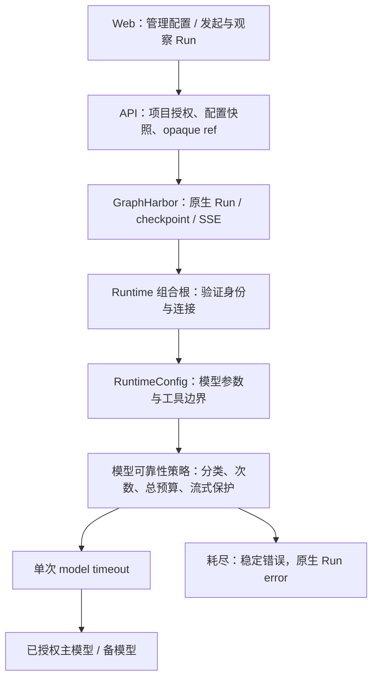

# Agent 模型调用稳定性治理 - 整体方案

> 状态：`blocked`。后端/Runtime Phase 及 GraphHarbor post42 的 V01-C 默认配置/实际子图已通过；等待同事前端和完整平台回退，Final 未执行。Anthropic 真实 API 排除；现役 post41 未升级。实现进度见 tasks.md。

## 目标与验收口径

本期目标是在已授权模型的 transient 故障下继续一次推理，同时保持项目隔离、工具副作用边界和原生 Run 的真实状态。最小成功标准是：A transient 失败后 B 生成完整结果，工具仍只执行一次；A/B 均失败时在固定预算内结束为 error；Runtime 收到取消后停止后续候选；部分流式内容不会和另一模型拼成假答案；同项目与跨项目的正反链路都有证据。

优化前 GraphHarbor 默认取消轮询约 20 秒，ACK 或提前 interrupted 不是执行退出证据；独立复测 ACK 后仍请求备用，ACK→lease 释放7.925秒，见 `evidence/cancel-default-heartbeat.json`。轮询由 `min(max(heartbeat/2, 1), max(lease/3, 1))` 决定；显式heartbeat=20约10秒，不能当默认。1秒heartbeat对照仅证明缩短传播窗口，没有写入现役配置。post42 已按下述方案修复并完成 V01-C，默认配置和实际子图停止确认后无新增候选；任何版本的 ACK 都不承诺任意竞态窗口立即零请求。

### 取消传播决策（2026-10-07）

- **人工决定：** 用户先确认落文档与跨包清单，随后明确「按刚才的 GraphHarbor 专项方案实施，直接使用 ~/.my_best/.env 中上传即可（开发验证完成后）」。实施与验证后双包发布已授权，Git 操作和现役升级不在范围。
- **官方依据：** [官方数据面说明](https://docs.langchain.com/langsmith/data-plane#communication)明确使用 Redis string + PubSub 发取消；已读取本机锁定 `langgraph-api==0.13.0` 的 `worker.py`、`api/runs.py`、`asyncio.py` 及 `langgraph-runtime-inmem==0.33.0` 的 `Runs.enter()`。生产 PostgreSQL/Redis 服务端的全部内部实现并未取得，不能将开发 runtime 对照称为完整生产一致性证明。
- **底座方案：** Worker 在 factory 前注册现有 control queue，确认订阅就绪后复查 control key/PG，重连后复查活跃 Run；即时接收 interrupt/rollback，heartbeat 负责续租及故障兜底。取消 execution Task 后等待 stream、模型 sleep、HTTP/资源上下文退出，清理期间按 owner/代际保护续租，重复通知不打断清理；之后事务性确认停止、释放 lease、发布唯一 terminal/done，不能在 running 受理阶段提前发送停止终态。
- **等待口径：** `wait=false` 默认 ACK 仅表示受理；`wait=true` 等 Worker 停止确认，不能只检查提前写入的 `interrupted`。原默认 smoke 没传 `wait=true`，失败记录保留为取消延迟证据；新验收必须同时证明默认 heartbeat 下即时唤醒和停止确认后无新候选请求，不能仅放宽旧断言。
- **恢复边界：** lease 到期不等于执行已停止；取消与完成/停机、Worker kill、重复通知、Redis 断线、rollback、threadless 和排队隔离由 GraphHarbor 专项验证。已取消 Run 不得作为基础设施重试重新执行；外部已发送请求、同步线程和已发生工具副作用不承诺撤回。
- **实施归属：** GraphHarbor 仓库 `docs/projects/20261007-worker-cancel-propagation/` 管理双包任务；平台增加下述 V01-C 依赖复验，不改依赖安装目录。即时控制方案不引入新公开 Run 状态、模型业务字段或前端配置页；Schema 扩展若确有必要须先说明影响再评审。
- **前端交接：** 同事复用既有 cancel/SDK，区分停止中、停止确认、确认超时。默认 ACK、本地 SSE abort、旧版本的提前 Run 状态都不能显示为执行已停止；新版 `wait=true` 与终态投影联验通过后再接入。详见 [交接](frontend-handoff.md#取消停止确认交接2026-10-07)。

**2026-10-07 实施后事实：** GraphHarbor post42 已实现共享控制监听、重连复查、清理续租/代际与持久停止/rollback receipt，无 Schema 迁移。V01-C 默认 heartbeat ACK→lease 释放 0.123 秒且仅 primary，实际 general-purpose/research 子图 9 项通过；旧默认失败证据保留。HTTP/Python/JS 锁定对照与回退/kill/混合版本通过；false=202，true 停止已确认=200，无法确认=503。混合版本不具备新版保证，平台现役仍 post41；发布事实见 GraphHarbor 专项。

不增加新的 Agent 循环、模型代理服务、模型 Registry、Harness 装饰器、provider 健康数据库、全局熔断器或计费系统。已有沙箱、记忆、技能、SSE 保活和消息队列继续按自己的规范工作。

## 服务分工

| 层级 | 开发内容 | 必要性与边界 |
|---|---|---|
| Platform API | Agent 管理配置、主备模型授权、提交快照、模型 ref 及内部连接响应扩展、定时执行复核、审计 | 必须。模型/凭据由控制面治理；API 不执行 provider 重试 |
| Runtime Service | 有限候选、transient 分类、官方 retry/fallback 组合保护、单次和整体 timeout、取消、流式限制、父子 Agent 装配与 trace | 必须。只有执行层掌握一次模型调用的真实状态 |
| Platform Web | 编辑页配置与错误展示，核对实际成功模型；复用管理 service、权限、SDK 与轨迹 | 配套需要，由同事完成。后端可先通过 API 验收，用户界面完成需独立记录 |
| GraphHarbor | 原生 Run/checkpoint/SSE/取消/调度 | 通用取消修复在独立跨包专项实施；模型失败仍归一化为业务失败，避免整 Run 重试，不向底座加入 provider 策略 |



## 1. 管理配置与持久化

### 公开配置

在既有 Agent GET/POST/PATCH DTO 增加顶层 `model_resilience`，与 `context` 分开。它是项目管理者配置，不是聊天调用者可随 Run 提交的 Runtime Context。

已实现的完整对象如下，默认关闭：

```json
{
  "enabled": false,
  "fallback_model_id": null,
  "max_attempts": 3,
  "attempt_timeout_seconds": 600,
  "total_timeout_seconds": 900
}
```

| 字段 | 已实现约束 | 行为 |
|---|---|---|
| `enabled` | 严格 bool，默认 false | false 时保持当前单模型路径；不默认全项目开启 |
| `fallback_model_id` | Catalog UUID 或 null | null 表示同模型重试；不接受 provider:model、URL、API key 或任意模型对象 |
| `max_attempts` | 严格整数，1~5，包含首次调用 | 默认 3；不使用含糊的「重试 3 次」表示总调用数 |
| `attempt_timeout_seconds` | 严格有限数字，1~900 秒 | 默认延续当前 600 秒；启用策略时取此值，禁用时沿用现有环境变量路径 |
| `total_timeout_seconds` | 严格有限数字，1~1200 秒，且不小于 attempt timeout | 默认建议 900 秒；包括 provider 等待、retry 与 backoff；实际还受原生 Run 剩余生命周期约束 |

这些是批准并实现的默认值，不是已经测得的 SLO。600 秒来自现有代码，900/1200 秒给有限重试留空间，且低于 `.env.example` 的 `GRAPHHARBOR_RUN_TIMEOUT_SECONDS=1800`。部署前需验证实际 Worker 配置与慢推理基线；不为 flash/pro/ultra 另造一套策略档位。

PATCH 语义：字段缺省保持现值；`null` 重置为关闭的默认策略；对象表示完整替换，必须包含上述五个字段，拒绝未知字段。配置关闭时清除内部持久化保留键，便于旧版本回退。修改普通 `context` 必须保留尚未关闭的可靠性设置，反之亦然。

### 保存位置与权限

- 复用 `AgentRecord.context` JSON，内部保留键为 `_platform_model_resilience`，不新增表、列或批量迁移。
- `_normalize_agent_context()` 仍只接受原有五个推理字段；客户端不能通过 `context` 写内部键。
- `_assistant_item()` 将内部键转为顶层 `model_resilience`，公开 `context` 不返回内部键。
- `AssistantsService.create_assistant()/update_assistant()` 在现有事务内验证、合并、保存策略，读写仓储沿用现有 methods。
- 读权限沿用 `project.assistant.read`，写权限沿用 `project.assistant.write`；配置审计沿用 Agent 更新动作，仅加脱敏摘要。
- API 的 Agent 参数 schema 增加独立管理 section，供同事取得范围/默认值；不把策略塞进远端 graph 的 `context_schema`。
- 首期支持 `reference_agent`、`showcase_demo`、`dearflow_agent`、`workflow_demo`。使用一个小的明确支持集合给 schema/保存校验复用；不建立插件注册表。其他教学图允许读取默认关闭策略，拒绝开启未装配能力。

沿用当前参数 schema 的 `sections` 格式，新增 `key="model_resilience"`、`type="object"`、`required=false` 的 section，附 `supported`、完整默认对象与五个字段的 JSON Schema `properties`。未支持图也返回该 section，但 `supported=false`。构建位置为 `AssistantsService.get_parameter_schema()` 在现有远端推理 schema 返回后追加管理 section；远端 provider 继续负责已部署 graph 的 Context。实际 Pydantic 返回使用 `anyOf` 表达 nullable 字段，UUID 由 validator 校验；完整样例见前端交接，前端不自行猜测支持图。

### 模型选择与授权

主模型继续按现有规则解析：Run 显式选择 > Agent 默认 > 项目默认。备用 ID 是项目 Agent 的明确设置，不自动更新用户的主模型偏好。

保存、创建实际 Run 和兑换连接时分别校验：模型存在、启用、当前项目可见、对应项目策略允许、actor/Thread/Agent 仍有执行权限。主备相同在配置阶段拒绝；若运行时用户覆盖主模型为已配置备用，合并成单候选，不重复构造或重复切换同一个模型。

允许项目显式选择公共模型或本项目 BYOK；不自动把私有/本地模型请求送往平台公共云模型。不同 provider 名称并不证明故障域独立：若 A/B 共用 base_url 或同一上游 Gateway，需在验收证据中注明，不能称为独立容灾。

**授权差异 R01：** 基线 `build_delegation_policy()` 未过滤其他项目私有模型，见 [源码证据](reference-analysis.md)。用户批准后已通过 `enabled_model_ids()` 统一项目 Catalog/Delegation/保存/执行的允许范围，并保留凭据兑换项目检查。跨项目 BYOK、禁用模型及篡改签名的拒绝测试已通过，不把 JWT 列表当作唯一授权依据。

## 2. API 到 Runtime 的内部契约

### 固定提交策略

`RuntimeGatewayService.launch_runtime_run()` 在第一次 reserve 之前从受管 Agent 读取配置，并与主模型快照一起固定在现有 `RunRequest.config_snapshot` JSON 的内部键中。同幂等 key 重试使用同一快照，不因第二次 HTTP 请求或管理者改配置而改变 provider 选择。

仅在已验证的服务端快照中保存策略，客户端执行配置白名单不增加这一键。发往 GraphHarbor 前剥离内部快照键，把策略加入 `runtime_model_ref` 的签名 payload。复用既有 project/actor/agent/thread/action/expiry 绑定，不增加 Delegation operation 或放宽 JWT claims。

- 交互提交、旧 create/stream 入口、Protocol command、排队消费和审批 resume 均追踪到 `launch_runtime_run()`。
- 新 submission 从当前管理配置得到策略；已接纳的 submission 保持快照。审批产生新执行动作时沿用现有父 Run/幂等关系，不重发已执行工具。
- 定时任务 `authorize_execution()` 在真正执行时按当前 Agent 和候选授权重建 reference；不能复用创建 cron 时的旧权限。
- `suggestions-generate` 和其他辅助入口不请求该扩展，保留自己的短预算。

### Reference 与连接响应

复用 `/api/runtime/internal/model-config`；签名 payload 增加经过验证的 `model_resilience` 快照和版本标记，不携带凭据。签名必须覆盖备用 ID、全部预算字段与版本。

内部响应保留当前主模型字段，仅对启用策略的已批准执行返回扩展：

```json
{
  "model_id": "<primary-catalog-uuid>",
  "provider": "<primary-provider>",
  "base_url": "<internal-primary-endpoint>",
  "protocol": "<primary-protocol>",
  "model": "<primary-model-name>",
  "api_key": "<internal-only>",
  "resilience_version": 1,
  "model_resilience": {
    "enabled": true,
    "fallback_model_id": "<fallback-catalog-uuid>",
    "max_attempts": 3,
    "attempt_timeout_seconds": 600,
    "total_timeout_seconds": 900
  },
  "fallback_connection": {
    "model_id": "<fallback-catalog-uuid>",
    "provider": "<fallback-provider>",
    "base_url": "<internal-fallback-endpoint>",
    "protocol": "<fallback-protocol>",
    "model": "<fallback-model-name>",
    "api_key": "<internal-only>"
  }
}
```

这不是浏览器可调用的新 API。主备均执行 `_authorize_model_reference()` 等现有权限检查；兑换完成后连接仅保留在模型客户端内存，不能写入 config、checkpoint、State、HTTP 公开响应、日志或 trace metadata。

`fetch_model_connection()` 的旧调用者继续只拿主模型。已新增 `fetch_model_bundle()` 复用同一 HTTP/HMAC 请求与响应校验，为接入策略的组合根取得主备连接及不可变策略，不额外兑换备用连接。

现有过期 reference 只有带新鲜 Runtime HMAC 时才能在排队后兑换；保留这条规则并覆盖主备。构图时兑换并校验两者，避免第一次失败后才兑换已过期 reference。连接初始兑换失败属于配置/权限错误，不触发另一个 provider 来掩盖。

已构图 Run 的连接使用范围按用户批准 R01 沿用现有执行授权模型；不宣称支持每个 token 或每次 retry 重新鉴权。撤权覆盖下次兑换、恢复构图和新 Run；紧急中止已运行任务使用原生取消，并受上述 Worker 通知延迟限制。

## 3. Runtime 重试执行策略

### 最小新增模块与预算单位

已新增 `runtime_service/middlewares/model_resilience.py:ModelResilienceMiddleware`，复用 `AgentMiddleware` 与公开官方 middleware API。它只负责当前 model invocation 的策略，次数、最后失败、provider cooldown 和流式标记均保存在调用局部；不能放在共享实例可变字段上造成子任务并发串扰。

这里的 invocation 指一次进入可靠性 middleware 的调用，内部可有多个候选尝试；**不等同于整个 LangGraph model 节点，也不包括辅助摘要请求**。Deep Agents 摘要可能压缩历史后重新进入下游，形成另一次受管 invocation。按批准方案保留其既有语义，每次 invocation 独立预算。ContextOverflow 恢复测试已区分生成尝试、辅助摘要与压缩重入；Run deadline 与既有逻辑模型步数限制继续有效。

已实现的内部组合是官方 ModelRetry 包住官方 ModelFallback，provider handler 前增加局部保护：

- `ModelRetryMiddleware(retry_on=显式分类器, on_failure="error", jitter=True)` 负责重复执行、退避和等待。
- 有备用时复用 `ModelFallbackMiddleware(backup)` 的请求切换及现有跨模型清洗。
- 官方 fallback 无错误筛选，因此 guarded handler 发现上一个错误不可重试、流已输出或次数耗尽时必须拒绝再访问候选；不能依赖官方默认 catch-all 行为。
- provider handler 前只在真正发起调用时计数，并限制所有候选共享 `max_attempts`。即使官方两层循环还尝试进入下一候选，也不得再发送第四个请求。
- `asyncio.timeout(total_timeout_seconds)` 包住官方循环及所有 sleep；每次 handler 内由现有 `ModelCallTimeoutMiddleware` 限制单次调用。

默认最多三次的行为是：有 B 时 A/B/A，无 B 时 A/A/A；成功立刻返回。所有物理尝试共享预算，不能变成「A 重试三次后 B 又重试三次」。下一次逻辑模型调用重新从请求的主模型开始，不跨 Run 保存熔断/粘滞状态。

Task R00 的锁定版本组合验证已通过，实际 compiled graph 确认摘要位于策略外层。ContextOverflow 先透传给原生摘要恢复，无法恢复时由同名摘要包装器归一化为稳定失败；压缩重入有独立 invocation 预算。流式消息与工具副作用的浏览器投影仍由 V02 联合验收。

### transient 分类

| 类别 | 重试/切换 | 说明 |
|---|---|---|
| OpenAI/Anthropic 连接、timeout、rate limit、server error | 是，仍受错误码与输出状态约束 | 使用真实 SDK 类型，不用异常文案字符串包含判断 |
| LangChain `ModelError` | 根据 `is_retryable`，并覆盖明确永久错误 | 核对被包装 provider 错误，尤其 quota/鉴权 |
| provider HTTP 408/429/500/502/503/504/529 | 是 | 只从已知 SDK/provider 响应中读状态；不对任意带 status_code 的业务异常生效 |
| httpx connect/read/write/timeout、remote protocol 断连 | 是，未输出时 | 不把 UnsupportedProtocol/LocalProtocolError 等配置错误一概当 transport transient |
| 单次模型 wall-clock timeout | 是，仍有总预算且未输出时 | 超时的协程/流必须先取消并收尾，然后才允许下一个候选 |
| 401/403、参数错误、model not found | 否 | 按稳定 provider_rejected/不兼容错误报告；不通过换模型绕过 |
| `ContextOverflowError` | 不做 provider transient 重试或切换 | 保留原类型供外层官方摘要压缩/恢复；无法恢复后的稳定失败归一化位置须在 R00/R06 验证，不能提前吞掉原生恢复 |
| 429 的明确 insufficient_quota/billing 状态 | 否 | 限流与额度耗尽分开，不做无意义重试 |
| Runtime 身份、哈希、工具权限错误 | 否 | 保留既有错误语义，在模型策略外完成检查 |
| CancelledError、GraphBubbleUp/审批中断 | 否 | 立即传播，不转成模型 outage |
| 未知程序异常 | 否 | 不新增自动 retry/fallback，按现有错误出口处理 |

### backoff 与资源预算

先用官方指数退避：initial delay 1 秒、factor 2、max delay 30 秒、jitter 为正负 25%。Retry 外包 Fallback 时，A 失败后首次 B 调用立即执行；A/B 都失败后再进入下一轮 A，第一次轮次等待约 0.75~1.25 秒。无 B 时，每次重试均由 Retry 退避。默认 N=3、有 B 时只会出现一次轮次等待，不能写成 B 前必等 1 秒、A 前必等 2 秒。若评审要求每次物理访问前都 jitter，必须另评估 guard 的等待与官方退避是否重复。

provider 的有效 `Retry-After` 通过标准库解析秒数或 HTTP 日期，记录该候选的最早再次访问时间。它限制重试同一候选，不阻止调用无相同限流范围的备用；实际等待取官方 backoff 与候选 cooldown 的较大者，且纳入总预算。等待超过剩余预算时直接结束，不能压缩服务端要求后提前再次请求。

启用受管策略的主备生成实例显式 `build_model(..., max_retries=0)`，包括 RuntimeConfig 的 model_builder 重建路径与 reasoning 绑定后的实例。不能只修改初次构造，也不能修改全局默认。摘要和记忆提取已按下节使用独立辅助实例；suggestions、标题和未接入教学图保持各自构造路径。

现有 model/tool call limit 继续限制逻辑模型步数/工具动作；增加独立物理 attempt 观测。每个受管 invocation 的生成尝试最多 N 次；摘要、压缩重入、多步和并行子图都可能增加整节点/Run 的请求总数，失败调用也可能计费。复用 Langfuse usage 和单次预算，本期不承诺计费上限。

### 实际子图与辅助推理范围

- **显式子图：** Showcase 的 research/general-purpose/chart-agent 已通过 `build_subagents()` 定义并接收 middleware factory，按同一策略接入。DearFlow researcher 同样显式接入。
- **DearFlow general-purpose：** 实施复核纠正原规划事实：researcher() 返回的 name 是 general-purpose，已只读覆盖默认槽位，不存在另一个隐式同名子图。保留现有研究工具范围和 child 限额，直接在其 middleware factory 装配策略，禁止重复添加同名全工具子图。
- **摘要：** 接入路径另建一个基于已兑换主连接的辅助模型实例，保留其既有 SDK 设置。用公开 `create_summarization_middleware(auxiliary_model, backend)` 同名覆盖根和各子图默认摘要，保留阈值、历史 offload、ContextOverflow 恢复与官方 helper retry；不访问 `_summary_model` 等私有字段。摘要位于可靠性策略外层，其请求/耗时不属于受管 invocation 的 N/total；长对话摘要故障仍是已知缺口，需真实错误/资源回归，不能宣传为受管 fallback 覆盖。
- **记忆提取：** `MemoryContextMiddleware` 使用上述辅助实例，保留现有整体 deadline、结构化清洗与 best-effort 降级；不自动发送给备模型，不新增独立兑换。
- **skills：** 当前 `build_skill_tools(workspace, model)` 没有推理调用。保留存储、审批与静态检查行为，不新增可靠性封装或借机清理其参数。
- **suggestions/标题：** 各自的既有 one-shot/Agent 路径不接入本期策略，记录与主/子生成不同的覆盖范围。

R03 必须确认以上范围和 invocation 预算单位。辅助实例隔离是保持原调用行为所需的具体改动，不把「辅助不接入 fallback」写成「辅助完全不受本次构图修改影响」。

### middleware 装配顺序

现有工具、workspace、memory 和消息处理保留原责任。关键约束是 RuntimeConfig 与原生摘要均位于可靠性策略外侧，单次 timeout 在策略内侧。Deep Agents 的默认摘要是 core 槽位，通常在追加的 RuntimeConfig 之前；无需仅为外层先后重写官方 factory。以下表示该图的推荐相对顺序（非 Deep Agents 图没有摘要层）：

```text
Deep Agents SummarizationMiddleware（保留压缩与原生恢复）
  -> RuntimeConfigMiddleware（参数重建、消息修复、工具授权）
  -> 现有 workspace / model limit / tool limit 检查
  -> ModelResilienceMiddleware（总预算、候选保护与官方重试）
  -> ModelCallTimeoutMiddleware（每次候选的整个响应）
  -> 其余需要被每次调用包含的已有请求处理
  -> provider handler
```

`RuntimeConfigMiddleware` 内层会把模型重新设回主模型，因此它必须在可靠性策略外面；工具校验不能因切换候选跳过。Deep Agents 会按默认槽位合并 middleware，传参列表不等于最终顺序；摘要例外与永久错误归一化位置在 R00/R06 用真实 compiled graph 确认。以真实嵌套调用测试证明顺序，不能只断言 class 名称列表。

## 4. 流式、模型兼容与恢复

### 流式提交边界

底层模型可能在 handler 返回前通过 callback 发布 chunk。不能认为「handler 抛错」代表用户还没有收到输出。

- 每次 invocation 用独立 callback/原生消息事件关联检测内容；覆盖 text、reasoning、tool-call chunk 与 content blocks。只有空 message-start/纯 metadata 不算有内容，但必须清理或正确收敛失败空占位。
- 已发任何内容后失败，保留原生消息身份与部分内容，终态为 `runtime.model.stream_interrupted`，本期不自动请求 B 或重放 A。
- 未发内容时允许重试，但以实际 SDK/Worker 流验证没有幽灵步骤、重复 tool-call 或错误的消息归并。
- 不缓冲整段回答来假装安全，不手写第二条 SSE 消费管道，不用全文字符串去重。
- 每次 invocation 创建独立 observer，通过浅复制模型追加局部 callback，保留 SDK 客户端；不向共享模型注册永久 handler。回调只记录白名单关联字段，失败/取消与并行调用的计数和 partial 标志不串扰。

### 兼容性

候选共用同一份已授权工具和完整消息历史，禁止重放工具。备用独立构造参数/connection，DearFlow 独立 `apply_reasoning()`，不复制主模型 base_url、key 或 provider 专属参数。

一期真实模型验收覆盖已配置的官方/代理 DeepSeek、Qwen 与 Minimax。2026-10-06 用户明确「Anthropic 我们也没有这块的 api，就不验证了」，本期不执行 Anthropic 真实 API smoke，不作为验收或发布阻塞项；已有 SDK/受控协议回归保留，首次接入真实 Anthropic 前再验收对应组合。跨供应商、跨协议是两件事：前者可以共用协议，后者必须测试官方消息转换、Anthropic cache/thinking、历史工具配对和 reasoning 块。当前 Catalog 没有统一能力矩阵；不宣称从 provider 字符串就能判断视觉/上下文/structured output 能力。

真实配对已验证官方 `deepseek-flash` 与 miaomiaoai `deepseek-v4.1-flash` 双向文本/工具历史/图片，Qwen 文本/工具/图片与 Minimax 文本/工具 smoke 也通过。此前 Qwen/Minimax 连接失败已确认由 smoke 在多个事件循环间复用 LangChain 默认缓存 HTTP pool 造成，修正测试连接所有权后 13 项全通过；不再归因于代理故障。Anthropic 只有 SDK/受控协议证据；已查询 miaomiaoai 模型列表，无 Claude 候选，尚无真实 Anthropic 配置。旧代理 `DeepSeek-V4-Flash` 图片 400 明确报告仅支持文本，属于具体代理/模型能力问题，不能据此判断所有 DeepSeek 模型。具体结果与限制见 verification.md。

备用能力不足时不可为了切换模型丢图片、额外截断历史、删除 tool results 或取消 structured output 来求成功；既有 Deep Agents 原生上下文压缩仍按自身语义运行。已知不兼容候选不得访问；实际请求得到明确不兼容 4xx 时终止并报告。未验收的模型组合保持配置关闭，真实启用前记录文本、长上下文、工具和实际使用模态的配对 smoke 证据。无需新增能力数据库。

### 恢复与副作用

本期不自动重跑整 Run，不为模型失败重新触发工具，也不使用浏览器的 submit 重试恢复 provider。耗尽后用户可以通过既有新请求/恢复入口继续；只承诺已有 checkpoint 语义，不能声称当前未完成模型输出一定已持久化或工具天然 exactly-once。

审批等待、父 Run 取消、Worker 的原生总 deadline 仍优先于模型策略。全部已完成工具节点需在后续恢复/重新构图测试中保持不被本策略重复执行。

## 5. 覆盖入口与代码改动位置

下表列出实际实现、复用入口与同事前端位置；复用文件不必产生改动，进度以 tasks.md 为准。

| 文件（相对仓库根） | 符号与改动 |
|---|---|
| `apps/platform-api/src/platform_api/modules/agents/application/contracts.py` | Create/Update command 顶层字段，严格完整对象与 PATCH 清空语义；复用 domain DTO |
| `apps/platform-api/src/platform_api/modules/agents/domain/models.py` | `ModelResilienceSettings`、`AssistantItem.model_resilience`，列表/详情一致默认 |
| `apps/platform-api/src/platform_api/modules/agents/application/service.py` | `_assistant_item()`、`create_assistant()`、`update_assistant()`、`get_parameter_schema()`；分离/保留内部 JSON 与公共 Context、授权候选、生成管理 schema |
| `apps/platform-api/src/platform_api/modules/agents/infra/sqlalchemy/repository.py` | 复用 `update_assistant_configuration()`/创建方法；仅在实际需要时改映射，不新增仓储框架 |
| `apps/platform-api/src/platform_api/modules/runtime_policies/application/service.py` | `build_delegation_policy()`；仅在 R01 批准后统一项目模型作用域，并补隔离回归 |
| `apps/platform-api/src/platform_api/modules/runtime_gateway/application/service.py` | `launch_runtime_run()`、`_attach_runtime_model_reference()`、模型允许校验；提交策略快照、内部键剥离、备模型复核与 ref 签名数据 |
| `apps/platform-api/src/platform_api/modules/runtime_catalog/application/model_connection.py` | `create_model_reference()/parse_model_reference()`；验证新签名字段/版本，兼容无策略的旧 ref |
| `apps/platform-api/src/platform_api/modules/runtime_catalog/application/service.py` | `_authorize_model_reference()/resolve_model_connection()`；主备统一授权和内部连接 bundle |
| `apps/platform-api/src/platform_api/modules/runtime_catalog/presentation/http.py` | `get_internal_runtime_model_config()`；内部 DTO 扩展，保留新鲜 Runtime HMAC 和过期 ref 规则 |
| `apps/platform-api/src/platform_api/modules/scheduled_tasks/service.py` | `authorize_execution()`；定时/手动触发在执行前获取当前受管策略 |
| `apps/platform-api/src/platform_api/adapters/langgraph/sdk_client.py` | 私有字段过滤，核对 Run JSON/state/history 不暴露内部快照、ref 或 connection；不把任意模型异常文本公开 |
| `apps/runtime-service/src/runtime_service/runtime/contracts.py` | 不可变 `ModelResiliencePolicy` 与 bundle，不改变公开 `RuntimeContext` |
| `apps/runtime-service/src/runtime_service/runtime/modeling.py` | `fetch_model_bundle()`、现有 connection 校验与 `build_model()` 调用；只在接入策略路径将 SDK retry 设 0 |
| `apps/runtime-service/src/runtime_service/middlewares/model_resilience.py` | classifier、局部 attempt guard、流式观察、`ModelResilienceMiddleware` 与原生摘要恢复包装，复用官方循环 |
| `apps/runtime-service/src/runtime_service/middlewares/model_call_timeout.py` | 复用现有 class；必要时仅增明确定义的单次 timeout 错误类型，不复制模块 |
| `apps/runtime-service/src/runtime_service/runtime/errors.py` | 复用 `RuntimeResolutionError` 输出稳定模型代码；不让原始 SDK/timeout 触发额外整 Run 重试 |
| `apps/runtime-service/src/runtime_service/middlewares/__init__.py` | 如需统一导出新 middleware，显式维护 `__all__` |
| `apps/runtime-service/src/runtime_service/services/reference_agent/agent.py` | `get_agent()`；将正式策略与既有测试注入区分，保留 probe 无联网 |
| `apps/runtime-service/src/runtime_service/services/demo/showcase_demo/agent.py` | `get_agent()`；根与实际子图均显式装配，不重写教学工具/审批 |
| `apps/runtime-service/src/runtime_service/services/dearflow_agent/agent.py` | `get_agent()/middleware()`；主模型/researcher/实际 general-purpose、备模型独立参数、辅助实例与公开摘要替换；记忆直接提取范围明确，skills 无推理不新增包装 |
| `apps/runtime-service/src/runtime_service/services/demo/showcase_demo/subagents.py` | `build_subagents()`；复用显式 general-purpose 和各子图 factory，按需同名覆盖摘要与装配策略 |
| `apps/runtime-service/src/runtime_service/services/demo/workflow_demo/agent.py` | `get_agent()/model_agent_for()`；节点内构图路径显式复用同一策略 |
| `apps/runtime-service/src/runtime_service/observability/` | 复用现有 Langfuse callback/trace；仅按需要增加 attempt 的脱敏字段 |
| `apps/platform-web/src/services/agents/types.ts`、`agents.service.ts` | 同事增加管理类型和 PATCH 字段；现有 updateAgent 解构会丢掉新增顶层字段，必须同步修改 |
| `apps/platform-web/src/modules/agents/pages/AgentEditorPage.vue` | 同事复用双栏编辑页和 BaseSelect，策略不进入 parseAgentContext |
| `apps/platform-web/src/modules/chat/composables/useChatSession.ts`、`components/ChatSession.vue` | 同事适配已有 SDK 失败态与机器码；不自动重新 submit |

backend_demo/deep_agent_demo/mcp_demo/failure_demo 等教学路径本期不扩展 fallback，但属于 build_model/shared middleware 回归范围。未装配图的 enabled 配置必须拒绝，不能返回保存成功后静默忽略。

## 6. 失败语义与观测

### 已实现稳定 Runtime 错误

| 代码 | 条件 | 可见语义 |
|---|---|---|
| `runtime.model.retry_exhausted` | 所有允许物理次数均 transient 失败 | 模型服务暂不可用，运行失败，可稍后继续 |
| `runtime.model.retry_budget_exceeded` | 推理总预算用尽，包括等待 | 模型调用等待超时，运行失败 |
| `runtime.model.stream_interrupted` | 已发布内容后 provider 失败 | 本次回答未完成，保留部分内容 |
| `runtime.model.provider_rejected` | 已知永久 provider/额度/请求拒绝 | 模型配置或额度不可用，需要管理员处理 |
| `runtime.model.fallback_incompatible` | 备用无法保留请求语义 | 备用模型不支持当前请求，需要调整配置 |

错误只携带稳定代码与字段名；不得拼接 exception body/message、endpoint 或凭据。已知 provider 错误归一化后在 except 块外抛出新 Runtime 错误，使原始异常不留在 `__context__`/`__cause__`；Worker traceback/终态不串入 provider 文本，trace 也只加白名单字段。

单次 timeout 在策略内可重试；总预算耗尽与取消必须区分。耗尽最终使用现有 ValueError 系 Runtime 错误，避免 GraphHarbor 按 infrastructure 重试整 Run。Run 总 timeout 则保持原生 timeout；用户取消保持原生 interrupted/cancel 语义，不改记 provider error。

复用原生 lifecycle/error，不增加新的 SSE event 类型。真实 v3 Worker 已确认 `method=lifecycle`、`params.data.event=failed`、`status=error`、`reason=business_error`；错误为 `params.data.error={type: RuntimeResolutionError, message: runtime.model.retry_exhausted}`，机器码在 message，没有 error.code。其他模型稳定错误使用相同投影，完整样例见前端交接与 evidence/worker.json。HTTP 握手前错误仍按 error-envelope，已开始的 SSE 不追加 HTTP JSON 错误体；定时历史保留既有 scheduled_task_execution_failed。

### 最小观测

记录 request/trace、run/thread、graph/子图 namespace、逻辑 invocation、物理 attempt 序号、requested/effective Catalog model ID、safe provider 类别、safe error 分类、等待/耗时、预算耗尽和是否 fallback 成功。高基数字段放 trace/log，不作为 metrics label；不另建 attempt 表。

原有 trace 的主模型元数据代表用户所选模型；切换后另记 effective model，不覆盖身份、权限或 Context hash。成功 AIMessage 的 `response_metadata.platform_model_resilience` 已附 `version=1`、`requested_model_id`、`effective_model_id`、`attempts` 和 `fallback_used`，均为当前受管 invocation 的安全摘要。只在策略启用并真实成功时添加，不覆盖 provider 既有 usage；隔离 Worker 的最终 `values.messages[]` 已确认保留，浏览器 history/SDK 读取路径仍需联合验收，不承诺首块即可读取。A/B/A 成功的 fallback_used=false 表示最终成功模型是 A，不表示没有访问过 B。前端对缺失摘要兼容，不能以它替代 Run 权威状态或写回用户偏好。

## 7. 实施与验证顺序

1. **Phase 0：人工评审与定向验证。** R01~R05 评审；核对原生组合、流式 callback、跨协议消息和 Worker 错误投影，先证明实现路径可行。
2. **Phase 1：控制面。** 管理 DTO/JSON、项目模型口径、策略快照、opaque reference/内部 bundle、定时路径和审计，完成权限/篡改/幂等测试。
3. **Phase 2：Runtime。** classifier、官方组合保护、timeout/cancel、流式边界、四个 Agent 组合根与子图，完成定向测试。
4. **Phase 3：后端真实链路。** 隔离 PG/Redis、受控 provider 故障、真实模型对及恢复/取消/定时执行，验证次数和副作用。
5. **Phase 4：同事前端与联合验收。** 配置/失败态、SDK 消息身份、跨项目/多会话隔离、浏览器与生产构建。
6. **Final：完整回归、灰度和回退演练。** 实现门禁、文档审查与责任确认；生产发布需另有明确授权。

前端交接可以先行联审/做 mock，但以批准并实现的 schema 为准。Phase 记录与 Final 记录分开，后端通过只记后端阶段。

## 8. 灰度、回退与规范同步

- 先发布支持新 bundle 的 Runtime API/全部 Worker，再发布 API 扩展，所有 Agent 默认 disabled；确认没有旧 Worker 承接开启策略的 Run。
- 用隔离测试项目启用一个已经配对 smoke 的模型对，比较正常路径、transient、长推理和并发记录；保留版本、配置、Run ID 与回退证据。
- 回退先关闭所有已启用 Agent 配置并移除内部 JSON 键，再停止新策略提交、核对并处理运行中/提交结果未知的请求，最后才回滚旧镜像；不能只改一个环境变量并声称活动 Run 已退回。
- `config_snapshot` 的内部键也必须在旧镜像回退演练覆盖。未确认的 pending submission 先通过既有幂等/Run 对账恢复，禁止批量删除运行数据。
- 无 schema 迁移，但持久 JSON、Run 快照和旧版本解析仍需验证。单靠「无新表」不能推断可无条件回滚。
- 实现时同步 API 服务规范、Runtime middleware/模型开发说明、环境预算文档、`docs/FEATURES.md` 和 feat 用户变更记录。
- 审查 `error-envelope`、`trace-propagation`、`delegation-jwt`、`sse-event` 的受影响段落。规范保持现有状态，本规划不将原专项 draft 升为 active；只有对应验收门禁完成才更新。

## 9. 人工评审表

| 编号 | 建议决策与影响 | 当前状态 |
|---|---|---|
| R01 | 按项目统一 Catalog/Delegation/主备兑换允许范围；显式备模型代表允许该模型处理任务数据；兑换后采用现有 Run 授权生命周期 | 用户批准 2026-10-06 |
| R02 | 耗尽保持 error、部分输出停止自动切换；用稳定业务错误阻止 provider 失败被整 Run 再调度 | 用户批准 2026-10-06 |
| R03 | 四个接入图及实际 general-purpose；优先显式保护、禁用须另批；保留原生摘要恢复并隔离辅助实例；N/total 按受管 invocation、不等同整节点，辅助不扩大 SLA；真实模型对验收 | 用户批准 2026-10-06，采用显式保护；用户后续明确本期不验收 Anthropic 真实 API |
| R04 | 默认最多 3 次、单次 600 秒、总预算建议 900 秒；SDK 重试置 0；真实慢推理与实际 Worker deadline 决定最终运维值 | 用户批准 2026-10-06 |
| R05 | 顶层管理字段、内部 JSON 与提交快照、opaque reference 扩展；先更新全部 Worker、默认关闭灰度，回退前处理内部键与 pending submission | 用户批准 2026-10-06；本轮不执行发布 |
| R06 | 按 LangGraph Server 设计即时取消：Redis 控制队列 + 持久标记/PG 兜底，`wait=true` 等 Worker 停止确认；默认配置复验，前端不增加取消配置 | 用户确认方案并追加实施/验证后发布授权 2026-10-07；GraphHarbor post42实现及V01-C通过，现役未升级 |

评审人：用户。批准原话：「不需要精简，我们就按照原方案来推进吧，可以开始实施了」。日期：2026-10-06。保留原配置和前端交接，授权后端/Runtime 实施与隔离验证；不包含前端代开发、git 提交、生产发布或现役库操作。新增实质范围调整仍需说明并评审。
