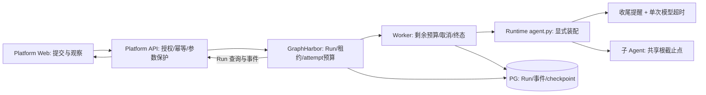

# Agent 运行生命周期超时治理 - 整体方案

> 状态：partial，仅剩T11前端与联合Final。正式post42已发布/锁定/冷安装，完整12组平台HTTP、Worker接管及R01-R04匹配版本回退通过；实际证据见verification.md，原失败轮次保留。

> 2026-10-07 用户修订：GraphHarbor 必须按 LangGraph Server Worker 实现；本方案已改为每 attempt 预算，取代原“同 Run retry/重启不续期”。对照与证据边界见 [官方 Worker 对照](langgraph-worker-parity.md)，修订实施/验收由 T13 跟踪。

## 背景与目标

当前项目已经拥有单次模型超时、GraphHarbor 执行尝试硬限、取消、checkpoint 和前端 timeout 展示。缺口是软收尾、共享受信 attempt 预算及对官方 Worker 超时/重试/停机语义的验证；重试获得新 attempt H 本身符合官方源码。

本期目标：每个 Worker attempt 有服务端唯一时间预算，主/子 Agent 在硬限前得到通用收尾提醒；超时终态可查询，重启在当前 Run checkpoint 上恢复，断流/审批不误判或重复提交。

## 1. 时间语义与建议默认值

| 名称 | 建议定义 | 责任方 |
| --- | --- | --- |
| Run | GraphHarbor 的一个 `run_id`；一个 Thread 可以产生多个 Run | GraphHarbor |
| H：硬限 | 每个 Worker attempt 的上限；平台沿用 `GRAPHHARBOR_RUN_TIMEOUT_SECONDS`，通用底座支持 `BG_JOB_TIMEOUT_SECS`，未配置默认 86400 秒 | GraphHarbor |
| G：收尾预留 | `AGENT_RUN_WRAPUP_RESERVE_SECONDS`，建议默认 120 秒；0 表示关闭软提醒 | Runtime |
| 收尾开始 | `soft_deadline = hard_deadline - G`；G > 0 时必须 G < H | Runtime |
| M：模型调用上限 | 原 `AGENT_MODEL_CALL_TIMEOUT_SECONDS`，默认 600 秒 | Runtime 模型 middleware |
| 初始 pending | 首次执行尚未开始，排队时间不计入 H | GraphHarbor |
| retry/requeue | 同一 Run 的下一 attempt 从 checkpoint 继续并重新计 H；排队/退避/停机不累计 | GraphHarbor |
| HITL | 原 Run interrupted，不在人工等待期间保持执行计时器；resume 创建新 Run、新预算 | 原生 Run / 平台 resume |
| Run/Thread/任务总限 | 跨 attempt 或多个 Run、人工等待的累计截止时间 | 官方本切片未提供，本期不实现 |

H 的现有示例是开发 1800 秒、容器 300 秒。本期建议保留现有 H，先统一语义和配置关系，不直接把生产时长改成 45 分钟。若要全环境统一到 1800 秒，需要评审明确批准配置变化。G=120 时两个示例分别在 1680 秒、180 秒进入收尾窗口。

G 必须是有限非负整数；H 是有限正数，正式配置验证沿用整数秒，隔离 GraphHarbor 测试可使用小数秒。非法配置应启动预检失败，不能静默回退到 2700 秒或在缺少硬限时承诺已治理。M 可以大于 H，实际执行由更早到达的模型超时或 Worker 硬限结束。

2026-10-07 用户明确选择官方 Worker 语义，取代 10-06 的跨 attempt 总限。累计任务预算不在本期，不保留额外总限模式。

## 2. 整体架构与职责

| 层 | 必须负责 | 开发判断 |
| --- | --- | --- |
| platform-web | 展示服务器状态、现有停止动作、断流核实、保留消息和产物 | 必须交接和回归；必要 UI 改动交同事，不让前端决定 timeout |
| platform-api | 当前权限、拒绝客户端预算注入、私有字段脱敏、原生 Run 状态/错误透传、幂等恢复 | 在现有网关补保护/测试；不新增运行表、监控循环或强杀接口 |
| runtime-service | 解析 Worker 预算、显式装配收尾 middleware、共享主/子时钟、模型错误类型和资源取消传播 | 本期主要平台仓库实现范围 |
| GraphHarbor Worker | 每 attempt 硬限、故障重试与checkpoint接管、取消、租约和唯一终态 | 独立依赖源码对齐官方语义，提供私有预算桥接 |

不能用网关 HTTP read timeout、SSE 的 45 秒闲置重连、前端定时器或 Delegation JWT 的 exp 代替 H。订阅断开不取消 Run，已接受的 Run 不因委托过期被本项目新增规则取消。

## 3. GraphHarbor 通用增强与依赖门禁

以下路径相对 **GraphHarbor 的 `libs/langgraph-runtime-pg/src/langgraph_runtime_pg/` 包根**；独立源码及测试入口已核对，保留原有cron工作。正式post42已随取消专项发布，本轮从PyPI冷安装并接入平台，不修改site-packages。

| 位置 / 符号 | 建议改动 |
| --- | --- |
| `run_store.py:RunRepository.create/claim_next` | create 拒绝内部预算注入；每次 claim 在原 Run 锁/事务内刷新 attempt H/开始/截止，递增 fencing generation |
| `production_worker.py:ProductionWorker.run_once` | 使用剩余预算包住图工厂、模型连接兑换、工具初始化和 graph invocation；到期不启动新执行；复用 `RunTimedOut` 分支落库 |
| `run_store.py:RunRepository.fail/requeue_expired/requeue_for_shutdown` | DB故障/reaper有界重试；checkpoint drain归还attempt额度；不将旧attempt deadline到期当成待恢复Run终态 |
| `production_worker.py:_run_timeout_seconds/_drain_grace_seconds/_is_infrastructure_error`、`run_state.py:transition` | 官方配置/默认与别名；模型/provider超时落error；重试次数与租约代次分离，复用retry_counters，不新增Schema |
| `graph_executor.py:thread_config/invoke_graph` | 由 Worker 最后注入只读预算，覆盖/拒绝 Assistant、Thread、Run config 中伪造的同名值 |
| `database.py:run_to_dict`、`ops.py:Runs.get/search` | 隐藏私有预算；本期不生成公开预算快照，保留原生 status/reason |

### 3.1 持久化方式

复用 `RunRow.kwargs` JSONB 保存当前 `__graphharbor_run_budget`：版本、本 attempt 开始/截止时间与 H。每次 claim 更新，供 factory 消费；它不是官方公开 API 或浏览器可提交参数。

- 不新增平台 Run 表、不改 checkpoint schema、不新增独立预算表；沿用已有 `__graphharbor_resume_after_drain` 私有 kwargs 的局部模式。
- 每次 claim 与预算更新同事务，使用原 Run 行锁，避免同一 attempt 被双重领取。
- 只存 UTC 时间和数字，不持久化 monotonic 值、模型凭据或提示词。
- 如果官方维护方要求列级建模，再单独评审 ORM/migration/回退，不直接在平台操作依赖的数据库表。
- 原 kwargs 序列化直接出 Run 对象；已补明确的私有字段过滤并验证 API/SSE/history，不以双下划线命名代替出口保护。

### 3.2 时钟、重试与取消

每次 claim 以数据库时间生成本 attempt UTC deadline；同一 attempt 用数据库时间求剩余秒数并转换为进程 monotonic。新的 Worker attempt 获得新的 H/时钟；graph、子 Agent 和模型请求自身不能重置。数据库/宿主时间异常仍属于部署条件，不能声称 UTC 不受 NTP 影响。

Worker 在传给 graph factory 的 `config.configurable.__graphharbor_run_budget` 注入只读运行快照，含 run/thread 标识、冻结 H、UTC deadline 和当前进程 monotonic deadline。字段名与结构需由 GraphHarbor 评审冻结；它不加入平台的业务 `RuntimeContext` 或 Delegation JWT。图工厂解析完成后，Worker 从交给 `invoke_graph` 的执行配置移除该私有字段，middleware 通过构造参数持有预算，不依赖公开调用配置传播时钟。

状态机不扩大公开集合。当前 attempt 初始化耗尽 H 时走 `running -> timeout`，不打开图；retry/reaper不因旧attempt的deadline结束Run。故障次数耗尽走error；正常drain不占次数且不降低fencing generation。

私有运行快照不进入 AgentState、checkpoint metadata、公开 history、SSE 或外部 tracing payload。锁定 LangGraph 的 checkpoint metadata 提取会排除 `__` 字段，但这不自动保护其他序列化出口；必须逐出口实测。Runtime 解析后从绑定 graph 的公开配置中移除该字段，主/子 middleware 通过同一不可变对象持有本进程时钟。

硬超时继续使用执行/cancel/shutdown task 与原生终态路径。当前 attempt 的 drain 不延长 H；后续领取生成新 attempt，旧租约不能覆写新 owner 的 checkpoint/终态。所有 Worker 不可用时不会即时持久化终态，恢复后由 lease/reaper 与有界attempt策略接管。

各次等待都即时计算 `max(0, monotonic_deadline - now)`；shutdown drain 使用 `min(drain_grace_seconds, remaining)`，耗尽预算走 timeout，不能以 shutdown 为由重新给完整 grace 或 H。

取消是协作式的：`task.cancel()` 不能强杀阻塞事件循环、忽略 CancelledError 的协程、同步线程或远端供应商任务。必须验证本项目受支持的 async 模型、工具和 Docker 路径；发现阻塞/残留就作为门禁失败处理。外部任务状态未知时保留 unknown，不声称取消成功或盲重试。

### 3.3 正式发布门禁

post41 已有每次尝试硬限，但没有受信 attempt 预算桥接及本轮模型错误/handoff语义修正；当前Runtime组合仍不能直接配post41部署。

middleware、平台保护及正式包链路已完成；PyPI四产物哈希匹配发布清单，Runtime的pyproject/uv.lock均post42，其余依赖版本不漂移。API/Worker一致的冻结环境通过12组HTTP和匹配版本回退；前端交接已更新。同事仍需完成F01-F10与联合Final；新Runtime与post41不属于可部署组合。

## 4. Runtime 代码补充位置

以下文件相对 `apps/runtime-service/`。除依赖锁定外，下列 Runtime 能力已实施；符号与测试证据见 implementation/01-budget-and-wrapup.md。

| 文件 / 符号 | 改什么与原因 |
| --- | --- |
| 新增 `src/runtime_service/runtime/run_budget.py:RunBudget/read_run_budget` | 最小不可变 dataclass 与纯解析：校验版本、有限数值、run/thread 匹配；承接 Worker 预算，不访问数据库、不创建定时器 |
| 新增 `src/runtime_service/middlewares/timeout_wrapup.py:TimeoutWrapupMiddleware` | `awrap_model_call` 比较共享 monotonic soft deadline，追加通用指令；不修改原请求、不改运行终态、不负责业务保存 |
| `src/runtime_service/middlewares/__init__.py` | 沿现有导出方式暴露收尾 middleware；组合根仍显式声明装配，不增加自动注册 |
| 同文件 `TIMEOUT_WRAPUP_INSTRUCTION` | 短通用常量：报告已完成、未完成、产物路径及后续动作；停止新调查；不声称未核实操作已成功、不因收尾越权或免审批 |
| `src/runtime_service/middlewares/model_call_timeout.py:ModelCallTimeoutMiddleware.awrap_model_call` | 定义继承 `TimeoutError` 的 `ModelCallTimeoutError`；仅当本 middleware 的 timeout scope 确认 expired 才转换，provider 自身 TimeoutError 与 CancelledError 保持原语义 |
| `src/runtime_service/services/dearflow_agent/agent.py:get_agent/middleware` | 根 factory 读取一次预算；主 Agent 与 researcher 注入同一个值；保持执行 key 过滤、授权、模式和调用次数限制 |
| `src/runtime_service/services/demo/showcase_demo/agent.py:get_agent/middleware` | 同样消费共享预算；子 Agent 通过现有 `build_subagents` 参数装配，不造通用 Builder |
| `src/runtime_service/services/reference_agent/agent.py:get_agent` | 接入同一原子 middleware，与现有显式 retry/fallback 顺序组合验证 |
| `src/runtime_service/services/demo/workflow_demo/agent.py:get_agent/model_agent_for` | 在外层 factory 固定预算，内部模型 Agent 再构建也不重置；审批产生新 Run 时接受新 Worker 预算 |
| `src/runtime_service/runtime/resolver.py:reject_untrusted_configurable` | 必要时验证预算形状与受信身份；不能仅因字段以下划线开头就信任客户端。真正防注入在平台和 Worker入口完成 |
| `scripts/validate_runtime_config.py:validate` | 校验 H/G 和启用条件；schema/probe 构图不计时、不申请外部资源 |
| `.env.example`、`deploy/.env.runtime-service*.example` | 注明硬限与收尾窗口关系，G 默认 120，G=0 关闭提醒；不引入 `AGENT_RUN_TIMEOUT_SECONDS` |
| `deploy/docker-compose.runtime-service.yml`、`deploy/docker-compose.runtime-service.host-infra.yml`；另核对仓库根 `deploy/docker-compose.stack*.yml` | 核对 API/Worker 环境来源；根级 stack 显式 environment 要传新参数。只有遗漏时补映射 |
| `pyproject.toml`、`uv.lock` | 已锁定正式post42双包并从PyPI冷安装/冻结同步复验；只升级这两个包及产物信息 |

### 4.1 middleware 顺序与实例边界

建议相对嵌套顺序：`RuntimeConfig -> 已有 fallback/retry（仅原来启用者） -> TimeoutWrapup -> ModelCallTimeout -> provider`。官方 Deep Agents 自带 middleware 仍保留；最终以锁定版本真实组合测试为准。

重试/fallback 每次向内调用都重新检查软截止点，避免整轮重试只做一次提醒判断。RuntimeConfig 必须先完成授权/工具裁剪；收尾不放宽权限。短 prompt 在原有结构上追加，不替换已有业务规则、缓存块或多模态块。

预算作为当前 Worker attempt 的不可变值在组合根解析，子 Agent 共享。正式执行缺少或出现非法 Worker 预算时明确失败，不悄悄用构图时间代替；schema/probe 模式不装配计时，已有本地单测可以显式提供预算或关闭提醒。middleware 不用全局计时器、不建 `{run_id: _start}` 永久字典、不在 `abefore_agent` 无条件重置。AgentState/checkpoint 不保存进程 monotonic，也不让 Thread 后续回合继承旧 deadline。

### 4.2 软收尾的实际保证

到达 soft deadline 后的模型调用收到一次通用提示；同一请求经过多层或重试不得重复插入。模型应给出部分成果和未完成项，但 prompt 不能保证遵守。

若模型调用或工具跨过软窗口，或者 graph factory 就耗完硬限，可能没有任何机会再发模型请求，此时 Worker 直接 timeout。这不是“优雅总结已完成”。单元/链路测试必须包含该场景。

首期不新增工具禁用模式或强制保存工具，不自动批准 `write_file/present_artifacts`，也不在取消之后再启动一条总结 Run。已有文件和完整 checkpoint 保留；正在写入的未提交内容、远端执行成功与完整最终报告均不作保证。

### 4.3 模型超时与 Worker 重试

官方 Worker 将图内 TimeoutError 与自身硬超时区分。本次按用户要求修正 GraphHarbor：`ModelCallTimeoutError`/provider TimeoutError 沿 graph 已有 retry/fallback，未被 graph 恢复时落error，不自动重跑整图；`RunTimedOut` 才表示当前attempt硬限并落timeout。

受支持的瞬时数据库错误和显式 RetryableException 才进入 Worker 有界重试；普通应用 ConnectionError/OSError不算DB故障。没有Runtime专有类名判断。前端仍以持久化Run状态为准，不能凭异常类名推导终态。

## 5. Platform API、契约与前端

平台文件从仓库根开始：

| 位置 | 必须检查/补充 |
| --- | --- |
| `apps/platform-api/src/platform_api/core/runtime_contract.py` | Protocol/标准 Run 保持配置白名单，拒绝私有预算/系统 prompt 覆写字段；input 或普通消息内容不能作为受信预算来源，不使用字符串黑名单 |
| `apps/platform-api/src/platform_api/modules/runtime_gateway/application/service.py:_execution_config/_normalize_protocol_lifecycle_frame` | 保留公开 config 白名单；保留原生 timeout status，不将 SDK completed 标签当作任务全部成功；resume 不允许覆写预算 |
| `apps/platform-api/src/platform_api/modules/runtime_gateway/presentation/http.py:_redact_event_value/_redact_sse_frame` | 新私有 kwargs/config 字段不泄漏；不新增公开预算。既有 ACL 和帧边界处理复用 |
| `apps/platform-api/tests/test_runtime_gateway_runtime_contract.py`、`test_runtime_gateway_event_redaction.py`、`test_run_requests.py` | 覆盖全部入口、内外错误区别、幂等恢复与脱敏；仅测试不能替代真实 Worker 终态 |

建议保持现有 20 条普通 Run 路由，无新 timeout API。SDK 的 Run JSON `status` 保持 `pending/running/success/error/timeout/interrupted/...`；`wrapping_up` 不加入 RunStatus。

本期不生成或暴露 `Run.metadata.execution_budget`。私有 monotonic/config/持久对象不透传，也不新增 custom SSE 提醒事件或前端倒计时；前端只消费现有 Run 事实。以后确有预算展示需求再独立批准公开契约。

前端已有 timeout 显示，原则上只需回归；必要时调整状态说明与模型错误类型展示。所有改动位置、样例和场景见 [前端交接](frontend-handoff.md)。同事负责 Web 源码与浏览器验收，本轮不修改前端代码。

私有预算保护和既有终态语义同步到Runtime开发标准与平台网关标准，并注明匹配的post42组合。沿用HTTP错误映射和JWT；预算没有新增SSE事件。取消专项新增的停止确认事实沿现有生命周期透传，不能由cancel ACK或GET interrupted替代；本项目不把其他SSE/JWT草案整体标为active。

平台cancel成功仍为HTTP200 `{"ok":true}`；默认是受理ACK。确认停止需同一路径的JSON body `{"wait":true,"action":"interrupt"}`，或目标Run的 `execution_stopped=true` 终态事件。平台路由不转发SDK query wait/action；原生未确认503按既有映射为平台502，网络等待超时为504，均保持待核实。具体前端流程见交接。

## 6. 关键边界行为

| 场景 | 预期 |
| --- | --- |
| 普通短任务 | 不注入提示；现有回答、工具、审批和 artifact 行为不变 |
| 收尾窗口内正常回答 | Run 仍可 success；这只表示图正常结束，回答必须诚实列出未完成内容 |
| 硬限到达 | Worker 取消执行，原生 timeout 唯一落库；前端核实后释放 busy，保留已确认消息/产物 |
| 用户停止与硬限竞态 | 以服务端首次提交的合法终态为准；当前停止是 `interrupted + cancel_requested`，不会与 timeout 来回改写 |
| 单次模型耗时到 M | graph已有policy可重试/回退；未恢复则error，Worker不重跑整图；若本attempt硬限先到则timeout |
| 重连/切页/关浏览器 | 同一 Run 继续，预算不刷新；新连接不创建 Run |
| HITL 等待 | 原 interrupted 保留，不能为了收尾自动批准；新 resume Run 有新 deadline |
| 同一 Run DB重试/Worker 接管 | 从当前Run checkpoint继续，领取新attempt H；旧attempt已过期不阻止接管；故障次数耗尽则error |
| 下一回合或下一 cron occurrence | 新 run_id、新预算；旧终态/旧 deadline 不影响它 |
| 收尾期间追加消息 | 不重置预算；消费与回执沿用现有队列。未消费或外部 ACK 未知明确保留，不自动作为新请求重发 |

## 7. 验证、实施与回退

实施阶段：人工评审 -> 通用依赖契约/实现 -> Runtime/平台确定性验证 -> 正式包隔离链路 -> 同事 Web 联验 -> Final。具体文件、用例和命令见 [任务](tasks.md) 与 [验证](verification.md)。

当前attempt H不在执行中热更新；下一次Worker领取使用该Worker配置的H。旧Run被新Worker接管时生成当前attempt预算，不推断历史开始时间，不按created_at累计超时。

回退分两种：

1. 关闭软提醒：G=0，新图恢复原prompt；当前attempt硬限仍由Worker执行，历史checkpoint/终态保留。
2. 回退版本组合：暂停新提交，先drain/核实在途，再同时回退Runtime代码和已验证双包。R02-R04已在隔离环境完成：post42交接后旧Runtime/post41从同Run checkpoint继续，排队Run与历史/工作区保留，普通/取消/HITL通过。新Runtime不能只降依赖为post41；旧Worker恢复旧模型错误重试/drain额度限制，混合版本不享有新保证。

本方案没有SQL migration，JSONB私有字段可保留供恢复；不得为回退删除历史checkpoint、工作区、终态或队列数据。用户已另行授权本机依赖发布；正式包复用取消专项的发布结果，现役/远端部署和生产配置变化未执行。

## 8. 人工评审清单

- [x] 10-07用户明确选择官方Worker attempt预算，取代10-06同Run不续期决策；排队/HITL/新Run按第1节处理。
- [x] H 使用现有配置，G=120 秒，0 关闭软提醒；没有新增 45 分钟总限。
- [x] 软提醒为 best effort，收尾不代表业务目标完成，不自动审批或补发总结 Run。
- [x] 批准 GraphHarbor 通用私有预算及独立源码实现；本期没有公开预算投影。
- [x] 前端由同事实现；真实浏览器联验仍属于最终验收门禁。
- [x] 用户另行授权正式依赖发布；post42已发布，Runtime锁定/冷安装/隔离API-Worker组合与完整匹配回退通过。现役重启/远端部署不属于本轮执行。
