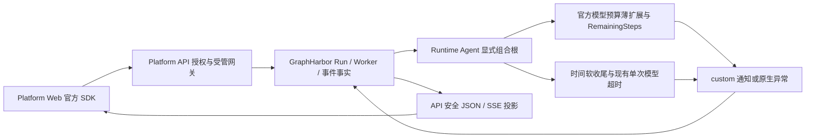

# Agent 执行预算 - 整体方案

> 状态：2026-10-07 用户已批准；本轮非前端范围 done，整体 partial（仅同事前端与三服务浏览器联合验收待完成）。新增类、函数、字段和错误码已实施，证据见 verification.md。

## 目标与成功标准

1. 支持通用 `create_agent`/`create_deep_agent` middleware 接入；自定义 StateGraph 有明确的最小适配方法。
2. 模型调用和图 superstep 进入预警区间时，用户看到一次可识别的告警，下一次模型请求得到幂等收尾指令。
3. 硬限制即使跳过 after_agent，仍通过原生 lifecycle/error 返回安全的限制原因；有 custom 事件时补计数和范围。原生 Run GET 用于终态核实，不假设它有 error 字段。
4. 保留当前 hard cap、`end/error`、Thread 累计、审批、取消和权限策略；告警发送失败不使正常执行失败。
5. 前端同事能按固定契约完成接入；真实三服务、父子图、重放、HITL、取消和回退验收可执行。

## 预算口径

| 预算 | 计量与所有者 | 重置/终止语义 |
| --- | --- | --- |
| graph steps | LangGraph `RemainingSteps` / `recursion_limit`，计 superstep | 当前图执行的 managed value；超限抛 GraphRecursionError；不是调用次数 |
| model calls / run | 官方 `run_model_call_count`，run_limit | 锁定版本用 UntrackedValue；每次 invocation 重置；按现有 end/error 退出 |
| model calls / thread | 官方 `thread_model_call_count`，thread_limit | checkpoint 持久累计；重建 middleware/发下一条消息不能重置 |
| tool calls | 已有官方 ToolCallLimitMiddleware | 保留现有 run/thread/特定 task 限制；本期补触限原因，不新增近限工具预警 |
| model call time | 已有 ModelCallTimeoutMiddleware | 单次 handler 耗时；timeout/cancel 继续传播 |
| Run hard timeout | GraphHarbor Worker | 由 GRAPHHARBOR_RUN_TIMEOUT_SECONDS 控制，涵盖 registry.open 和执行；缺省关闭 |
| soft wrapup time | 本期 TimeoutWrapupMiddleware | 从当前 Agent invocation 进入执行时计时；在模型边界检查；不是 Worker 剩余时间 |

官方 model count 记录完成的模型迭代，不等于 SDK retry/fallback 的 HTTP 次数或 Token 费用。不同 graph/子 Agent 的 superstep 和调用预算也不能相加后冒充统一总预算。

## 整体链路



没有新增 REST endpoint、数据库表、Delegation operation 或用户可写的预算配置。客户端继续只提交现有 `recursion_limit`；模型/Thread 预算由组合根现有参数提供。

## Runtime 设计

### 1. 复用官方限制器，补通知

新增 `R/src/runtime_service/middlewares/execution_budget.py`：

- `ExecutionBudgetState` 继承官方 `ModelCallLimitState`，增加私有 managed remaining 与告警 latch。锁定版本已验证声明为 `remaining_steps: Annotated[int, PrivateStateAttr, RemainingStepsManager]`，manager 必须在注解最后；裸 RemainingSteps 会进入 InputSchema 导致构图失败，把 PrivateStateAttr 放最后则无法得到 managed 值。保持官方 run/thread counters 及其 UntrackedValue/PrivateStateAttr 语义。
- `ExecutionBudgetMiddleware` 薄扩展官方 `ModelCallLimitMiddleware`，替换组合根里对应实例。构造参数继续接收当前 run_limit、thread_limit、exit_behavior；不再解释一次环境变量或模式配置。
- `before_model()` 先调用官方实现。在官方返回 `jump_to="end"` 时产生 reached 通知；在精确 `ModelCallLimitExceededError` 时通知后重新抛出原异常；正常分支才评估 approaching。
- 官方 async 路径当前委托 `self.before_model()`；子类必须保留 `hook_config(can_jump_to=["end"])` 和 state schema。用真实 compiled graph 验证 sync/async，不能只 mock 方法或复制官方算法。
- `wrap_model_call()/awrap_model_call()` 复用同一请求转换函数，在下一次实际模型请求的 system message 中追加通用收尾指令。使用官方 request override；保留原内容块和 metadata，重复经过 wrapper 只注入一次，不为同步/异步各写一份判断。
- `build_budget_notice()` 构造固定白名单数据；`check_graph_budget()` 给自定义 StateGraph 节点使用。它们与 middleware 放同一文件，不新建 registry、事件总线或接口工厂。

不从最后消息匹配英语短语，不写第二套计数，不修改官方异常类型或限制值。自然回答恰好用完最后一次模型调用但没有再请求下一次调用，不应标成“因限制停止”。

`end` 的官方人工 AIMessage 可由该薄扩展追加 `additional_kwargs.runtime_budget_notice`，内容与 reached 通知相同。该标记用于事件过期后的历史显示，正文保留官方含义；只修改官方返回的人工消息，不扫描或改写模型正常输出。此键为服务端保留键，API 写入口拒绝客户端伪造，公开读出口仅保留校验后的通知字段。

### 2. 预警和收尾余量

本期冻结模型余量 3 次、图余量 8 supersteps。真实图及循环边界检查已通过，通知薄扩展与官方限制器的同负载对照均为 2 model calls / 8 supersteps；余量是收尾机会，不保证某个图一定来得及总结。可选软计时增加自身 hook 节点，默认关闭。余量作为组合根参数，无管理页面或新增统一配置系统。

- 模型 remaining 从官方当前 counters 与该实例的实际 limits 求得，分别处理 run 和 thread；thread 先耗尽时必须标 thread。
- 图 remaining 从 managed value 读取，不能用 messages 长度、模型调用数乘二或随意推导 checkpoint step。
- 同一 invocation、namespace、dimension、budget_scope 只发一次 approaching；reached 是另一事件，不被 approaching 去重挡住。
- latch 绑定真实 Run/invocation 和 namespace，不能仅保存布尔值到整个 Thread。旧 Run 的 latch 不抑制新 Run；父子图也不能共享同一个 latch。
- 新 clock/latch 使用 invocation 内 UntrackedValue + PrivateStateAttr；真正的 server Run ID优先来自Worker受信metadata.run_id，不使用model callback UUID。无服务端Run的本地调用可以只保留日志/人工消息，不编造公共Run关联。
- 低 recursion_limit 可能在模型或 middleware 节点运行前就硬失败，此时只保证原生错误出口，不承诺总能预警或生成总结。
- 新 hook 可能增加 superstep；尽量复用原限制器已存在的节点，记录正式四 graph 的实际节点成本，不能机械把 8 认定为充足收尾空间。

收尾指令要求说明已完成/未完成项和可继续的起点，避免新调查或新委派；不要求提交 PR、保存仓库、发送通知或执行未获授权的写工具。它是模型提示，不保证模型服从，也不为生成总结额外开启调用或提升预算。

### 3. 时间软收尾

新增 `R/src/runtime_service/middlewares/timeout_wrapup.py:TimeoutWrapupMiddleware`，复用标准库单调时钟和上述通知/提示内容处理，不增加 timeout dependency。

- 已实施配置 `AGENT_WRAPUP_AFTER_SECONDS`；缺省不启用，显式配置必须有限且为正数。启用时 Runtime 启动校验，非法值不能默默放宽。
- 起点为当前 Agent invocation 进入执行，不是类构造、Thread 创建或第一条历史消息的时间。私有起点用 invocation 内 UntrackedValue，不能跨进程持久化 monotonic 数值。
- Workflow 使用内层模型 Agent invocation 起点，外图 prepare/route、模型准备及人工等待不计入；这是该自定义图的明确接入边界，外图仍独立检查步骤预算。
- 只有模型边界检查达到阈值，产生一次 `wrapup_started` 通知并注入提示词。模型/工具执行中没有新边界时，不承诺实时响铃。
- 主图装配；子图默认不另起同阈值计时器。主图等待子任务的时间计入自己的软计时；子图独立步骤预算继续生效。真要全树共享 deadline 时需要另评审。
- 人工中断结束当前 invocation；resume 使用现有新 Run/调用口径重新计软时间，不将审批等待算成正在执行。
- 现有 `ModelCallTimeoutMiddleware` 和 Worker 硬超时原样保留。软收尾不捕获 CancelledError/GraphBubbleUp，也不在用户取消后追加模型调用。

当前 `Runtime.execution_info` 没有整次 Run deadline。Worker 的超时从构图之前开始，而该 middleware 更晚开始。因此首期展示“运行时间较长，开始收尾”，不能展示“离 Run 超时还有 120 秒”。部署者可把软阈值设得早于硬阈值，但长构图仍可能先触发硬超时。权威 deadline 注入、动态压缩模型 timeout 和新硬定时器不在本期。

### 4. Agent 适配和装配顺序

| 接入类型 | 最小接入 | 验证重点 |
| --- | --- | --- |
| create_agent | 组合根替换官方模型限额实例为薄扩展；按需装配软时间 middleware | 原限额/退出策略不变；没有工具也能使用 |
| create_deep_agent | 同上；主/子 Agent 分别传实际预算，子 Agent 关闭主图软时间计时 | Deep Agents private state 隔离；父子事件可区分 |
| 自定义 StateGraph | 内部 schema 加 RemainingSteps，input/output schema排除managed字段；真实循环/模型前节点调用 check_graph_budget | 外图不能用内层 Agent remaining 冒充；硬错误仍由网关兜底 |
| 无模型循环的 graph | 只接 graph 检查函数和原生错误出口 | 不强制安装模型限额或引入不存在的模型调用 |

四个正式注册 graph 均列入本期：DearFlow、Showcase、Reference、Workflow。Workflow 外图的 `prepare/route/respond` 适配图预算，内层 create_agent 适配模型预算；用内部 WorkflowBudgetState 继承现有公开 WorkflowState，后者继续作为input/output schema。内层模型属于主Agent的实现细节，不是委派子任务；`respond()` 将自己的root writer传给内层组合函数作为明确通知落点，内层primary通知沿root发布，图步骤通知仍标识内/外图自身。只在该已有两层组合根接线，不做通用转发总线。其他教学 graph 不默认重构；提供 Showcase 接入样例与契约测试证明扩展性。

组合顺序维持当前范式：身份/Context/workspace 校验，预算限制，模型错误观测，既有单次模型 timeout，模型调用；工具限制、权限、HITL 和工具容错保留。具体 before/after 的执行顺序按官方 compiled graph 验证，不能只把列表名字排对就认定正确。

使用非流式 `ainvoke` 时通知 writer 可以是 no-op；硬限制仍生效，`end` 人工消息和已有日志仍可读。schema probe 不取计时、不发通知、不访问通知渠道。

## 公共通知契约

运输使用现有 `custom` channel。payload 的 `type` 识别本项，不新增 `custom:budget` transformer。v3 使用 `useChannel(stream, ["custom"])`；普通默认 modes 已加入 custom，显式 modes 仍需包含它。普通 Run 子图流必须创建时指定 `stream_subgraphs=true`（SDK 为 `streamSubgraphs: true`），否则 GraphHarbor 按原规则过滤子图事件；Protocol 订阅须包含相应 namespace/depth。

```json
{
  "version": 1,
  "type": "runtime_budget_notice",
  "notice_id": "budget:run-1:primary:model-run:approaching",
  "run_id": "run-1",
  "scope": "primary",
  "budget_scope": "run",
  "code": "model_call_limit_approaching",
  "limit": 50,
  "used": 47,
  "remaining": 3,
  "unit": "model_calls"
}
```

| 字段 | 约束 |
| --- | --- |
| version/type | 固定 1 / runtime_budget_notice |
| notice_id | 服务端确定性生成，含真实 Run、namespace 的稳定摘要、code、budget_scope；长度上限 256 |
| run_id | 当前受信执行 Run ID，不是 callback UUID；字符串长度 1-128 |
| scope | primary / subagent；namespace 使用原协议外层，保留它以定位具体图 |
| budget_scope | run / thread / graph；不能用 thread_id 作为全局配额 |
| code | 仅允许下表 code，不输出原异常或自由文本 |
| limit/used/remaining | 非负有限数且不超过 JS safe integer，或 null；调用/步骤必须整数；无法取得权威计数时用 null，禁止编造 |
| unit | model_calls / graph_supersteps / seconds，必须与 code 一致；本期工具限额仅有硬错误码 |

| 通知 code | 发生位置 | UI 含义 |
| --- | --- | --- |
| model_call_limit_approaching | 官方模型计数接近实例预算 | 模型调用额度接近上限，准备收尾 |
| model_call_limit_reached | 官方限制器将结束或抛异常 | 当前 Agent 因模型预算停止；Thread/Run 分别展示 |
| graph_step_limit_approaching | managed remaining 进入余量区间 | 图执行步骤接近上限，准备收尾 |
| wrapup_started | Agent invocation 软时间阈值到达 | 运行时间较长，开始收尾；不是超时终态 |

GraphRecursionError/Worker timeout 不要求 middleware 在异常后强发 custom；使用下一节原生错误投影。通知是已观察事实，不是终态 ACK。发送后若随后写 checkpoint/运输失败，可能出现重复或丢失；notice_id 用于去重，不能承诺 exactly-once。

GraphHarbor 继续持久化和重放事件；无需存第二份事件表。410/旧游标失效时走现有恢复流程，使用仍可重放的本Run终态/custom事件或服务端人工消息的结构化标记显示停止原因。post41 的 RunRow/run_to_dict 没有error字段，Thread.error是最新线程槽位，不能归因到任意历史Run；禁止假设Run GET能补回详细分类。事件和消息标记都不可取得时只展示原生Run状态和安全泛化原因，历史approaching也不补猜。若要求过期事件后的每个Run仍有精确原因，需要单独评审持久查询方案，本期不暗加接口/存储。

## Platform API 设计

### 1. 安全错误码

扩展现有 `project_execution_error()`，只对可信上游 error 字典里的精确异常 type 做固定映射，不解析异常正文，也不按字符串 includes 猜。

| 上游精确类型 | 公开 code | 固定安全 message |
| --- | --- | --- |
| GraphRecursionError | runtime_graph_step_limit_reached | Graph step limit reached |
| ModelCallLimitExceededError | runtime_model_call_limit_reached | Model call limit reached |
| ToolCallLimitExceededError | runtime_tool_call_limit_reached | Tool call limit reached |
| RunTimedOut | runtime_run_timeout | Run time limit reached |

其余保持当前安全泛化行为。已有 TimeoutError 不能被映射成整次 Run timeout，因为它可能是单次 provider timeout。字符串形态的 error 保持 SDK 兼容、安全泛化；没有 type 就不声称确知原因。

实际带error的Thread JSON、state/history tasks、普通 error、Protocol/v3 lifecycle、tasks、debug task_result 均已覆盖；Run JSON仅保留实际字段，不添加error。保留原生 status、shape、event/id/seq、namespace 及正常模型/工具正文，API不自行改变父Run状态；子图原异常沿父图传播时仍遵循原生失败终态。

既有 `tasks.error` 清洗缺口已修复。G0 批准保留 `runtime_execution_failed` 下划线码及 `Runtime execution failed` 字符串安全形状；冲突断言同步按批准契约修正。业务 artifact/result 的 error 不按 Runtime 资源错误清洗。

### 2. 事件与内部字段

- 对 type=runtime_budget_notice 的 custom payload，以及 `additional_kwargs.runtime_budget_notice` 人工消息标记，做固定字段白名单和数值/枚举校验；删除未知字段。无关 custom 事件继续按当前规则处理。
- 新增私有 latch/clock 键和服务端 notice 保留键到 `core/runtime_contract.py` 写入口防伪清单；Runtime 的可写输入边界也要复核，不能只靠 `PrivateStateAttr` 限制网络输入。
- `runtime_budget_notice` 标记不是一律删除的内部 key；公开读取保留校验后的数据，写入拒绝。clock/latch/counters 保持内部，不公开计时进程信息。
- 沿用项目/Thread 授权和 v2 委托；不允许浏览器覆盖软计时起点、thread count、退出策略、模型预算或 notice。
- 不在 API 设置 active run 锁、自动重试或更新第二份终态；不从通知更新 run_requests 执行结果。

## 代码落点清单

下表相对于仓库根；非前端路径已实施，前端路径由同事接续。

| 路径 | 函数/类与改动 |
| --- | --- |
| `apps/runtime-service/src/runtime_service/middlewares/execution_budget.py`（新增） | ExecutionBudgetState/Middleware、check_graph_budget、build_budget_notice；官方限制器薄扩展、图预警和通知 |
| `apps/runtime-service/src/runtime_service/middlewares/timeout_wrapup.py`（新增） | TimeoutWrapupMiddleware；invocation 单调计时与 request prompt override |
| `apps/runtime-service/src/runtime_service/middlewares/__init__.py` | 显式导出实际使用符号，保留 __all__ |
| `apps/runtime-service/src/runtime_service/services/dearflow_agent/agent.py` | middleware()/_build_agent() 主子装配，使用现有解析后 run/thread 限额 |
| `apps/runtime-service/src/runtime_service/services/demo/showcase_demo/agent.py` | middleware()/_build_agent() 主子装配与二开样例 |
| `apps/runtime-service/src/runtime_service/services/reference_agent/agent.py` | _build_agent() 保留 end 语义并接通知 |
| `apps/runtime-service/src/runtime_service/services/demo/workflow_demo/agent.py` | model_agent_for() 内层模型预算接线 |
| `apps/runtime-service/src/runtime_service/services/demo/workflow_demo/schemas.py`、`workflow.py` | 内部WorkflowBudgetState与原公开WorkflowState分开；prepare/select_route/respond 的外图检查及内层primary通知root writer接线 |
| `apps/runtime-service/src/runtime_service/observability/diagnostics.py` | safe_fields 白名单补预算安全字段，复用 log_diagnostic/既有 root callback；无诊断 DTO 扩展 |
| `apps/runtime-service/.env.example`、`README.md` | 软阈值配置、默认关闭、四种限制差异与接入示例 |
| `apps/platform-api/src/platform_api/adapters/langgraph/sdk_client.py` | project_execution_error()/redact_runtime_private_fields() 的精确限额映射和通知白名单 |
| `apps/platform-api/src/platform_api/modules/runtime_gateway/presentation/http.py` | _redact_sse_frame() 所有错误槽位与 budget custom 安全投影 |
| `apps/platform-api/src/platform_api/modules/runtime_gateway/application/service.py` | _DEFAULT_STREAM_MODES 及各默认模式装配点、_normalize_payload() 写入防伪 |
| `apps/platform-api/src/platform_api/core/runtime_contract.py` | 保留键写入拒绝，现有公开 config 白名单不放宽 |
| `apps/platform-web/src/modules/chat/budget/`（同事新增） | types.ts/view-model.ts：schema、归并、文案和动作判断纯函数 |
| `apps/platform-web/src/modules/chat/composables/useRunBudget.ts`（同事新增） | SDK custom 订阅与 Run/namespace 投影；不创建第二个 useStream |
| `apps/platform-web/src/modules/chat/components/ChatAgentStatusBar.vue`、`ChatSession.vue`、`SubtaskDetail.vue` | 复用现有提示位和 scoped 子任务显示；状态仍来自 SDK |
| `apps/platform-web/src/modules/chat/composables/useSessionConnection.ts`、`useChatSession.ts` | 只在实际接入需要时透出 SDK handle/流模式，不重构现有会话逻辑 |
| `docs/guides/env-matrix.md`、服务规范、`docs/standards/error-envelope.md`、`sse-event.md` | 已同步真实默认值与新通知/错误码；其他专项未完成的 draft 不毕业 |

测试位置与具体验收见 tasks/verification；前端代码由同事负责，本文列出接口和边界，不代写前端业务实现。

## 风险、上线与回退

- **低步骤预算先失败：** 原生错误出口必须成立，预警和 LLM 总结不作为硬停止的前提。
- **Thread 配额不可续：** 默认不提供“一键继续”绕过线程累计；向用户解释分解请求或联系管理员，不静默清零。
- **子图退出影响父图：** child=end 可让父图处理局部结果；DearFlow/Showcase 保留 child=error，未处理的限制异常会沿父图传播。真实并行场景已验父Run=error；提示归属子图，父Run始终采用原生终态，不能承诺父图必继续。
- **软收尾与硬超时起点不同：** 明确使用软阈值，不显示虚假的硬倒计时；卡住的调用由原有 hard 边界处理。
- **总结或通知落盘失败：** 原始异常继续传播，失败后不偷偷新建模型调用；读取原生终态，诊断导出故障不阻塞。
- **非幂等工具：** 告警/继续/重连不能重发已执行写工具，结果未知时维持既有核对逻辑。
- **上线方式：** 隔离环境验证后分服务交付；旧 Web 忽略新 custom，新 Web 无通知时显示旧错误；不切换 SDK/GraphHarbor 版本。
- **回退：** 组合根恢复原官方模型限制器，关闭软阈值；API 保留安全泛化与必要错误清洗；Web 回退提示投影。没有新增表需迁移，旧 checkpoint 的告警私有键需验证可忽略，不能回退安全修复到原文外泄。

## 实施顺序

G0、T01-T07、T08A 非前端 Final 和 T09 本轮交接收口已完成。待同事 F01-F04 → T08B 三服务浏览器联合 Final，再将整体项目改为 done。每 Task 独立记录 Phase，本轮非前端 Final 与未来三服务 Final 分开，详见 tasks/verification。
