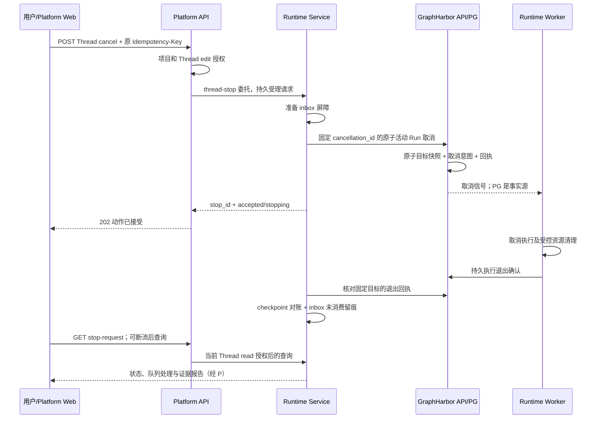

# Agent 运行取消与中断 - 整体方案

> 2026-10-07 用户批准治理方案，非前端源码、唯一post43包版隔离验收与真实Docker已完成。整体blocked：B02正式发布指令/正式源锁接入待完成，前端由同事实施；现役部署另行指定。证据见verification.md。

## 1. 背景与范围

基础 cancel 已有，问题是用户点击 Stop 后，产品未统一说明停止了哪些 Run、后续队列是否继续、Worker 是否真正退出、工具资源是否清理，以及哪些进度已经保存。[源码对照](open-swe-comparison.md)列出了现状和参考项目差异。

本项目将这条链路补齐为通用控制能力；不迁入 Slack、GitHub、Linear、PR、repo、autofix、渠道身份或源渠道通知。其他 Agent 工程能力只列为复用基线，不作为本项目实施任务。

### 必做范围

1. 一个有 Thread edit 授权的会话停止入口，涵盖受理时已接受的活动 Run 和待执行 Run。
2. 固定目标、持久动作回执、同请求重试与恢复，避免旧请求误伤新 Run。
3. 停止意图、Worker 停机确认、工具资源确认分别呈现。
4. Runtime 运行中消息 inbox 的停止屏障、checkpoint 对账与未消费原因。
5. 确定性状态报告，无 LLM、无 graph 执行、无消息注入。
6. 现有 Docker/local/主子图/长工具取消的契约验证及必要修复。
7. 前端同事接入、真实联合验收、故障与回退验证。

### 明确后置

可选 LLM 润色见第 8 节，单独验收，不阻塞确定性报告。`request_drain()` 等当前 superstep 完成的模式、全局 kill、取消独立外部异步任务、撤回已经完成的外部副作用、Slack 通知、模型 fallback、预算治理和通用 Agent Builder 均不在本期。

## 2. 成功标准与停止语义

| 概念 | 本项目定义 |
|---|---|
| Thread | 当前租户/项目内固定的会话，不跨 Thread 扫描 |
| 停止目标边界 | 引擎事务取得该 Thread 的提交/领取边界后形成的活动 Run 快照；服务端记录 `accepted_at` |
| 活动目标 | 快照中 `pending/running` 的 Run，包括排队的 resume；以及已写取消意图、但仍持有执行 lease 的 Run |
| 旧队列处理 | 默认取消该快照内全部待执行 Run，并阻止它们后续启动；保留记录与输入，不删除 |
| 新动作 | 边界之后才被服务端接受的 Run，不属于旧停止请求；另一次 Stop 才能取消它 |
| 重试 | 同一个 actor scope、Thread、Idempotency-Key 与正文复用原 stop_id/目标，不重新按当前状态筛选 |
| `interrupt` | 保留 Run/checkpoint 的原生取消动作；不代表等工具自然结束、撤销文件或外部请求 |
| ACK | 停止意图已持久接受；不等于实际执行或资源已停 |
| 执行确认 | 引擎持久终态事件确认 `execution_stopped=true`，执行 lease 已释放；仅 status 不够 |
| 资源确认 | 工具的受控命令/容器等完成取消清理，有独立证据；不能由执行 task 退出推断 |
| 已保存进度 | 已提交的 root checkpoint、真实工具回执及已发布成果；不把模型表述或中间流 token 当事实 |

### 三个易混淆的行为

- **取消正在运行的任务：** 用本项目会话 Stop。用户的普通文本“停一下”仍是消息，不承诺自然语言自动识别成控制命令。
- **等待人工审批：** 原生 `interrupt()` 暂停。Stop 不自动批准、拒绝或抹掉已持久审批；无活动 Run 时明确报告仍有待处理审批。
- **继续/重新开始：** 用户后续显式动作，重新授权。取消请求和报告查询不得自动触发 `resume`、新消息或旧队列。现有“继续执行”必须覆盖中途工具可能重放的验证。

最后一项具有风险：checkpoint 前已经发生的外部副作用可能被再次执行。现有部署/媒体的结果未知回执应保留；无法证明幂等的工具不得自动重试。首期不新增一个“自动继续”按钮。

## 3. 三层职责与调用链

| 层 | 必要性 | 做什么 | 复用边界 |
|---|---|---|---|
| platform-web | 必需，同事负责 | 发起 Stop、保存动作回执、呈现 stopping/确认未知/已停止与报告，刷新和多端对账 | 复用 SDK controller、ChatSession、run-actions 模式与 useServerPromptQueue；不持有执行事实 |
| platform-api | 必需 | 当前身份、项目、Thread edit/read 授权；签发精确委托；短事务；安全 DTO、审计关联 | `RuntimeGatewayService`、thread_access、现有错误/追踪出口；不直接清 Runtime SQL |
| runtime-service | 必需 | 请求持久化和恢复、引擎调用、inbox 屏障/对账、工具资源记录、确定性进度报告 | `MessageInbox`、`reconcile_run()`、Backend、现有模型 one-shot 模式 |
| GraphHarbor 引擎 | 配套必要 | 原子固定 Run 目标、取消意图、lease/checkpoint fence、终态确认与通用取消回执 | 保持引擎通用；不包含平台 JWT、产品摘要或 Runtime inbox |

“停止完成”不依赖浏览器保持连接；后台收敛只处理取消/对账，不新增 Agent 调度器。

## 4. 原子取消与持久恢复

### 4.1 为什么不能只在 API 循环 list + cancel_many

当前单 Run cancel 和 `runs_cancel_many()` 可复用为底层取消实现，但产品 Stop 还需要原子目标边界：列表分页中可能有 pending 被 claim，旧请求重试时可能看到新 Run，running 取消后队列可能立即开始下一项。Platform API 的内存锁无法覆盖多实例和引擎 Worker。

GraphHarbor 配套源码已增加通用原语及查询面：

- `POST /threads/{thread_id}/runs/cancel-active`，固定 `action="interrupt"`，接收 `cancellation_id` 和原生 scoped idempotency key。
- `GET /threads/{thread_id}/runs/cancellations/{cancellation_id}`，只读固定目标、接受时间和执行退出确认。

它们不是平台公开接口；平台不放通全局 `/runs/cancel`，也不把一个自定义 `thread-stop` token 放行到全部原生资源。

引擎里复用 `_cancel_row()`、`RunRepository`、`record_event()`、控制信号及 `stopped_event()`。新增通用 `RunCancellationRow` 保存 cancellation_id、Thread、原生 principal/key 的 scope、请求摘要、完整目标 ID 快照与 accepted_at。不保存平台身份属性、摘要正文或模型密钥。

取消事务必须与该 Thread 的提交和 claim 串行化；读取全部活动目标后统一提交取消意图。现有锁顺序有“Run -> Thread”和“Thread -> Run”两种路径，因此采用已有非等待锁模式：不能立即锁齐时整单回滚并有界重试，不在持有 Thread 锁时等待 Worker 的 Run 锁。冲突时不形成一半成功的固定快照。

固定目标包括持有 lease 的 `interrupted/cancel_requested` 行，避免第二次 Stop 把仍在清理的 Run 当成“不存在”。普通 HITL 已暂停且无 lease 的 interrupted 行不是活动执行目标。

查询完整快照不得被首页 100 项截断；对外详情按目标分页，计数覆盖全部。多于 100 个 pending 的场景必须实测。回执确认来自引擎持久终态，不依赖 Redis 是否成功广播。

### 4.2 Runtime 请求数据与恢复

Runtime 新增 `runtime_stop_requests`，和现有 Runtime 业务表处于自己的 Alembic 管理边界。保存：

- stop_id/cancellation_id，tenant/project/thread，签名身份对应的 actor scope。
- Idempotency-Key 的 scope/hash、requested_at、engine accepted_at。正文只允许空对象，无需另存正文摘要。
- 收敛步骤、固定目标或引擎回执引用、inbox 对账结果、报告证据游标。
- 后台处理租约/重试时间、安全错误码、最近确认时间。

不存 bearer token、委托 JWT、模型引用、provider 响应正文或整份聊天历史。此表表示控制动作及业务回执，不复制 Run status/lease 状态机。

运行流程：

1. 当前请求授权通过后，短事务复用或建立 stop_request。
2. 在相同 Thread advisory lock 下固定当前 queued/claimed inbox 的 target_run_ids（已有容量上限 100）。仅这些旧目标立即停止领取/追加，409 明确反馈；从准备阶段起也不封锁整个 Thread 的后来新 Run。
3. 调用引擎固定 cancellation_id 的原子取消。重复或丢 ACK 后先读该引擎回执，绝不创建新的取消 ID。
4. 引擎 accepted 后，屏障补入完整固定 target_run_ids；连同原 inbox 对账目标保留，不影响新 Run 的 inbox。
5. Runtime 收敛器核实每个目标的执行退出，再 reconcile checkpoint，最后关闭未消费记录。
6. 成功持久化报告证据与阶段；浏览器不在场也会收敛。

短事务与远端等待分开，POST 持久受理后立即返回。Runtime lifespan 收敛器每秒领取一个待处理动作，45 秒租约/10 秒续租、2 秒重试、每次最多对账 10 个 Run；单个上游 HTTP 等待 10 秒。租约 fencing 防止旧处理器回写，重启恢复，退出清理受管任务。不能依赖一次 FastAPI BackgroundTasks 或未托管 task。

后台只有准备、确认、对账几步，不创建模型/Agent Run。准备失败若引擎尚未提交取消意图，保留失败回执并解除准备屏障；已提交后不能因网络错误撤销意图或恢复队列。每步可幂等重做。

### 4.3 后台授权与撤权

入口继续使用现有项目 Runtime write + Thread edit；查询使用 Runtime read + Thread read。读取他人的 inbox 正文不因能 Stop 而获得授权。

新增自定义 `thread-stop` 和 `thread-stop-read` operation，仅允许对应 Runtime internal 端点。后台准备尚未发送到引擎时，沿现有 scheduled 授权的 HMAC 模式增加当前授权回查 `POST /api/runtime/internal/stop-authorization`，复用签名/窗口校验，刷新精确的短期 native 委托，不存或延长浏览器 JWT。

引擎已经提交的取消意图和 cleanup 必须继续完成，后续撤权只影响再次操作/查询。清理完成不需要恢复已撤销的模型或工具权限。若后台还没提交时权限明确被收回，则标记 denied、解除准备屏障；授权回查超时为可重试不可用，不伪装 403。

GraphHarbor 新原语的授权回调携带服务端 cancel_active 标记和 cancellation_id；Runtime native `run-cancel` 必须绑定 Thread 与 `sha256:hash(runtime-cancellation/v1:<UUID>)`，不能扩展为任意 Thread update/global status 操作。查询使用下述独立 scope。

**接受后后台核实的权限：** 普通 native `read` 仍实时回查 ACL。受信 Runtime 收敛器签发 30 秒 `run-cancellation-read`，仅允许 fixed cancellation_id/Thread/原 principal 的回执；context_hash 绑定 cancellation_id，服务账号仍携带原 credential_id，引擎再核对归属。该 scope 不能读 Run/state/input/output/workspace，不能提出新取消；Runtime 内部用已接受控制动作及既有 checkpointer 对账。公开 GET 仍核对当前 Thread read。R08 已人工批准，隔离真实撤权后收敛与查询拒绝均通过。

## 5. 两种队列分别处理

### 5.1 GraphHarbor 待执行 Run

当前 `useServerPromptQueue()` 已立即提交 Run，并由引擎消费；既有 queue cancel/reorder 使用 expected IDs 的 CAS。产品 Stop 新增的是统一取消当时全部活动目标，不重做这些功能。

取消 pending 只更新该 Run，不写空 Thread state、不删除输入、不丢历史记录。停止后再次发送是新请求、新 Run。未确认的浏览器入队动作保留原 key/body，用原请求对账；如果它在引擎边界前受理，应出现在旧 Stop 目标中，边界后受理则作为新动作显示。

### 5.2 Runtime 运行中 inbox

复用 `MessageInbox` 与 `reconcile_run()`，不按 open-swe 的 Store key 直接删除。

- inbox_run_ids 与引擎 targets 在 `enqueue()`、`claim()` 的数据库边界检查，共用 Thread advisory lock，不使用进程内 bool。拒绝阶段释放屏障；已接受的旧目标继续保留屏障。
- `claimed` 不等于 `consumed`；先读取该 target Run 已提交 root checkpoint 的累计 message_ids。
- 已消费记录保留 `consumed` 和 checkpoint 证据。
- 执行退出确认后，其余 `queued/claimed` 转为 `not_consumed`，reason 明确为 `user_stopped`；已有状态枚举足够，不为此新造消息总线。
- 对账失败继续保留记录并重试，不“清空成功”掩盖错误。
- 查询路径可以触发/帮助对账，但不能是唯一收敛机制。
- 审批型 interrupted 与 user cancel 不再共同被误判成普通 `run_ended`。

旧已经终止但还没有对账的 inbox 行也要收敛：按它们原 target 的持久证据关闭，不能把原成功/失败都改记 `user_stopped`。Stop 覆盖固定活动目标的所有 sender，但报告只暴露计数和当前 Thread read 可见证据，不输出他人的 inbox 原文。

## 6. 所有 Agent 如何适配

### 6.1 无需适配即可获得的能力

所有通过正常受管 Thread/Run 入口执行的图都获得会话停止、动作回执、Run 级 checkpoint 保留、基础证据报告。普通 `StateGraph` 不被迫迁成 Deep Agents，模型无需决定是否调用“停止工具”。

Reference、Workflow、Showcase、DeerFlow 四图都要实际跑取消；至少两个不同业务 graph 验证共用报告没有 graph_id 分支。

### 6.2 已有 Middleware 的适配

挂载了 `MessageQueueMiddleware` 的 Agent 复用其 root-only inbox 机制，增加停止屏障；子图不得领取主图的消息。普通无 inbox 的 workflow 不为此强制装配中间件。

模型/工具错误处理和 retry 必须传播 `CancelledError`、LangGraph 控制异常；用户 Stop 不被转成普通 ToolMessage、模型错误或重试。已有 `ToolErrorMiddleware` 和 `ModelErrorMiddleware` 先验证，只有真实不符才改。

### 6.3 长工具、命令和子智能体

取消资源必须在拥有资源的边界实现：

| 场景 | 适配要求 |
|---|---|
| 普通 async 模型/HTTP 工具 | 传播取消，关闭本次连接；远端已受理请求仍可能执行，报告 unknown |
| Docker execute | 复用现有 shield 清理；验证 rm 超时/失败；将结果记录为 confirmed/unconfirmed，不只写一行 warning |
| local execute | 当前 to_thread 不可终止同步命令；先核对锁定官方 Backend 的真正 async 能力，满足清理则复用；否则在 Backend 等待既有有限超时的线程执行结束后再传播取消，且报告在等待清理；不尝试强杀 Python 线程 |
| 工具生成的受控子进程 | 注册资源、有限超时、取消后的 wait/reap；文件和工作区不删除 |
| 同 Run 内同步调用的子 Agent | 根执行 task 取消需传播到实际子 task，覆盖并行两工具/两子 Agent；不另外建子调度器 |
| 独立 Thread/外部 detached 任务 | 首期不承诺级联取消；报告现有任务 receipt/id 与 unknown，由该能力原有取消接口处理 |
| 用户手动开的 PTY Terminal | 独立于 Agent Run；Stop 不关闭用户终端，现有 Terminal 控制继续有效 |

Runtime 新增最小 `runtime_run_resources` 记录，仅为可取消资源的实际证据：thread/run/resource token、类型、active/cleanup_confirmed/cleanup_unconfirmed、服务端时间。后台/线程返回前登记，结束和取消清理后更新；这样即使资源先完成、停止 HTTP ACK 后到达，也可关联正确 Run。不记录命令正文或宿主绝对路径。local 执行取消最多等待 75 秒，无法确认或进程重启留下 active 时报告未知，不强杀 Python 线程。

基础 Stop 的 `execution_stopped` 只说明 graph task 已停；`resource_cleanup` 独立显示。发布前，生产支持的 Backend 必须达到 confirmed/not_required；不支持的外部副作用仍允许 unknown，但不得提示“所有外部操作已撤销”。

## 7. 状态报告与可见契约

### 7.1 状态模型

这是控制动作的回执，不替换官方 SDK Run 状态：

| phase | 含义 | 用户反馈 |
|---|---|---|
| accepted | Runtime 已持久受理，可能尚未获得引擎快照 | 停止请求已提交 |
| stopping | 引擎目标已固定，等待执行/对账 | 正在停止 |
| stopped | 固定目标执行退出、inbox 对账完成、资源 confirmed/not_required | 已停止 |
| no_active_run | 引擎边界上无活动目标，遗留 inbox 对账完成 | 当前没有运行中的任务；审批存在时同时提示 |
| confirmation_unavailable | 引擎无法证明实际退出，或资源/对账长期无法核实 | 停止结果尚未确认；保留回执供继续核实 |
| rejected | 引擎提交前明确授权或请求失败 | 停止请求未被接受 |

网络错误不自动进入 rejected；租约被 fence 但没有 execution_stopped 确认必须显示 confirmation_unavailable。后续恢复可收敛为 stopped，不能看到 interrupted 就提前结束。

### 7.2 必做确定性报告

`runtime_service/run_control/report.py` 只读生成版本化 DTO，首期固定上限，超过时标记 truncated：

- stop_id、thread_id、requested_at、accepted_at、confirmed_at。
- target_count、pending_cancelled_count、inbox consumed/not_consumed 数量，准备阶段可为 null。
- execution_stopped 布尔/未知，resource_cleanup pending/confirmed/unconfirmed/not_required。
- has_pending_interrupts，不返回审批的私有内容。
- progress：最近已提交 root checkpoint ID/time，最多 20 项存在于 state 的标准 Todo，最多 10 个实际工具完成证据，最多 20 项通过原有权限过滤的成果引用。
- uncertainties：未完成工具、外部结果未知、没有可识别业务进度等安全原因码。
- source 为 checkpoint/receipt，message_id/run_id 保留；本期不扫描整个工作区或假设各 graph 都有 todos/artifacts。

按目标 Run 的 checkpoint 取证，不能让后续新 Run 的 state 覆盖旧请求报告。没有 checkpoint 就说明尚未保存；只有进度 checklist 就叫“已保存计划状态”，不声称真实任务已完成。报告不从 Langfuse 推断业务事实，也不把模型文本解析成完成断言。

报告显示为运行状态提示/详情，首期不插入 graph messages，不影响下一轮上下文、记忆提取、推荐问题或最新业务 Run。

### 7.3 已实现 API 契约

| 方法 | 平台公开路径 | 权限与响应 |
|---|---|---|
| POST | `/api/langgraph/threads/{thread_id}/cancel` | Runtime write + Thread edit；必须 Idempotency-Key；正文空对象；202 回 StopRequest |
| GET | `/api/langgraph/threads/{thread_id}/stop-requests/{stop_id}` | Runtime read + Thread read；200 当前回执/报告，Cache-Control: no-store |
| GET | `/api/langgraph/threads/{thread_id}/stop-requests?limit=20&cursor=...` | Thread read；分页动作列表，供刷新/多端恢复；无原始 key/actor 私有信息 |

列表按 Runtime requested_at/stop_id 倒序，limit 1–100，cursor 为不透明稳定游标。POST 正文严格为空对象，任何新增字段返回 422；同 actor/credential/Thread/key 复用原动作。非法 UUID、未知或重复 query 字段均 422。未授权沿现有 401/403/404 策略；Runtime 的 503 存储故障公开为 502 stop_storage_unavailable，平台配置失败为 503，超时 504。相同 key 重试仍 202，phase 可能是终态。

查询需要重新验证当前权限；跨 Thread/项目的 stop_id 不泄露存在性。平台明确校验 target ownership，不信任客户端 run_ids、时间、completed 字段、context 或 model_id。

响应详情示例见 [前端交接](frontend-handoff.md)。现有 `/runs/{run_id}/cancel` 保留为单 Run 原生操作，工作区等已有调用者不被默默变成清整个队列。

首期不新增强依赖 SSE 事件：前端沿现有 SDK lifecycle 刷新回执，必要时按回执查询；断流也可完成。若增加通知，只能作为已有流的可选提示，正确性仍由持久 GET 保证。

## 8. 可选 LLM 摘要：明确后置

首期报告已经解决“静默停止”。需要更自然的语言时再实现独立的 `POST /stop-requests/{stop_id}/summary`：

- 只使用已经确认的 stop_report 固定证据，不读取后来新 Run 的上下文。
- Platform 按当前模型授权签发独立 `stop-summary-generate` 委托；Runtime 沿 suggestions 的 resolve/build_model/ainvoke 模式调用一次。
- 不构造原 Agent，不绑定工具、MCP、workspace Backend、subagents、inbox 或 graph checkpoint。
- 有限输入、输出与总超时，不回传思维链；超时/失败降级到确定性报告，停止本身不失败。
- 相同 stop_id/model/证据版本复用已生成正文；不宣称任意 provider 的网络请求具备 exactly-once。
- 文本明确区分已保存、进行中、待办和结果未知；不能把 Todo 的 completed 当独立事实确认。

暂不实施、暂不签发新 scope。没有真实使用需求时，确定性报告已经足够。

## 9. 拟修改代码位置

所有路径相对本仓库根；GraphHarbor 行相对配套仓库根。新增名称以批准后的实际代码为准，禁止记录一个不存在函数为“已有”。

| 位置 | 已有入口/拟新增入口 | 计划改动 |
|---|---|---|
| `apps/platform-api/src/platform_api/modules/runtime_gateway/presentation/http.py` | 已有 cancel_thread_run；新增 cancel_thread/list_stop_requests/get_stop_request | 严格 DTO、Thread 路径、Idempotency-Key、no-store |
| `apps/platform-api/src/platform_api/modules/runtime_gateway/application/service.py` | RuntimeGatewayService._load_thread/_thread_upstream | 协调当前 edit/read 授权和受控 Runtime 转发；Session 不跨线程 |
| `apps/platform-api/src/platform_api/modules/runtime_gateway/application/run_control.py`（新增） | StopRequest/StopReport DTO | 请求/响应白名单和安全投影，不增加框架层 |
| `apps/platform-api/src/platform_api/adapters/langgraph/runtime_gateway_upstream.py`、`apps/platform-api/src/platform_api/modules/runtime_gateway/application/ports.py` | 既有 upstream 合约 | 增加实际使用的三项受控能力；不直通 global cancel |
| `apps/platform-api/src/platform_api/core/security/tokens.py` 及当前 operation 定义处 | 当前委托签发 | thread-stop/thread-stop-read 校验；实现前用搜索确认定义所有调用点 |
| `apps/platform-api/src/platform_api/modules/audit/http_resolution.py` | 既有审计路由解析 | 新动作请求及查询资源、请求编号和 accepted 语义 |
| `apps/platform-api/src/platform_api/modules/runtime_catalog/presentation/http.py`、`apps/platform-api/src/platform_api/entrypoints/http/middleware/auth_context.py` | authorize_scheduled_execution 及受信入口白名单 | stop-authorization HMAC 回查；拆出共享签名校验供两个真实消费者，新增路径不依赖浏览器认证 |
| `apps/runtime-service/src/runtime_service/http/run_control.py`（新增） | cancel/list/get endpoints | authenticate、精确 custom scope 和 DTO；不混入 webapp 大函数 |
| `apps/runtime-service/src/runtime_service/run_control/{service,repository,report}.py`（新增） | request_stop/reconcile_stop/build_stop_report | 请求短事务、恢复租约、引擎受控取消、确定性证据 |
| `apps/runtime-service/src/runtime_service/webapp.py` | lifespan/router 注册 | 管理取消收敛器任务的启停，保留现有资源关闭流程 |
| `apps/runtime-service/src/runtime_service/runtime/auth.py`、`apps/runtime-service/src/runtime_service/auth/platform.py`、`apps/runtime-service/src/runtime_service/run_control/authorization.py`（新增） | operation 校验与 native auth callback；scheduled._callback 的签名模式 | 精确新 scope、HMAC 后台回查、原子 native cancel 目标标记、固定回执核实 |
| `apps/runtime-service/src/runtime_service/messaging/inbox.py`、`reconcile.py` | enqueue/claim/reconcile_run | DB 屏障和确认后关闭；消费状态不删除 |
| `apps/runtime-service/src/runtime_service/middlewares/message_queue.py` | abefore_model | 复用 root-only claim，不重复创建新队列 |
| `apps/runtime-service/src/runtime_service/workspace/execution.py` | execute_in_workspace/cleanup | 复用 shield；登记/记录实际资源清理结果，取消继续传播 |
| `apps/runtime-service/src/runtime_service/services/demo/showcase_demo/backend.py`、`services/dearflow_agent/workspace/backend.py` | LocalWorkspaceBackend/DearWorkspaceBackend.aexecute | 共享有限取消等待逻辑或复用合格上游能力；保留安全/工作区边界 |
| `apps/runtime-service/src/runtime_service/db/migrations/versions/`（新增迁移） | Runtime 两张回执/资源表 | 增量迁移及回退，不修改 GraphHarbor Run 表 |
| `apps/runtime-service/src/runtime_service/services/demo/showcase_demo/README.md`、Runtime standards | 当前扩展样板 | 补取消传播、资源登记和报告适配说明 |
| GraphHarbor `libs/langhost/src/langhost/core_api.py`、router 注册 | _cancel_row/runs_cancel_many；新增 cancel-active/query | 原子目标/回执，保留现有单 Run 语义 |
| GraphHarbor `libs/langgraph-runtime-pg/src/langgraph_runtime_pg/{run_store,models}.py` 与 `migrations/versions/` | RunRepository/stopped_event；RunCancellationRow | 固定目标与幂等、通用回执；复用 Worker 退出/fence |
| `apps/platform-web/src/services/threads/session.service.ts`、Chat 模块 | 见前端交接 F01-F06 | 同事接入，当前开发方本轮不改前端源码 |

该清单是文件范围，不强制每个文件都产生 diff。控制异常、Backend、Worker 先验证再改；普通业务 graph 只写必要资源适配，不统一换组合根。

拟新增的聚焦测试入口：`apps/platform-api/tests/test_run_control.py`、`apps/platform-api/tests/integration/test_thread_stop.py`、`apps/runtime-service/tests/services/test_run_control.py`、`apps/runtime-service/tests/runtime/test_run_control_scope.py`、`apps/runtime-service/tests/durable/test_thread_stop.py`、`apps/platform-web/src/modules/chat/run-stop-actions.test.ts`、`apps/platform-web/e2e/thread-stop.spec.ts`。它们验证可观察控制行为；不逐函数复制实现断言。

## 10. 开发范式和标准审查

- Platform API 保持模块化单体：router 解析、service 协调、repository SQL；异步 HTTP 不占数据库事务，DB 生命周期在同线程。
- Runtime 保持 `agent.py` 唯一组合根，显式 Middleware/Backend 装配；不复制 open-swe 的大型 server factory、不新建 Agent Builder/工具注册器。
- Runtime/GraphHarbor 数据归属不变：Run/lease/checkpoint 为引擎事实；inbox/stop_report/资源业务证据为 Runtime；平台授权与审计为 Platform。
- 涉及的标准：API gateway、audit/permission、`docs/standards/{delegation-jwt,sse-event,error-envelope,trace-propagation}.md`、Runtime development。实施和批准后按真实行为同步，不在规划阶段把草案伪装成 active 标准。
- SSE 标准中的旧 `promptQueue drain` 描述与当前 `useServerPromptQueue` 已有差异。本项目只记录依赖与需核对项，不自行裁决/重写已有标准的权限或契约冲突。

## 11. 风险、依赖与实施顺序

| 风险/依赖 | 处理与发布门禁 |
|---|---|
| 持久队列专项 T7 未完成 | 先核实当前安装版本、源码和真实 FIFO/审批/取消行为；不能按旧 FEATURES 行认定全部缺失 |
| 引擎缺少原子取消回执 | GraphHarbor 配套为本方案依赖；不在 Platform 写 SQL 或用内存锁替代；缺能力不发布“生产级停止” |
| cancel status 先到、cleanup 后到 | 持久 execution_stopped 与资源证据分开，GET 报告可恢复 |
| 取消信号、请求 ACK 丢失 | PG 意图/固定 ID 回执为事实；原 key 对账，禁止扩大目标 |
| 锁顺序、分页目标遗漏 | 非等待锁整单回滚；多 Worker + >100 目标真实并发验证 |
| 权限撤销/授权服务故障 | 当前授权、准备前 HMAC 回查；已提交 cleanup 继续；读写范围和故障码不混淆 |
| to_thread 与外部结果未知 | 资源边界有限等待，外部 receipt 保留 unknown；不宣称取消能回滚外部世界 |
| 新 Run 与旧报告/多端竞态 | stop_id 固定目标 + 原 checkpoint 证据；前端身份/Thread generation 保护 |
| 双表迁移与配套包发布 | 隔离库 forward/backward；先完成所有代码/包验证，再按授权做真实迁移/重启 |

进度见[tasks.md](tasks.md)：源码、唯一post43包版16条HTTP、真实Docker/PPTX与7条恢复已完成。双包四产物/冷安装/临时锁接入已验，B02剩正式发布指令与正式源复验；前端与浏览器由同事实施，整体Final未开始。现役部署独立指定。500目标有逐Run线性成本，超时后后台恢复同回执，不宣称秒级大队列停止。
