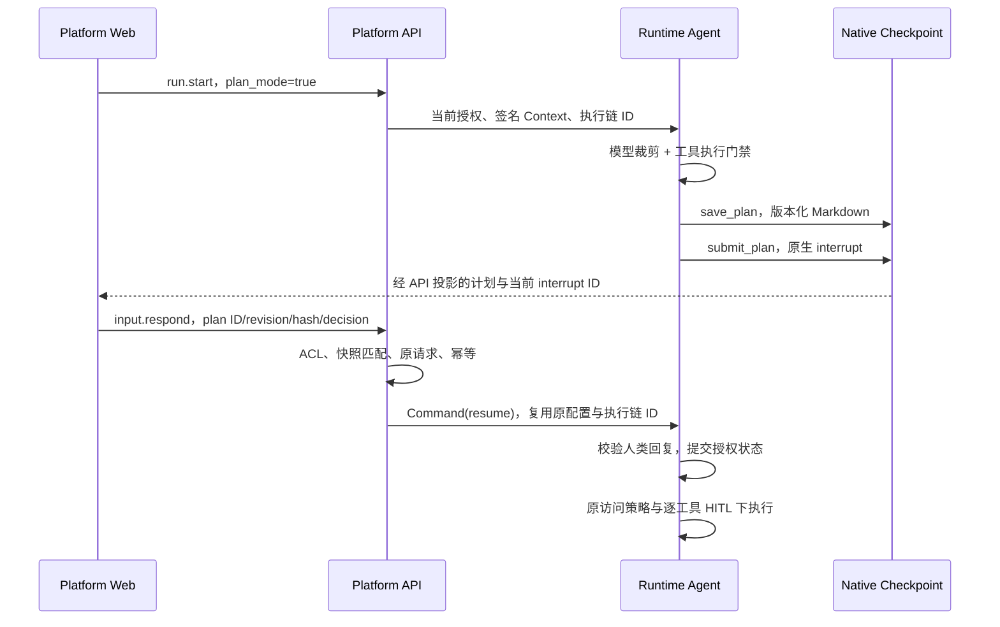

# 整体方案

> 已获治理实施批准的设计基线。Runtime/API 已按本文落地；Platform Web 仍由同事实施，真实三服务验收尚未完成。

## 目标与不变量

1. 用户从 Run 首步选择“先规划”，或模型在执行途中调用 `enter_plan_mode` 后，Agent 只能执行经过审查的调研工具和受控计划操作。
2. 待审计划来自持久 checkpoint 的确切版本；只有当前有 approve 权限的人类可以批准。模型输出、聊天文字、Thread metadata 和客户端 state 更新均不能放权。
3. 批准只解除 Plan Mode 约束，继续遵守 RuntimePolicy、图声明、会话 access_policy、原有工具 HITL、预算和 Workspace 隔离。
4. 所有 Agent 采用同一公共机制，但每个组合根必须明确接线并审查它的工具和隐式副作用。无 workspace 的 Agent 也能存计划和中断。
5. 重启、断流、幂等重试、重复批准、并发批准、新 Run、历史重放与 fork 都不能错误恢复旧授权。

本期不保证模型逐条遵循批准计划的语义，也不撤销 enter_plan_mode 之前的副作用。希望严格先规划的用户必须在首个运行请求中开启；人类独立 Terminal 和人工文件操作沿用原授权，不纳入 Agent 工具限制。

## 分层链路

| 层 | 必须补的能力 | 可直接复用 |
| --- | --- | --- |
| Web，同事实施 | 下一次 Run 的开关、计划中断识别、Markdown预览和三类决定、实时/历史隔离 | ChatComposer/RunOptions、官方 SDK、useSessionInterrupts、run-actions、当前权限/错误/Markdown工具 |
| API | plan_mode 输入白名单、签名执行链、计划回复校验、私有字段拒绝与公开投影、fork/历史恢复防复用、审计 | 当前命令入口、RunRequests、approve ACL、原始配置快照、委托 JWT 和 state/history/SSE 网关 |
| Runtime | 私有状态、三个工具、原生 interrupt、默认拒绝策略、整批检查与执行门禁、隐式副作用限制 | 显式组合根、RuntimeConfigMiddleware、现有 DeepAgents/AgentMiddleware、Worker/checkpoint、预算/取消/容错 |

不新增平台计划表、独立审批路由、JWT operation、GraphHarbor 执行引擎、全局 capability registry 或统一 Agent Builder。新增一个内部 Context 执行标识是授权范围绑定，不替代原生 Run 状态机。

## 三类配置的关系

| 配置 | 职责 | Plan Mode 的处理 |
| --- | --- | --- |
| `execution_mode` | DearFlow 的模型/工具额度、Todo、子任务等执行策略 | flash/standard/pro/ultra 保持；任何一档可选择 Plan Mode |
| `access_policy` | review/workspace_write/full_access 决定逐工具 HITL | 规划时三档都不能绕过写限制；计划批准后恢复原策略，不自动升级为 full_access |
| `plan_mode` | 客户端只请求本次新 Run 增加规划约束 | bool，默认 false；false/缺失不能解除 checkpoint 中尚未批准的规划约束 |

有效可执行工具 = 图实际装配工具 ∩ 当前 Runtime 授权工具 ∩ 当前规划阶段允许工具。普通模式的最后一项为原工具集合；任何集合为空都不能由批准自动补回。

## 状态与执行链绑定

### 唯一事实源

由公共 `PlanModeMiddleware.state_schema` 声明服务端持久字段 `runtime_plan`，只保留当前计划及最近决定，历史版本通过既有 checkpoint history 查看。实际字段用 TypedDict/Pydantic 等现有结构化方式校验，不在各 Agent 自定义一份状态，也不把工具权限记在全局实例属性。

| 内部字段，拟议 | 内容 |
| --- | --- |
| `version` | 1，严格 schema |
| `active` | 规划限制是否开启，只有受信状态转移可以解除 |
| `plan_id / revision` | 服务端计划标识与递增版本；未保存为 0，有效稿为正整数，不接受 bool |
| `title / markdown / content_hash` | 当前快照；未保存时 title/markdown 为空字符串、hash 为 null，保存后 hash 由服务端计算 |
| `bound_execution_id` | 本次 API 已签名执行链标识 |
| `decision` | 最近 approve/request_changes/abandon，及其对应 plan ID/revision/hash |
| `approved_by / approved_at` | 仅由恢复运行的已鉴权人类身份和服务端时间生成 |

未产生计划时为 null；进入规划时建立计划标识和 revision=0 的空草稿。save_plan 才产生 revision=1 的有效正文，submit_plan 和 reply 必须 revision>0 且 hash 非空。批准数据只对绑定的执行链、当前计划版本有效；不能仅凭 active=false 或 approved_by 字符串推导批准。`runtime_plan` 不接受普通 input、update_state、command、metadata 或 configurable 注入，公开 `agent_plan` 也禁止客户端回写。

### 最小执行链标识

拟在 RuntimeContext 增加公开 bool `plan_mode` 和服务端专用 `plan_execution_id`，两者纳入 `runtime-context/v6` 的规范化签名。前者可由新 Run 请求；后者不出现在前端可写 schema，API 负责产生和恢复，Runtime 校验 context_hash 后使用。

- 新 Run：在 RunRequests reserve 前从平台现有项目、Thread、幂等请求身份生成稳定执行 ID，落入该请求的 context_snapshot；不能使用客户端提供值。
- 原生 resume：从原 interrupted Run 的 RunRequests context_snapshot 复制同一执行 ID。所有后续工具 HITL/clarification resume 继续该 ID；真实 Run ID 可以变化。
- Worker 重启/幂等重试：使用同一持久请求快照；Context 的 plan_mode=true 不能在恢复时再次覆盖已经批准的 runtime_plan。
- 普通新 Run：使用新执行 ID；旧批准不可当作新授权。普通模式依旧可按既有授权运行，但未批准的 active 规划约束继续存在；新请求 false 无权清除它。没有待审 interrupt 时，继承 active 的新执行创建新 plan ID/空草稿并清旧决定，旧正文仍保留在历史；同执行 ID 的 Worker 重启或 resume 不执行此重置。
- 新的计划周期：重新 enter/首步启用会清空旧批准并建立新 plan ID；进入状态要可幂等，不能每次 before_agent 无条件重置。

内部 ID 不是秘密令牌；可信性来自服务端注入、签名和不可写边界。若当前锁版本无法可靠区分恢复路径，T01 必须停止接线并提交具体差异评审，不能退回 Thread 全局 bool 放权。

### 逻辑状态转移

| 逻辑状态 | 推导来源 | 允许动作 / 下一状态 |
| --- | --- | --- |
| 普通执行 | 无 active 规划，且未要求首步规划 | enter_plan_mode -> 规划中；其他工具按当前原策略 |
| 规划中 | runtime_plan.active=true，无当前计划 interrupt | 调研、save_plan；submit_plan -> 等待计划审批 |
| 等待计划审批 | 原生 Run interrupted 且当前 interrupt.type=agent_plan_review | approve -> 受控执行；request_changes -> 规划中；abandon -> 保持限制并结束本次运行 |
| 受控执行 | 已批准当前 revision/hash，且执行 ID 匹配 | 恢复原工具集合，再经过原有 HITL；重新 enter -> 新规划周期 |
| 计划已放弃 | 已处理 abandon，active 仍为 true | 本次 Run 正常结束；后续新消息可继续规划，新批准前不执行副作用工具 |

“等待审批”从真实 interrupt 派生，不尝试在 interrupt 前返回尚未提交的 Command(update=awaiting_review)。保存和提交分成两个工具节点：前一个节点先提交草稿 checkpoint，后一个节点只读该快照并 interrupt，恢复时不生成新 revision、不重复保存或外部写入。

停止使用现有会话 Stop。Stop 不批准计划、不自动 resume、不清除规划约束；放弃计划不等于取消独立 Terminal 或 detached 任务。

## 三个通用工具

建议集中于新文件 `apps/runtime-service/src/runtime_service/tools/plan_mode.py`，直接使用官方 tool/ToolRuntime 或现有注入范式，保持少量纯函数与结构化 state，不建工具框架。

| 工具 | 输入 | 状态行为 |
| --- | --- | --- |
| `enter_plan_mode()` | 无客户端授权参数 | 只能增加限制；active 时幂等，执行阶段再次进入则新建计划周期；返回规范 ToolMessage + Command 更新 |
| `save_plan(title, markdown)` | 标题 1-128 字符，正文非空且 UTF-8 不超过 64 KiB | 仅规划中可调用；统一换行，服务端 revision/hash；相同快照保存不增加版本；只更新当前计划 checkpoint |
| `submit_plan()` | 无批准人、无放权 bool、无替换正文 | 读取已提交有效快照，产生 `interrupt(agent_plan_review)`；验证恢复答复后批准、修改或放弃 |

hash 使用服务端 canonical JSON 的 version/plan_id/revision/title/markdown 的 UTF-8 SHA256，输出 `sha256:` 加 64 位小写十六进制；不含时间或批准人。反馈上限 2000 字符，修改请求必填，批准不携正文，放弃可附理由。限制为本期协议约束，评审后可调整，不能由模型/客户端扩大。

request_changes 的反馈与对应快照留在状态/规范 ToolMessage 中；新内容保存会清除旧批准并推进 revision。原稿未变时保存仍幂等，但 submit 必须拒绝该已请求修改的同 revision，不能反复弹出同一稿审批。当前 public capability 只声明图支持；如计划三工具被 RuntimePolicy 禁用，新 Run 的 true 请求应在执行前明确拒绝，自主 enter 不得进入无法保存/提交的状态；已 active 后被撤权则保持限制并安全停止。

三个状态工具必须各自独占一个工具批次。混合 `enter_plan_mode+write_file`、`save_plan+submit_plan`、`submit_plan+execute` 等整批在任何工具执行前拒绝；不是先执行无害项再处理另一项。无论模型提示是否遵守都成立。

abandon 分支验证后记录决定、保持 active 并用官方节点跳转结束根图；T01 必须实测 Tool Command/END 的主图语义，不能让模型收到“已放弃”后继续无限工作。子 Agent 不暴露这三个状态工具。

## 权限与副作用规则

### 模型和执行同时控制

1. `PlanModeMiddleware.awrap_model_call()` 按当前状态裁剪工具，补充简短系统约束；与 RuntimeConfig、budget/wrapup 只取交集。
2. 校验返回的完整 AIMessage tool_calls：未知/不允许工具或状态工具混批，整批拒绝并给安全错误；不把中断/取消异常吞成普通工具结果。
3. `awrap_tool_call()` 在调用 handler 前再次校验实际工具来源、名称、当前 active、执行链和批次。即使模型幻觉、恢复旧 ToolCall、替换 handler，也不产生业务副作用。
4. 状态/批准损坏、来源不可确认、版本不支持时保持限制或失败终态，不能“无法读取 -> 普通模式”。隐式中间件写入使用同一状态谓词。

顺序原则是：受信 Context/Runtime 授权先验证；规划门禁先于真实工具执行、工具 retry 和副作用；原生 interrupt/GraphBubbleUp/CancelledError 保真；原有 ToolErrorMiddleware 不把规划授权失败当可重试业务错误。具体 middleware 列表位置以 T01 锁版本集成测试锁定，不凭类名顺序猜测 wrap 顺序。

### 默认允许名单

复用组合根中实际工具对象，以少量明确声明传入 middleware。声明需绑定第一方受审查实现，不能仅因同名或 MCP 的 readOnlyHint=true 就放行；名称冲突、重复或覆盖公共计划工具应在组装时拒绝。Catalog 可展示能力，不能决定许可。

| 类型 | 规划期行为 | 本仓适配 |
| --- | --- | --- |
| 本地调研 | 可允许受审查 `ls/read_file/glob/grep/read_reference/fetch_documentation` | 保留原路径/项目隔离；读隐藏历史/凭据仍受原限制 |
| 网络调研 | 可允许第一方 search_web/fetch_page/github_query/arxiv_search 等只读业务实现 | 沿用现有网络边界，受控缓存例外见下表；不是任意网络 POST 都算只读 |
| 草稿/Todo/澄清 | 计划三工具、write_todos、request_information | 保留原澄清 interrupt；计划提交不进入普通工具 HITL，原生计划 interrupt 为唯一审批 |
| 记忆/技能读取 | 受审查 search_memory/list_skills/review_skill_package/find_skills | 保留当前 scope 与成本限制；不能变相 import 或持久化 |
| 未知、自定义未审查、MCP | 默认拒绝 | 首期无配置让管理员任意勾成规划可用；后续逐实现审查再扩 |
| 文件/执行/部署/外部变更 | write_file/edit_file/execute/deploy_preview、media 创建、skill 写、manage_memory 等拒绝 | 不解析 shell 文本，不开放路径前缀写入；图表/图片等产物创建默认不放行 |
| 子 Agent task | 规划期拒绝 | 不假定父 state 自动继承；执行期恢复 task 后仍保留子图原权限和计划工具禁用 |

实际允许名单在组合根审查后落定，上表不是自动启用所有同名工具。不存在的工具不补造，不为 Planning 单独放大图原有能力。

### 允许的基础设施例外

| 副作用 | 推荐规则 | 需要覆盖的位置 |
| --- | --- | --- |
| checkpoint、Run/审计、日志、usage、预算计数 | 允许，保持现有限额与脱敏 | 原执行链和诊断边界，不新建异步持久层 |
| Workspace 目录准备、Skills 执行快照、自动摘要/历史 | 允许仅当前内部维护范围；不能写业务工作目录、安装任意包或更新技能记录 | WorkspaceMiddleware、运行准备、summary/offloading 回归 |
| 网络调研证据缓存 `/workspace/sources/` | 允许既有实现的有界受控证据缓存，调用参数不能指定任意写入目标；需实测路径/符号链接/隔离 | DearFlow `tools/search.py:_evidence()`、`tools/github.py`、`tools/arxiv.py` |
| 自动记忆提取/候选持久化 | active 时跳过；计划批准后的执行阶段沿用原规则 | DearFlow `middleware/memory.py:aafter_agent()`，不仅隐藏 manage_memory |
| 人类独立 Terminal、外部人工改文件 | 沿用原权限，明确不由 Plan Mode 控制 | 无新增禁用；审批快照不保证外部文件环境未变 |

因此本能力保证“Agent 未批准不做业务副作用”，不是系统完全零写入。若评审要求连调研缓存都禁止，改用无落盘返回或规划时排除对应工具，不开放普通文件写入来补救。

## 跨服务契约草案

### 启动与 schema

新 Run 可使用 `context.plan_mode=true` 或当前 `config.configurable.platform_runtime.plan_mode=true`。两处同时出现且值冲突则拒绝；只接受真正 bool，拒绝字符串、数字/null；内部字段 `plan_execution_id` 不可提交。resume 只携 response，不能附新 input/config/context。

graph capabilities 增加可选 `plan_mode: true`，只有完成接线的图声明；缺失/false 不支持，请求 true 时明确拒绝，不能静默普通执行。首期适配 Showcase、DearFlow、Reference，并为 Workflow Demo 做明确的外层状态接线：它是独立 StateGraph，`respond()` 动态创建内部 Agent，只传 messages 且只回写 response/messages，不会自动保留内部计划状态。需在原 schema 与 respond 输入/输出中受控传递 runtime_plan，验证嵌套 checkpoint/resume 后才声明支持，不能当 Reference 的别名。

Context v6 双端同批发布，`empty_runtime_context_hash()`、模型上下文签名、原生创建/协议命令、持久 cron 快照和旧 Run resume 都需覆盖。旧持久 v5 快照只在服务端重新鉴权后升级为 plan_mode=false 并生成新执行 ID；不接受外部 v5 token、旧批准或客户端旧 hash 混用。首期无人值守 cron 不支持 plan_mode=true，入口拒绝；不自动批准，也不改原调度审批终态策略。

### 原生计划 interrupt

外层沿用现有 interrupt `id/ns/value`。`value` 的拟议字段为：`version=1`、`type=agent_plan_review`、`plan_id`、`revision`、`content_hash`、`title`、`markdown`、`allowed_decisions=[approve,request_changes,abandon]`。它不是 HITL 的 action_requests/review_configs；不把 `submit_plan` 再加到普通 interrupt_on。

回复是现有 `input.respond.params.resume[interrupt_id]`，内层为 `version=1/type=agent_plan_response/plan_id/revision/content_hash/decision/feedback?`。API 对当前 interrupt 做严格类型、长度、字段集合与确切快照匹配，Runtime 恢复后二次校验；禁止客户端批准人、active、plan_mode、approved 或执行标识字段。完整合成示例见 [前端交接](frontend-handoff.md#冻结契约与合成示例)。

API 复用 `resume:<interrupt_id>` 幂等身份及原始请求摘要。相同 actor/正文重试返回同一提交；另一个 actor、不同决定或同 ID 新正文返回冲突。结果 unknown 时只对账/重试原动作，不另造批准请求。不能用进程内 lock 做多进程放权保证。

### 公开状态与审计

在已授权 state/history/SSE 的可信 state 槽位投影只读 `agent_plan`：version、status、active、plan_id、revision、content_hash、title、markdown、最近 decision，以及可展示的批准人/时间。公开 decision 为 approve/request_changes/abandon/null；内部关联快照不直接复制。status 为 planning/awaiting_review/approved/abandoned；无计划时键可缺失，未保存草稿 revision=0/hash=null/空正文。未批准时 approved_by/approved_at 省略；批准后 approved_by 严格为受信 `{user_id}`，本期无 display_name；批准时间为服务端带时区 ISO8601。awaiting_review 只有当前原生 interrupt 成立时才输出；历史记录可以显示当时状态但不可操作。

原始 `runtime_plan` 和内部 `plan_execution_id`/签名来源在 state/history/SSE、Run/config/error 出口剥离；不随意改写用户消息、工具正文中同名普通文本。Plan Markdown 是用户可读任务内容，不声称能过滤模型自己写入正文的秘密；现有敏感源边界继续生效。

复用当前 log_event/审计关联：记录 scope、run/parent run、plan ID/revision/hash、actor、决定和 outcome；不记录整段计划、原始模型提示或凭据。API 记录收到决定和派发接受；Runtime `runtime.plan.transition_prepared` 表示准备返回 Command，尚非 checkpoint 提交成功，真正批准以持久 state 为准。不能在 unknown 或 prepared 时宣称已执行。正文在既有 checkpoint retention 中保留，不新增永久审计正文库。

### 分叉、重放和多端

- 普通更新/输入禁止所有计划私有状态和内部执行字段；限制性 plan_mode 也只能从新 Run 选项进入，不能用 update_state 设置 false。
- `fork_thread()` 净化计划授权；若来源 checkpoint 含计划，目标仅可保留展示草稿，首次运行强制进入新规划周期。建议用服务端受保护的 `plan_bootstrap_required` Thread metadata 记录仅增加限制的启动要求，首次规划 checkpoint 提交前不清除；它不是批准来源。
- 历史 checkpoint 执行/时间旅行不能复用其中 approved 状态；新执行 ID 不匹配时批准失效，含计划 checkpoint 强制重新规划。只读历史不受影响。
- 待审期间普通新 Run、更新 state/编辑旧输入等不能替代当前审核快照；先明确处理当前 interrupt。普通 inbox 消息不被视为批准，恢复后仍执行原门禁。
- Runtime 重启后当前 interrupt 和计划版本保持；前端刷新/切换只能从当前 state 得到可操作审批，不能从 history 或旧 SSE 批准。

## 代码改动清单

以下均为计划位置，完整路径相对仓库根；新增文件标为“新增”。不因本表顺手重构周边模块。

| 服务 | 文件与函数 / 新位置 | 补充内容 |
| --- | --- | --- |
| Runtime | `apps/runtime-service/src/runtime_service/middlewares/plan_mode.py`，新增 PlanModeState/PlanModeMiddleware | 状态初始化/绑定、模型裁剪/整批检查、执行门禁及共享 active 谓词 |
| Runtime | `apps/runtime-service/src/runtime_service/tools/plan_mode.py`，新增 enter_plan_mode/save_plan/submit_plan | 受控快照、版本/hash、原生 interrupt、回复校验与结束分支；少量纯 helper |
| Runtime | `apps/runtime-service/src/runtime_service/middlewares/__init__.py`、`tools/__init__.py`、`runtime/errors.py` | 必要公共导出与固定错误码；沿当前容错边界传播，不捕获 interrupt/取消 |
| Runtime | `apps/runtime-service/src/runtime_service/runtime/contracts.py:RuntimeContext`；`runtime/resolver.py:parse_runtime_context()/runtime_context_hash()`；`runtime/__init__.py` | bool/内部执行字段、v6 hash、必要导出和严格解析 |
| Runtime | `apps/runtime-service/src/runtime_service/auth/platform.py:_reject_budget_state()` 及 run/update 入口 | 扩为计划私有注入拒绝；服务端签名 Context 例外仅由正常授权路径接收，限制性 bootstrap metadata 禁外部篡改 |
| Runtime | `apps/runtime-service/src/runtime_service/runtime/capabilities.py:graph_tools()/tool_catalog()`；`services/dearflow_agent/capabilities.py:graph_capabilities()` | 三工具声明和 graph 支持能力，不将 capability 当权限 |
| Runtime | `apps/runtime-service/src/runtime_service/services/demo/showcase_demo/agent.py` 局部 middleware()/create_deep_agent 接线；同目录 subagents.py | 主图三工具、允许名单、门禁顺序；子图不暴露状态工具并防越权 |
| Runtime | `apps/runtime-service/src/runtime_service/services/dearflow_agent/agent.py` 局部 middleware()；`subagents/researcher.py` | 四执行模式一致支持，主子图原策略保持 |
| Runtime | `apps/runtime-service/src/runtime_service/services/reference_agent/agent.py` 工厂和 `_DEFAULTS`/tools/middleware | 无 workspace 接入，工具/defaults/catalog 三处声明一致 |
| Runtime | `apps/runtime-service/src/runtime_service/services/demo/workflow_demo/agent.py:model_agent_for()`、`workflow.py:build_graph()/respond()`、`schemas.py:WorkflowBudgetState` | 独立工作流内外状态传递、受信 Context 和嵌套审批；内部 Agent 当前无 RuntimeConfigMiddleware，新增计划工具时需复用该授权门禁，原 workflow_confirmation 不替代计划批准 |
| Runtime | `apps/runtime-service/src/runtime_service/services/dearflow_agent/middleware/memory.py:aafter_agent()`；`tools/search.py:_evidence()`、`tools/github.py`、`tools/arxiv.py` | 跳过规划记忆写入；审查/约束缓存路径，必要时只排除不安全工具 |
| API | `apps/platform-api/src/platform_api/core/runtime_contract.py`，RUNTIME_OPTION_KEYS/schema/校验/PRIVATE_RUNTIME_STATE_KEYS | 新 bool、内部字段拒绝、冲突校验、计划状态注入防护 |
| API | `apps/platform-api/src/platform_api/core/security/tokens.py:empty_runtime_context_hash()` 及 Context hash 构造 | v6 与 Runtime 同步，JWT operation 不新增 |
| API | `apps/platform-api/src/platform_api/modules/runtime_gateway/application/planning.py`，新增 validate_plan_resumes()/project_agent_plan() | 严格计划回复验证和安全展示 DTO；避免复制整个网关服务 |
| API | `apps/platform-api/src/platform_api/modules/runtime_gateway/application/service.py:_runtime_context_snapshot()/launch_runtime_run()/send_thread_command()/fork_thread()` | 执行 ID 服务端注入/持久/恢复、当前计划匹配、幂等、bootstrap/历史重放、审计；直达 Run入口同保护 |
| API/Runtime | `apps/platform-api/src/platform_api/modules/scheduled_tasks/service.py:authorize_execution()`；`apps/runtime-service/src/runtime_service/runtime/scheduled.py:scheduled_execution()` | cron 禁规划、受信旧 v5 快照重新授权，不将旧哈希接收扩到公共入口 |
| API | `apps/platform-api/src/platform_api/adapters/langgraph/sdk_client.py:redact_runtime_private_fields()`；`modules/runtime_gateway/presentation/http.py:_redact_sse_frame()` | 可信槽位投影/剥离，普通/v2/v3 state/history/updates/end 一致 |
| Web，同事 | `apps/platform-web/src/modules/chat/plan-review.ts`，新增；`approvals.ts:parseReviews()`；`composables/useSessionInterrupts.ts` | 类型识别、快照指纹、三决定与原生恢复生命周期 |
| Web，同事 | `apps/platform-web/src/modules/chat/components/PlanReview.vue`，新增；`ChatComposer.vue`、`ChatRunOptionsDialog.vue`、`ChatSession.vue`、`composables/useChatRunConfig.ts` | 当前/历史预览、首步开关、权限动作；复用 Markdown/现有 Inspector，避免新页面 |
| Web，同事 | `apps/platform-web/src/types/workspace.ts`；`services/threads/workspace.service.ts`；`modules/chat/run-actions.ts`；`utils/markdown.ts` | 可选 capability、启动选项/原动作重试、安全渲染审查；只有必要时改现有 helper |

下一次 Run 的开关优先保存在独立运行草稿，在最终 submit payload 中合并，不写成 Agent 实体默认属性。当前 `apps/platform-web/src/services/agents/context.ts:parseAgentContext()` 会过滤未声明字段；若实施选择共用 AgentContext，必须同步 `types.ts/context.ts/context.spec.ts` 的 bool，而不能让开关看似启用却被 parser 丢弃。

`RuntimeConfigMiddleware` 原授权行为不重写；仅在接线/测试证明需要时增加最小协作点。API 的公开 RUNTIME_OPTION_KEYS 不包含 plan_execution_id，内部 RuntimeContext 才接收该受信字段；校验服务端 RunRequests 快照时不能误走客户端未知字段拒绝，也不能为修复它而放开公开白名单。模型响应与安全错误沿当前错误规范补精确固定码，候选 `runtime.plan.tool_denied/batch_invalid/state_invalid` 与 API `plan_response_invalid/plan_revision_conflict/plan_mode_unsupported` 需人工评审冻结；已有 interrupt_not_active/idempotency_key_conflict 等继续复用。

## 后续 Agent 的最小接入步骤

1. 在现有组合根导入公共 PlanModeMiddleware 和三个工具，不复制它们的状态转移。
2. 将实际工具、AgentDefaults、Runtime graph_tools/catalog 声明同步；明确列出受审查调研工具，与原授权取交集。
3. 检查 tool 之外的 memory/skills/cache 等写入，使用公共 active 谓词跳过或限制，不依赖提示词。
4. 自定义 StateGraph 显式传递计划字段和原生中断；证明外层 checkpointer 重启可恢复，子 Agent 不继承可放权控制工具。
5. 同步 Runtime `runtime/planning.py:PLAN_GRAPHS` 与 API `application/planning.py:PLAN_GRAPHS` 两侧支持声明，通过 U04-U12/I01-I08 的适用测试后声明 plan_mode capability；未经接线图请求 true 继续拒绝。

## 实施阶段与验收

1. Phase 0：人工评审、锁版本验证 state/Command/interrupt/END/多 Run 行为；产出真实契约 fixture，先消除安全不确定项。
2. Phase 1：Runtime 公共状态/工具/门禁、Context v6、四图接线与隐式副作用；单元和真实 ToolNode/checkpointer 集成。
3. Phase 2：API 权限/匹配/幂等/签名/公开投影/fork；真实两服务 HTTP + Worker 重启/并发验证，形成冻结前端交接。
4. Phase 3：同事实施前端；单元、类型、lint/build、三尺寸双主题与三服务联合验收。
5. Phase 4：Final 安全、性能、停止/恢复、回退验证，更新现状与标准。后端通过不能把前端或完整项目记为 done。

任务及具体测试目录见 [tasks.md](tasks.md)、[verification.md](verification.md)。先做原生 API Spike 不新增核心依赖；依赖更新若确有必要另行说明具体证据和批准范围。

## 上线、关闭与回退

支持与否通过现有 graph capability 和显式组合根发布控制。未完成接线的图不开能力，前端隐藏开关；未知 capability 请求拒绝。API/Runtime Context v6 成对部署，旧持久请求重新授权转换，版本不匹配 fail closed；不作静默降级执行。

回退前停止接收新的规划运行，使用已有 Stop 收敛在途执行，保留待审计划和 checkpoint。已有 active/待审 Plan Thread 必须保持只读/可导出并拒绝新执行，不能简单卸载 middleware 后继续运行；确认没有在途/可重放授权后才回退 API/Runtime。旧前端可以不展示能力，但后端约束保留。若旧版本无法保护含计划 checkpoint 的 Thread，应先完成当前版本封锁/停止并保留数据，回退门禁不通过就不降版。

回退不删除计划、checkpoint、workspace、记忆或用户消息，不重放旧写命令、不提供模型自批准的应急出口。不存在“把 plan_mode 改 false 就算恢复”的运维操作。

## 风险与人工评审清单

| 风险 | 控制与评审点 |
| --- | --- |
| 隐藏工具仍可幻觉/旧调用执行 | 实际 gate 与整批检查，副作用计数验收 |
| 子图/隐式记忆/缓存绕过 | 首期 task 禁用、子图接线和非工具副作用表；每个新 Agent 审查 |
| 旧批准跨运行复用 | 签名 execution ID + revision/hash，fork/历史失效与重启实测 |
| 大计划膨胀 checkpoint/SSE | 单当前快照、64 KiB 上限、有界反馈；测 state/流开销 |
| Markdown XSS/外部资源 | 复用并验证 sanitizer；禁 raw HTML/危险协议，历史同规则 |
| 审批后环境被人类更改 | 计划版本绑定不承诺环境快照；执行前沿现有检查，必要变更重新规划 |
| 产品误解“批准全部工具” | 原 access_policy/HITL 保持，前端展示当前状态不能伪造全权 |

### 人工评审清单

- [x] G01：接受首期禁 execute/task/MCP/普通写文件，以受控 Markdown 计划工具补齐草稿能力。
- [x] G02：接受原生 submit_plan interrupt + input.respond，不采用模型 approve_plan 或另建审批 API。
- [x] G03：批准 v6 Context 与服务端 plan_execution_id 范围；批准旧持久快照重新授权和双端发布门禁。
- [x] G04：确认基础设施/调研缓存例外、规划记忆写入跳过、人类 Terminal 范围。
- [x] G05：确认 revision/hash 冻结、混合批次拒绝、abandon/Stop、fork/重放失效与新 Run 不可解锁。
- [x] G06：确认 graph 接入清单、定时无人值守不支持规划、正文与反馈上限及固定错误码。
- [x] G07：确认前端交接范围和联合验收责任，整个项目 done 包含三服务链路。
- [x] G08：确认 active Thread 的回退封锁方案和数据保留要求。

评审记录：2026-10-09，用户确认方案评审完成并批准开始实施；G01-G08 按本文执行，范围保持不变：Runtime/API 先实施，Platform Web 由同事接手。T41/T42/T43 按责任拆为 -B 后端和 -F 前端验收：后端真实模型、安全/性能与封锁恢复已验证，前端三服务浏览器与整体 Final 仍待同事交付，后端证据不能替代整体项目完成。
