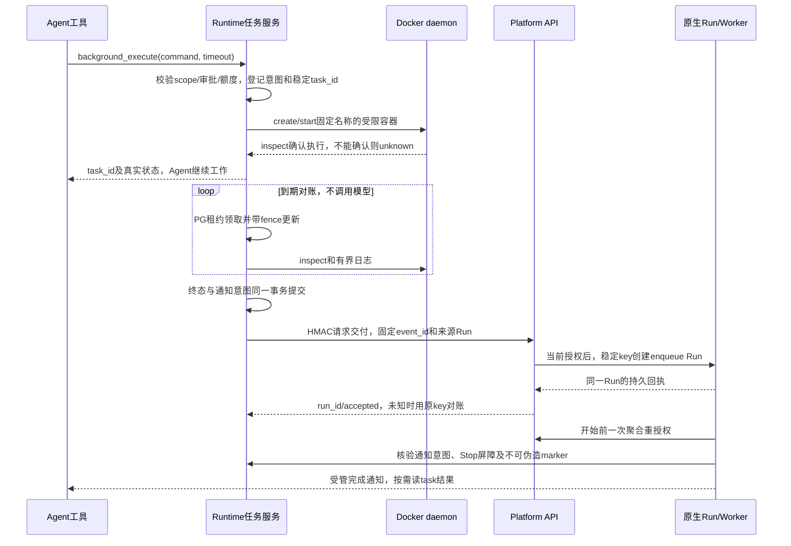

# Agent 通用后台非阻塞任务能力 - 整体方案

> 用户于 2026-10-09 批准 D01-D06，记录见 tasks.md。本文为实施设计；代码与验证状态以 tasks.md 为准，不代表生产已支持。

**实施状态：** `blocked`。T02/T03/T04/T06/T07 已实现并取得阶段证据；T01/T05/T08 因正式 post43 缺少按幂等 key 只读回查接受 Run 的接口而未完成。正常 ACK 与 Worker guard 回填已验；无回执且 Worker 未开始时保持 unknown/inflight，禁止重复 POST。新提交默认关闭，前端 F01-F12 交同事，后端/全栈 Final 均未执行。解除条件见 [引擎接续](engine-handoff.md)，实际样本见 [前端交接](frontend-handoff.md)。

发布镜像、旧源码回退、HITL通知和固定Stop后新任务的追加Phase已通过，验证资源已关闭；完整证据与未覆盖边界见verification.md覆盖矩阵，阶段通过不解除B01或代替Final。

## 1. 目标与范围

一次后台 shell 工具调用应在确认任务已登记、容器已开始后短时间返回 task ID；Agent 可以执行其他工具或回答，后台命令独立计时。用户和 Agent 能查真实状态/有界日志、申请取消；完成后只允许一次受管结果通知。

通用能力不依赖 DearFlow 的模式、媒体业务、仓库、渠道或供应商。首期接入 Showcase 与 DearFlow 的根 Agent；其他有 Workspace 的 Agent 通过同一公共工具工厂和 graph factory guard 显式接入。Reference/Workflow 不自动获得 shell；只读子 Agent 不获得启动/取消权限，写子 Agent 的独立后台任务首期不开放。

不实现 MCP Tasks、视频/音乐后台生成、任务 DAG、Goal 自动续跑、任意供应商 registry、Celery/Kubernetes scheduler、通用 sandbox pool 或网络部署。普通工具的 async await/并行执行不改成后台任务。

## 2. 三层职责

| 层 | 要做什么 | 不承担的职责 |
|---|---|---|
| Runtime | Task scope 与幂等登记、Docker 执行/状态/日志/期限/取消、持久终态与通知意图、租约对账、组合根接线、开始前 guard | 用户权限系统、模型 Catalog、第二套 Agent 执行循环 |
| Platform API | 当前用户/服务账号/项目/Thread/Agent/tool/model 授权、读/日志/取消精确委托、受管续接 Run、DTO 校验、审计 | 执行 shell、写 Docker 状态、复制任务数据库或自己调度 Agent |
| Platform Web | 展示任务、文本日志、取消回执；发现通知 Run 后沿官方 SDK 订阅；切换/撤权清作用域 | 启动监控、消费后台通知、派发 Run、模拟进度或判定资源清理成功 |
| GraphHarbor | 原生 Run/并发队列/幂等/Worker/checkpoint/取消事实 | 本平台 Task 授权、业务任务表、工具装配 |

前端离线不影响命令、对账或通知。前端交接仅规定消费契约，实施由用户同事完成。

## 3. 调用链

源 Run 正常结束不是后台命令完成；通知 Run 被接受不是模型已消费结果。状态必须分别保存并展示。

## 4. 工具与 Agent 接入

### 4.1 三个独立权限的工具

| 工具 | 输入 | 输出/副作用 |
|---|---|---|
| `background_execute` | `command: str`、`timeout: int = 900` | 校验后启动，返回 Task DTO；最长 3600 秒，命令最多 32768 字符；空白、bool 超时和越界拒绝 |
| `background_task` | `action: status/list/output`、可选 `task_id` | 只读；status/list 不含原始日志；output 返回最多 16 KiB 文本快照及截断/可用性；不阻塞等待终态 |
| `cancel_background_task` | `task_id` | 持久取消意图，返回真实 `cancel_requested/cancelled/unknown`；终态任务重复取消返回原事实 |

把取消独立为第三个工具，是为了沿现有按工具名的 allowlist/HITL 治理；避免一个叫 `background_task` 的“只读工具”暗含 stop 写动作。首期不提供 HTTP shell 启动入口。

`background_execute` 与既有 `execute` 要同时获得权限，禁止“禁用了 execute 但后台 execute 仍能启动”的旁路。取消需要自己的 tool key 和 Thread edit。查询不自动授予取消。`review` 默认审批启动与取消；`workspace_write` 对后台执行是否免审批按 D06 审批结果显式登记，不能仅因名字相似自动继承；`full_access` 仍受已签名工具 deny 与沙箱边界约束。

公共入口拟为 `tools/background.py::build_background_tools(binding)`。binding 是两个 Workspace 真实调用者共享的最小数据：scope、已验证工作目录、受管镜像、只读 skills 与 protected mount；定义在 `workspace/background.py`。不接收客户端 tenant/project/root/image，不从公共模块 import DearFlow/Showcase，不创建新 Tool Registry/Agent Builder。

组合根负责把工具名加入 `RuntimeConfigMiddleware` 的实际工具闭包、HITL 表和根工具列表。schema-only/probe 可以展示 schema，但不建 Workspace/容器、写表或监控；conversation maintenance 禁止启动/取消/自动交付。

graph factory 拟新增 `runtime/background_completion.py::background_completion_execution(factory, agent_key=...)`。该 guard 只对受信完成 marker 生效，普通执行沿原 factory；核验要发生在模型/MCP/Workspace 资源构造之前。不复制 `scheduled_execution` 的无人值守 interrupt-to-error 包装；完成 Run 允许真实 HITL 暂停，用户按当前 interrupt ID 显式恢复。

完成通知 Run 内不装配 `background_execute`，且服务端也拒绝新后台提交；普通 `execute` 等已授权工具仍可用。这样每个源任务至多派发一个完成 Run，不形成无人值守后台任务链。日后需要链式自动执行另评审。

### 4.2 能力声明

拟增加 `background_tasks`（本图已接入）与 `background_tasks_start_enabled`（拓扑/开关/当前策略允许新提交）。默认新提交关闭；关提交开关不关闭已接受任务的对账/日志/取消。

capability 只是声明；Platform 结合 Thread ACL/tool overrides 投影，Runtime 执行时再次核验。未接入图返回 false；新图要显式登记 Workspace resolver、工具声明和 guard，不能宣称任意 graph 零适配。保留 `independent_subagent_cancel=false`。

## 5. Runtime 持久事实与执行

### 5.1 首发拓扑

支持同一受管 Docker daemon、持久 Workspace、共享 Runtime PG 的单主机部署，以及该主机上的多个 API/Worker 副本。`execution_host_id` 绑定同一个 daemon/Workspace 域，不能复制到不共享资源的机器。管理进程重启可恢复对账，Docker daemon/宿主重启后的原命令不承诺继续执行，只收敛真实事实且不重跑。

LocalShell 首期返回 capability=false。不在宿主机启动 detached shell；不给命令容器 Docker socket、平台环境变量或远端模型密钥。现有生产限制 `network=none`、read-only root、cap-drop、no-new-privileges、PID/CPU/256 MiB 内存、受限文件大小和 skills 只读保持一致。编译/测试需在镜像中预装依赖并适应该资源边界；本期不为等待预览部署开网络/端口。

T01 必须冻结 API 与 Worker 如何连接同 daemon、daemon 看见的宿主路径/volume 如何映射、受管镜像与 runner 的打包方式。现有 Runtime Dockerfile 没有本次证明可用的 docker CLI/连接配置，不能只在 Compose 挂 socket 就声称生产可用。D01 批准前不修改部署权限。

### 5.2 最小应用表

新增 Runtime 所有的 `runtime_background_tasks`，**一张表包含任务事实与单次交付 outbox**；平台复用 `run_requests`/审计，不复制任务表。迁移拟 `0003_background_tasks`，实施时先核对最新 Alembic head。

| 字段组 | 内容和约束 |
|---|---|
| 身份 | `task_id, tenant_id, project_id, owner_id, credential_id, graph_id, thread_id, origin_run_id, checkpoint_ns, tool_call_id`；全部从当前已验证执行取得 |
| 提交去重 | `submission_key, request_digest`；scope+origin Run+namespace+tool_call_id 唯一；相同 key 不同命令/timeout/binding 摘要冲突 |
| 执行 handle | `execution_host_id, container_name, container_id, binding_digest, resource_id`；名称由持久 task_id 推导，labels 再绑定 scope；不以客户端名称查容器 |
| 命令事实 | `status, exit_code, reason_code, started_at, finished_at, deadline_at, cleanup_state`；不把它作为原生 Run 状态 |
| 有界日志 | `log_bytes, omitted_bytes, output_available, output_truncated, log_updated_at`；文件定位由 scope/task 推导，不接收 output_path |
| 恢复 | `next_check_at, lease_token, lease_until, fence, attempts, cancel_requested_at`；数据库时钟裁决，过期 lease 的迟到写入拒绝 |
| 单次交付 | `event_id, delivery_state, notification_deadline_at, delivery_run_id, delivery_accepted_at, delivery_attempts, delivery_retry_at, delivery_fence, delivery_reason, stop_id` |
| 关联 | `created_at, updated_at, request_id, platform_trace_id`；来源 Run 在 Platform `RunRequestsRepository.for_run()` 找原受管快照 |

不保存浏览器 JWT/平台密钥/完整命令或完整模型连接。命令原参数属于既有 ToolMessage/checkpoint 的用户业务内容；监控只持有 handle 和 digest，不靠重放 checkpoint 命令恢复。私有记录不能出现在 Workspace tree/fork/zip/普通 artifacts 中。

提交去重记录与日志采用不同保留策略。日志过期不删除 `submission_key/request_digest/task_id/event_id/delivery_run_id/终态/Stop` 的最小回执；只要来源 Run/checkpoint 仍能被重放，就必须返回原 task，不能因七天 TTL 重新执行。T01 同时冻结 Platform run_requests 与原生幂等记录的保留边界；未知交付或可重放来源仍存在时不得删除去重回执。

### 5.3 提交和未知结果

1. 授权、审批和资源参数通过后，在短事务中按 Thread/host 锁预留额度和任务意图；同事务登记后台资源回执，工具重放复用原 task。
2. 关闭事务，再用 argv 形式调用受管 Docker create/start；命令只交给容器 `/bin/sh -c`，不用宿主 shell 拼接执行。
3. 与等待式执行不同，后台容器不使用 `--rm`，不自动 restart。确定性名称和 scope labels 防重复；start 只针对同一个既有 container ID，已启动或已退出容器不能再次 start。
4. API/CLI 响应丢失时 inspect 原名称并核对 labels/ID；已运行或已结束就返回同 handle。Docker 不可达/无法确认时标 unknown，不重新生成 task/container 或再次执行命令。
5. 已确认从未创建的意图可以失败收敛；是否允许原工具 checkpoint 重放完成一次尚未启动的 create/start，T01 以故障窗口验证后冻结。监控本身不保存或重新执行命令。

新提交拒绝发生在副作用之前；提交后未知必须返回 task ID/查询途径。不能返回无 handle 的普通“失败”诱使 LLM换 ID 重试。工具取消/CancelledError 和基础设施异常保持既有传播与安全错误出口。

### 5.4 状态与日志

Task status 拟为 `starting/running/succeeded/failed/timed_out/cancel_requested/cancelled/unknown`。`succeeded/failed` 来自原容器终态、exit code/OOM 等可信管理证据；cancel/timeout 意图不等于清理确认。普通 exit 124/137 不能仅按数字认定超时/用户取消。unknown 仍可恢复，不自动通知重试。

`cleanup_state` 独立取 `not_required/pending/confirmed/unconfirmed`：已证实未创建资源为 not_required；已创建但尚未回收为 pending；匹配 scope/ID 的容器已终止并回收为 confirmed；控制不可达或证据不足为 unconfirmed。已登记取消但未证实停止保持 cancel_requested/unknown，不能写 cancelled/timed_out。终态仍可能 cleanup=pending；容量只在执行已终止且回收已确认，或证实从未创建资源后释放。

控制事实不读取 Agent 可写 `state.json`，不使用 PID 存活代替容器身份，也不把 CLI 的 exit 0 当 shell 成功。日志为不可信业务内容，不用于推断成功、身份或执行命令。

建议 runner 持续排空子进程 stdout/stderr，以 head/tail 各约 512 KiB 的 buffer 输出有界文本快照；快照用结构化编码，内容不是控制标记，退出前输出最后快照。容器 logging 同时启用有界轮转，建议 `local/max-size=2m/max-file=2`。Runtime 对账只读取有界日志范围，保存到 Workspace 外的私有目录，临时文件安全创建后 `os.replace`；路径/symlink/大小按现有 Workspace IO 边界核验。

临时 `/tmp` tmpfs 在容器退出后不可作为持久日志来源。T01 要验证大日志快照的分帧、轮转与退出可取回；若锁定 Docker logging 无法可靠保留有界快照，提交更小的受控日志采集替代方案再冻结，不能退回无限重定向。硬杀时日志可不完整，DTO 标明 unavailable/truncated，不伪造最后输出。

持久正文严格最多 1 MiB（包含省略标记）；HTTP 每次最多 64 KiB，Agent output 最多 16 KiB；UTF-8 替换/边界截断后仍重新核对字节上限。日志不进入全局错误/审计正文，原始业务日志权限与任务所在 Workspace read 一致；不承诺识别用户命令自行打印的所有敏感内容。

### 5.5 无模型监控和限额

采用 `webapp.py` lifespan 挂接 `background_tasks_lifespan()`，复用现有 Stop 对账的部署模式。循环只是有界 I/O/PG/HTTP/容器控制，不编译或执行 Agent，不成为新的 LangGraph Worker；多副本按 `next_check_at`/host 领取，`FOR UPDATE SKIP LOCKED`、lease 与 fence 保证唯一有效写入。网络等待期间没有数据库事务。

建议初始参数，均待 D05 批准、性能试验校正：

| 参数 | 首发值/含义 |
|---|---|
| 新提交开关 | `RUNTIME_BACKGROUND_TASKS_ENABLED=0`；只控制新启动/自动新通知准入，已接受任务的对账和清理继续 |
| 资源域 | `RUNTIME_EXECUTION_HOST_ID`，启用时必须显式配置并校验 |
| 命令期限 | 默认 900 秒，最大 3600 秒；独立于原 Run attempt 的硬限，禁止主动终止后又“恢复执行” |
| 并发 | 同 Thread 4、同 project 8、同 host 16；starting/running/cancel_requested/未确认 unknown 均占位 |
| 轮询 | 活跃任务每 5 秒；每批最多 20 个到期项，lease 45 秒/10 秒续租；外部故障有界退避 |
| 取消 | 先持久化意图，TERM 最多 10 秒，再 KILL/inspect；不能确认则 unknown+cleanup=unconfirmed |
| 通知 | 每任务一个稳定 event_id；瞬态失败最多 5 次自动交付尝试；最长 24 小时后 expired，之后只可查询 |
| 日志总量 | 私有日志域建议硬上限 2 GiB，包含临时快照；每任务预留最多 2 MiB 的正文+替换空间；先淘汰可清理终态日志，仍无容量则在启动前拒绝，不挤掉活跃任务日志 |
| 保留 | 原执行容器取证/日志封存后尽快回收；日志最长 7 天且可因总额提前淘汰，公开 available=false；最小幂等/Stop 回执随可重放来源保留；活跃/未确认资源不按 TTL 盲删 |

runner 自身持有单调时钟 hard deadline，防 Runtime 对账暂时宕机导致无限命令。Runtime 重启继续领取，不以 lifespan 退出为由强杀所有已接受任务；显式停用/回退时另执行可审计 drain。线程删除/权限变化不触发任何新执行，清理只针对已拥有资源。

运维沿已有安全结构化日志和健康检查记录 task/event/run/trace ID、最老到期延迟、pending 通知、unknown/unconfirmed 数、容量/磁盘拒绝及清理失败；不新增观测平台、不记录命令/日志正文。拟新增 `docs/runbooks/runtime-background-tasks.md`，写清 daemon/挂载恢复、固定归属核验、受管取消与 drain、迟到通知回查步骤；未知资源须有人工接续路径，不能删表或释放额度来掩盖。

## 6. 完成通知的生产语义

### 6.1 唯一交付路径

符合通知政策的命令 succeeded/failed/timed_out 与 `delivery_state=pending` 在同一 Runtime 事务写入；用户单任务取消、会话 Stop 或源 Run 失败清理产生 suppressed，仍可查询结果，不额外触发模型。event_id 从任务与通知版本确定；PG lease/fence 控制交付者，但不宣称仅凭 lease 就 exactly-once。

对账者向拟新增 `POST /api/runtime/internal/background-task-delivery` 发送 HMAC 时间戳、接口名、规范正文；正文只有 scope/task/event/origin Run/终态摘要，不含命令、日志、任意 input、模型 ID 或模型凭据。Platform 验证来源 Run 的持久请求与请求 scope/owner/credential/graph 一致，再构造固定、安全的完成提示。

复用 `RuntimeGatewayService.launch_runtime_run()`、`RunRequestsRepository` 和原生幂等键。key 固定为事件派生值，input/message ID/body 恒定；第一次提交的执行快照冻结，响应未知先用原 key 对账，不改 input、不更换 Run、不重执行命令。通过真实 lost-ACK 验证后才声称“一个事件最多一个接受的 Run”。

完整日志不进通知 prompt，提示只包含 task ID、状态和 exit code，模型按需调用 `background_task`；消息使用普通输入的安全数据语义，不伪装可覆盖 system 指令的新权限。

### 6.2 Thread 状态策略

| 情形 | 行为 |
|---|---|
| 原 Run/其他 Run 正在 running/pending | 通知保持 pending，优先等 Thread 可执行；提交固定使用 enqueue 处理检查与创建间的竞态，不 interrupt |
| Thread 空闲且授权有效 | 创建一个原生完成 Run；公开关联 task_id/event_id/origin_run_id/新 run_id |
| 等待 HITL/澄清或存在未恢复 interrupt | 保持 pending，附安全等待原因，不自动 resume；用户完成审批后再次核对；不借用无人值守 scheduled 的自动错误规则 |
| 通知 Run 自身遇到 HITL | 真实 interrupted，用户按原执行快照/current interrupt ID 恢复；不新建第二次完成 Run |
| Thread Stop/原 Run error/timeout/确认用户取消 | 抑制尚未接受的通知，清理受影响任务；已经接受的 Run 纳入 Stop 固定目标与补偿对账 |
| Thread/项目/Agent/用户删除、服务账号吊销、模型或工具撤销 | 不新建或开始完成 Run；标 blocked/suppressed，保留受管资源清理；不创建替代 Thread |
| 模型/预算不足或平台暂时不可用 | 有界重试或 blocked，任务真实结果仍可查询；不存在隐藏 Goal while/无限“继续”消息 |
| 关闭新提交开关 | 不再接受新任务和新的自动通知准入，pending 标 blocked；已接受通知 Run 与任务照既定生命周期处理 |

普通 JWT 过期不杀已接受命令。完成 Run 是新增执行：提交时、真正开始构图前分别核验当前身份/credential/project/Agent/model/Thread/tool policy。开始前 guard 参考 `scheduled_execution` 的重授权装配方法，用当前受管模型/工具快照替换过期引用，不复用旧浏览器 token。

guard 的 marker 只由 Platform 内部注入并签名，绑定 event/task/source Run/Thread/graph/context hash；公开 input/config/context/metadata 写入口拒绝伪造，读/流出口去私有 grant。开始前查询 Runtime 通知意图与 Stop tombstone；拒绝不得执行 MCP/model/Workspace 准备。该 guard 是 enqueue 延迟与 Stop 派发竞态的必要屏障，不是新 Agent 循环。

delivery_state 拟为 `not_ready/pending/dispatching/accepted/blocked/suppressed/expired/unknown`。命令尚未终态为 not_ready；accepted 仅表示持久 Run 接受；Run 的 pending/running/interrupted/success/error 从引擎读取，不在 Task 表复制一套。等待 Thread 空闲/HITL 不计入五次瞬态交付失败；blocked 的原因解除后，在通知期限内用原 event/key 再授权准入。unknown 只回查原幂等记录；24 小时过期停止新的派发，仍需查明已接受但丢 ACK 的事实，不能把“可能已接受”直接改成“未执行”。权限被撤销后仅受信内部对账固定回执，不授权浏览器继续读取。

### 6.3 停止与恢复边界

后台登记、通知准入、`request_stop()` 在相同 Thread advisory lock 下决定先后；Stop 接受时固定捕获已有任务 ID（含先前成功 Run 留下的活跃任务）与未接受/正在派发的通知 event。需要加法保存该快照，不靠未来查询“全部任务”改变固定边界。

如果通知提交响应尚未返回，Stop 持久抑制对应 event；迟到创建的 Run 在开始前 guard 被拦，并按真实 run_id 做既有原生取消/回执对账。不能只在 HTTP 发出前检查一次，也不能靠把事务跨整个 HTTP 保持来堵竞态。

会话 Stop 在没有活动 LLM Run、但仍有后台任务时也要完成任务清理。原生 `no_active_run` 仍说明没有 LLM Run；公开 Stop 增加可选后台清理摘要，只有任务清理确认后才显示后台资源已停止。独立 PTY/其他 Thread/Stop 后新用户 Run 的任务不在这份快照内。

原 Run 正常 success 允许已接受命令继续；原 Run 最终 error/timeout、确认的用户取消触发清理。Worker 基础设施重启/attempt 恢复不是终态失败，不重复提交；HITL 的 interrupted 不能仅靠状态字符串当取消，须核对 interrupt/Stop 事实。首次版本没有任意后台子 Agent。

fork/time-travel 只继承普通 Workspace 文件，不继承私有任务表/handle/通知/日志；重放同一 Run 的同一 tool_call 返回同 task，新的 fork scope 不能控制旧容器。清理结果通过现有 `runtime_run_resources` 投影，表不复制命令终态。

## 7. 契约与代码落点

### Runtime：新增与修改

| 完整位置 | 实际落点 |
|---|---|
| `apps/runtime-service/src/runtime_service/workspace/background.py`（新增） | 最小 Workspace binding，`create_task_container/start_task_container/inspect_task_container/stop_task_container/read_task_output`；仅受管 Docker |
| `apps/runtime-service/src/runtime_service/workspace/background_runner.py`（新增） | Linux 容器内非交互进程监督、独立期限、子进程组清理、stdout/stderr 持续排空和有界快照；随镜像或只读包资源装配 |
| `apps/runtime-service/src/runtime_service/workspace/execution.py` | 从现有 `docker_workspace_args()` 提取两条路径共用的安全参数；保留 foreground/Terminal 的 run/--rm/timeout 行为，不能复制后漂移 |
| `apps/runtime-service/src/runtime_service/background_tasks/repository.py`（新增） | `reserve_task/claim_due/save/request_cancel/delivery_intent/finish_delivery`，短事务、scope/额度/lease/fence 和单表 outbox；查询复用 `read_task/list_tasks` |
| `apps/runtime-service/src/runtime_service/background_tasks/service.py`（新增） | `start_task/cancel_task/reconcile_due/background_tasks_lifespan`，无模型 I/O 对账、deadline 和资源回执 |
| `apps/runtime-service/src/runtime_service/background_tasks/delivery.py`（新增） | `deliver_completion`，固定事件/HMAC/有界重试及失响应回查；原始日志不送平台 callback |
| `apps/runtime-service/src/runtime_service/background_tasks/schemas.py`（新增） | 任务/日志/列表 DTO 及严格枚举、有界数值，私有行与公开模型分开 |
| `apps/runtime-service/src/runtime_service/tools/background.py`（新增） | `build_background_tools()` 三个工具，verified scope/allowlist、HITL 与真实 ToolMessage |
| `apps/runtime-service/src/runtime_service/runtime/background_completion.py`（新增） | `background_completion_execution()`，开始前 marker/当前授权/Stop 核验，普通 graph 路径透传 |
| `apps/runtime-service/src/runtime_service/http/background_tasks.py`（新增） | Thread 绑定的 list/detail/output/cancel，`authenticate/authorize_thread_targets/require_tool_access`；Cache-Control no-store |
| `apps/runtime-service/src/runtime_service/db/migrations/versions/0003_background_tasks.py`（新增） | 应用表/index/约束、Stop 后台快照加法字段；parent=`0002_run_control`，downgrade 只退应用版本、保留表/回执；旧源码启动前必须先用新迁移代码 downgrade |
| `apps/runtime-service/src/runtime_service/webapp.py` | 挂内部 router/后台 lifespan，管理 HTTP client 与对账退出，不新增 FastAPI app |
| `apps/runtime-service/src/runtime_service/run_control/{repository,report}.py` | `request_stop/build_report` 固定后台目标与加法报告，配合既有 `service.py::_advance_claim()` 与 resources 等待真实清理；既有 Stop 回执保持兼容 |
| `apps/runtime-service/src/runtime_service/runtime/{capabilities,access_policy,auth}.py`、`auth/platform.py` | 三工具声明、审批/策略绑定、新 operation 只允许相应内部入口；capability 不成为授权 |
| `apps/runtime-service/src/runtime_service/services/demo/showcase_demo/agent.py` | 组合根构造 binding 并装配公共工具；既有子图闭包不装配启动/取消工具 |
| `apps/runtime-service/src/runtime_service/services/dearflow_agent/{agent,capabilities}.py` | 同一公共能力与三工具声明接入，复用现有 Workspace backend |
| `apps/runtime-service/src/runtime_service/graphs/{showcase_demo,dearflow_agent}.py` | 显式增加完成 guard，与原 scheduled wrapper 共存，禁止 cron/maintenance/完成 marker 混用 |

新 Python 包 `background_tasks/__init__.py` 仅为打包/明确公共导出；从定义模块导入，不新增级联装配。schema-only、Graph 注册、包资源、现有 Backend/Terminal 调用者、测试 fixture 均需一起核对。

### Platform API：新增与修改

| 完整位置 | 实际落点 |
|---|---|
| `apps/platform-api/src/platform_api/modules/runtime_gateway/application/background_tasks.py`（新增） | Task/Output/List DTO 与公开动作协调，组合当前 Thread ACL/精确委托 |
| `apps/platform-api/src/platform_api/modules/runtime_gateway/application/background_completion.py`（新增） | `deliver/authorize_completion/save_receipt`，HMAC 完成交付与开始前 actor/Agent/model/tool 重授权、固定回执和 reconcile-only 降级 |
| `apps/platform-api/src/platform_api/modules/runtime_gateway/application/service.py` | 补 task 方法及 `launch_runtime_run()` 内受信 completion config 分支；复用 `create_thread_run/launch_runtime_run`，不重写大 service 或用 scheduled marker 冒充完成通知 |
| `apps/platform-api/src/platform_api/modules/runtime_gateway/infra/sqlalchemy/repository.py`（复用） | 复用 `RunRequestsRepository.for_run/get/create/mark`，未新增平台任务表或修改该 repository |
| `apps/platform-api/src/platform_api/modules/runtime_gateway/presentation/http.py` | 四个 Thread 任务路由，公开 GET/POST cancel；用户输入无 shell/image/root/identity |
| `apps/platform-api/src/platform_api/modules/runtime_catalog/presentation/http.py` | HMAC `background-task-delivery` 与 `background-task-authorization` 内部入口，分别绑定用途/时间/正文 |
| `apps/platform-api/src/platform_api/entrypoints/http/middleware/auth_context.py` | 内部 HMAC 路由按现有精确内部入口规则登记，不扩大匿名 prefix |
| `apps/platform-api/src/platform_api/adapters/langgraph/runtime_gateway_upstream.py`、`modules/runtime_gateway/application/ports.py` | 四个内部 HTTP 方法/协议声明；SDK/HTTP 细节留 adapter |
| `apps/platform-api/src/platform_api/core/security/tokens.py` | `background-task-read/background-task-log-read/background-task-cancel` 三个 operation；scope 仍五字段，task_id 用路径+资源归属核验 |
| `apps/platform-api/src/platform_api/modules/runtime_gateway/application/run_control.py` | Stop 可选后台清理 DTO，保留旧 v1 必填字段和 phase 语义 |
| `apps/platform-api/src/platform_api/modules/audit/http_resolution.py` | 任务读取/日志/取消和内部交付的稳定审计 action；只含 ID/状态/码，不含命令/日志/JWT |
| `apps/platform-api/src/platform_api/core/runtime_contract.py`、`apps/platform-api/src/platform_api/adapters/langgraph/sdk_client.py` | 扩展 `PRIVATE_RUNTIME_STATE_KEYS/reject_private_runtime_state/redact_runtime_private_fields` 及现有 HTTP/SSE 调用者，拒绝/剥离私有 task grant、lease、handle，不另建平行 sanitizer |

上表按当前源码核对。原拟函数名已替换为实际实现；未改的 backend/prompts/subagents 与平台 repository 只复用。具体改动见 implementation/，验收状态见 tasks.md。

### 配置、发布与文档

检查 `apps/runtime-service/deploy/Dockerfile`、`Dockerfile.agent-workspace`、`docker-compose.runtime-service.yml`、`deploy/docker-compose.stack{,.nginx}.yml`、`scripts/local-stack.sh` 的真实启动/迁移/挂载；优先只更新批准使用的拓扑，其他拓扑保持新能力关闭并明确 capability=false。锁文件与构建镜像对齐 T01 核验的正式包，不盲目升级依赖或改引擎代码。

Runtime 接入规范、Platform gateway/audit standards、`docs/standards/{delegation-jwt,error-envelope,sse-event}.md` 和 FEATURES/CHANGELOG/CONTEXT 已同步批准的已实现契约与 B01 限制；原 JWT/SSE 整体仍为 draft，本专项 blocked 不触发标准毕业。部署只更新默认关闭的单主机 overlay 与锁定 Dockerfile，其他拓扑未启用。

运行手册与 Runtime 接入说明一起交付，明确新 Agent 的 Workspace binding、三工具/策略声明、组合根和完成 guard 四个接入点，以及 scope/审批/非阻塞/Stop 的最小验证集。

## 8. HTTP 与前端交接概要

公开前缀 `/api/langgraph/threads/{thread_id}/background-tasks`，内部前缀 `/internal/threads/{thread_id}/background-tasks`：GET 列表、GET `/{task_id}`、GET `/{task_id}/output`、POST `/{task_id}/cancel`（202）。均绑定当前 `x-project-id`，后两类读分别使用元数据/日志 operation；cancel 使用固定 Idempotency-Key。

字段、错误语义、完整示例和前端路径见 [frontend-handoff.md](frontend-handoff.md)。没有新的物理 SSE/custom 任务状态流，状态从 GET 读取；通知结果沿现有 Run 协议。老客户端可以忽略新增字段，不能把 ToolMessage 的 ACK 当命令成功。

TaskListV1 另含 `has_unresolved` 与 `latest_delivery_run_id`：前者按完整授权 scope 判断是否还有活跃任务、未确认清理或待交付/待对账通知，后者按持久接受时间返回最近接受的完成 Run。两者在同一查询快照按索引求得，不从第一页推断，不扩大当前调用者可读范围。前端据此持续发现后台完成 Run，再用现有原生 Runs/SDK 核实；任务列表仍独立分页。

## 9. 风险、验证与回退

- Docker 管理连接、跨进程共享挂载、post20/post43 构建差异是实施前真实环境门禁；本次没有验证任何目标部署。
- 容器/通知都有“接受成功但丢响应”的窗口，必须以稳定身份对账；应用租约只解决并发与迟到写，不单独保证唯一外部副作用。
- 源命令可与后续 Agent 同时写 Workspace，必须提示“并发读取/生成允许、同文件写入由任务使用方协调”；不虚构全工作区事务或依赖 DAG。需要独占写任务时采用已有任务条件约束，另评审，而非本期加通用锁服务。
- 自动完成 Run 有费用和权限含义，预算/用量沿既有治理采集，审批绝不自动批准；原命令的 unknown 不诱发模型重跑。
- 取消和线程删除只能确认已拥有资源。Docker 不可达/非本 host 不返回 cancelled，私有记录进入待处理并继续占位。

回退顺序：关闭新启动和新通知准入 -> 保留新 reconciler，取消/drain 已接受任务与通知 -> 确认或明确列出所有未确认资源 -> 验证旧源码/正式包可忽略加法表与字段 -> 回退应用。元数据/回执不删表；私有日志到期清理不得触及普通 Workspace；跨边界操作按现有危险操作规则单独授权。仅关闭 flag 不等于资源已回收。

验证实施见 verification.md；阶段通过后继续实现剩余项，最后分别判定后端、前端和整项目状态。后端完成+前端交接不能冒称全栈 done。
