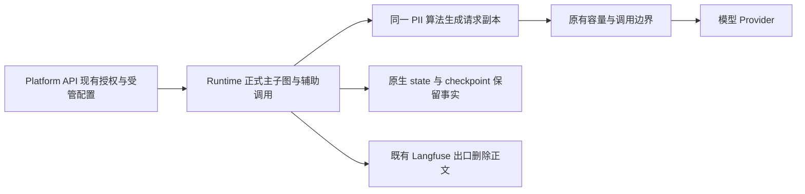

# F05：整体方案

> 2026-10-09 用户已批准 D01–D07 并授权实施；Runtime/API、后端门禁和实装交接已完成，整体 partial，仅剩同事的 F01/F02 与联合 V02。源码事实、实施差异与验证见 [实施记录](implementation/01-runtime-api.md) 和 [verification](verification.md)。

## 目标与验收边界

启用后，对配置检测器识别出的邮箱、凭据、身份证、信用卡和手机号，在本平台支持的模型调用入口发出文本前完成替换。相同标识符在同一受信 Thread 内跨轮次、主子图、摘要和辅助调用保持稳定；原始会话和工具执行事实保留。

主要验收对象是**Provider 收到的实际请求**，不是 middleware 是否被实例化。追踪仍维持不导出正文的现有基线。

| 数据面 | 本期行为 |
|---|---|
| 模型输入 | 改写文本副本；包含最终 system、历史消息、工具结果、旧摘要、模型历史 tool-call 参数及动态工具说明中的文本 |
| state/checkpoint/inbox/工作区 | 保留原事实；本期不清洗、迁移或删除 |
| 工具执行与 HITL | 执行参数、工具结果和审批依据保留；不把占位符恢复为凭据，不改工具自身出站数据 |
| Langfuse/OTel | 复用现有正文删除与 metadata 白名单；不可因为 F05 已脱敏而放宽 |
| 前端聊天/轨迹/文件 | 授权用户仍可看原输入/原工具结果；模型回答可能包含占位符；不承诺 UI 无 PII |
| 模型生成输出 | 不做全平台流式 PII 清洗；标题/推荐问题在自身出口复用文本检查，防止辅助字段意外回显 |
| 非文本媒体 | 不识别图片/音视频/文件二进制中的 PII；视觉模型只保护问题等文本字段 |

五类是可测的规则集合，不等于所有个人信息。姓名、地址、国际证件、混淆字符串、编码后的密钥、跨内容块拼接、恶意模型或任意工具外泄没有完整保证。跨内容块要覆盖正常分段文本拼接；编码/对抗识别不纳入本期。

## 配置与信任来源

采用 Runtime 现有环境变量范式，不复制 DeerFlow YAML/AppConfig，不新增数据库策略表或 Context/JWT 字段。



```dotenv
RUNTIME_PII_REDACTION_ENABLED=0
RUNTIME_PII_TOKEN_SECRET=
RUNTIME_PII_DETECTORS=email,api_key,national_id,credit_card,phone
```

- 默认关闭，关闭时不装配 PII middleware/摘要替换，原调用参数与 state 保持既有行为。
- 启用时密钥必须为专用高熵随机值，建议至少 32 个随机字节的安全编码；校验非空及最低长度，不宣称长度能证明熵。不得复用 JWT、模型 API Key 或 Langfuse 密钥。
- detector 名称仅允许上述五类；重复、未知、空列表及非法 enabled 值明确配置失败。用户配置顺序不改变固定检测优先级。
- API 与 Worker 使用同一配置/密钥。配置仅在启动/受控重启后变更，不支持 Run 中热更新；不得把密钥写到 state、metadata、公开配置、异常、日志或配置 hash。
- scope 从已验证 Delegation/Runtime 身份和执行 Thread 获取，不读取客户端的裸 `tenant_id/project_id/thread_id`。启用时缺少受信 scope 的辅助调用不得外发模型请求。
- 初期覆盖当前正式 `langgraph.json` 的四图；其他教学注册文件不自动宣称覆盖，详见接线矩阵。启用不是项目/用户可覆盖的参数。
- 混合项目需要不同政策时，本期部署级配置不够；另行评审接入已有受管策略与签名链，不临时在前端加开关。

## 共享算法：只维护一份

已新增 `apps/runtime-service/src/runtime_service/runtime/pii.py`，提供不可变策略、`load_pii_redaction_config()`、`redact_text()`、`redact_messages()`、`redact_model_request()`。检测直接使用标准库匹配对象在调用内替换，不维护额外 match DTO 或映射表；原值仅在调用内存中短暂使用。

| 检测器 | 最小规则与复用 | 风险控制 |
|---|---|---|
| email | 官方公开函数无法覆盖已批准的中文边界，使用一份有界 ASCII 邮箱模式，涵盖常用 `+` 地址 | 不使用排除一切中文的 `\b`；不声称覆盖所有 RFC/国际化邮箱 |
| api_key | 复用 DeerFlow 已知 provider 前缀的设计，结合 Open-SWE Authorization/Bearer 和结构化凭据标签的边界样例 | 凭据与 PII 分类不同但共用扫描；不对所有随机 ID 做熵猜测；未知格式明确未覆盖 |
| national_id | 本期只做中国 18 位身份证，ASCII 数字、GB 11643 mod-11、真实日历日期、大小写 X | 校验不证明真实身份；不添加地域码数据库或 CPF/CUIT/RFC |
| credit_card | 13–19 位 ASCII 数字、常用空格/连字符、Luhn；不能跨换行吞并多个编号 | 当前公开函数不足的长度/边界由本模块补齐；不导入私有 Luhn；流水号可能误报 |
| phone | 中国手机号与明确 `+国家码`/常用格式国际号码，号码长度边界 | 手机通常无校验和；不把所有 8–15 位数字当电话，不声称国际号码完全识别 |

固定顺序：email → api_key → national_id → credit_card → phone。强规则先处理重叠，原有合法占位符幂等通过。邮箱与手机号最容易损害正常任务，可由部署选择 detector 子集，但任何保证仅针对所选集合。

占位符为 `[CATEGORY_<27字符>]`：使用 `a-z` 的 26 字符字母表，将 HMAC-SHA256 前 16 字节按低位先行编码为固定 27 字符。HMAC 输入使用无歧义的规范序列化：算法版本、已验证 tenant/project/thread、category、原始完整匹配值。用结构化序列化，不能靠未转义的字符串拼接。

该方案提供 Thread 内稳定和跨 Thread 不关联；不保存映射、不自动还原。原值默认精确匹配，不额外做邮箱大小写/电话格式归一化；不同表示可能得到不同 token。密钥轮换或策略更新会改变新 token，旧摘要里的 token不迁移；需要稳定跨轮次的部署先 drain 正在执行的 Run，再重启。旧 token 与新 token不能自动关联，这个限制须评审接受。

HMAC 是假名化，保留同一 Thread 内关联性；不等同于法律意义上的匿名化。没有身份关联需求的部署可以选择取消 HMAC、改用固定标签，但这是 D03 的替代取舍，不能同时上线两套策略。

## 模型请求副本

已新增 `apps/runtime-service/src/runtime_service/middlewares/pii_redaction.py::PiiRedactionMiddleware`，采用官方 `wrap_model_call`/`awrap_model_call` + `ModelRequest.override()`。

1. 处理最终 `request.messages` 与 `system_message` 的可发给模型的文本，包含历史 Human/AI/Tool/System 消息；不能只看最新 HumanMessage。
2. 正常连续文本块先统一识别跨块标识符，再按原结构投影；文本替换不得破坏 image/file 引用、tool-call ID、消息 ID、name、artifact、status、usage 和 response metadata。未知的可外发文本结构不能静默绕过。
3. AI 历史工具参数及 provider 原生重复表示保持同步；只改数据字符串值，不改工具名/schema 参数名/结构性标识符。JSON 使用解析与序列化，不用正则改结构。明确测试 OpenAI function_call/tool_calls、Anthropic tool_use.input、DeepSeek reasoning_content；对带签名/加密的 provider reasoning块不擅自修改，无法安全构造受保护请求时阻断调用。
4. 对实际发送的工具说明字符串及 schema description/examples 等文本做副本投影，禁止扫描/更改 Provider 鉴权配置。需要以输出契约测试确认参数 schema 未被改变。
5. 不返回 state 更新，不新增 ToolResult wrapper，不改 `Command.update` 或 `Command.goto`。ToolMessage 来自主图、MCP、文件、搜索或历史都在同一最终请求边界保护。
6. 处理出错先阻断本次模型外发，返回安全 `RuntimeExecutionError("runtime.privacy.redaction_failed")`，不用原文重试。控制流异常（取消、interrupt/GraphBubbleUp）原样传播；日志只含固定原因和受信关联 ID，不含异常正文、匹配值或 token_secret。

原工具回执保留是有意边界：既符合本平台事实存储，也避免改坏成果/引用/审批。需要隐藏浏览器或存储 PII 的要求不能沿此 wrapper 宣称完成。

## 装配顺序与摘要

最终请求 PII wrapper 放在会改变请求的 RuntimeConfig、Skills/Memory、摘要/上下文恢复、备用模型/重试等 wrapper **之后**；有 ContextBudget 时放在它之前，让预算校验实际脱敏后的文本。必须通过真实模型请求断言顺序，不能只检查列表顺序。

摘要会从 middleware 内单独调用模型，因此另外提供薄的 `PiiSummarizationMiddleware`，继续继承官方 DeepAgents 摘要能力，只在 `_create_summary()`/`_acreate_summary()` 对摘要输入副本使用共享函数。历史归档、cutoff、pairing、checkpoint 和容量默认值继续沿用官方实现，不复制摘要循环。

| 当前入口 | 实装位置与符号 | 必须覆盖的行为 |
|---|---|---|
| DearFlow 主/子图 | `apps/runtime-service/src/runtime_service/services/dearflow_agent/agent.py::_build_agent()` 内 `middleware()` | 用验证后的 facts/thread 构造策略；主图及 researcher 共用；动态 system、队列新消息和恢复旧历史均受保护 |
| Showcase 主/子图 | `apps/runtime-service/src/runtime_service/services/demo/showcase_demo/agent.py` 中 `middleware()`、`build_subagents()` 调用 | 所有声明式子图和 task 委派覆盖，不扩权限，不改变只读重试范围 |
| Reference | `apps/runtime-service/src/runtime_service/services/reference_agent/agent.py::_build_agent()` | 模型 wrapper 接线，schema-only 不触发外发；内测模型保持可注入 |
| Workflow 内层模型 Agent | `apps/runtime-service/src/runtime_service/services/demo/workflow_demo/agent.py::_build_agent()` 内模型构建与 `create_agent()` | 每次重建沿原受信 scope；外层 `workflow.py::build_graph()` 不新增循环 |
| 工程化上下文摘要 | `apps/runtime-service/src/runtime_service/middlewares/conversation_offloading.py::ConversationOffloadingMiddleware` | summary 输入先脱敏再 trim/budget；手动/自动及摘要再次注入；归档仍保留原历史 |
| 容灾摘要 | `apps/runtime-service/src/runtime_service/middlewares/model_resilience.py::ModelResilienceSummarizationMiddleware` | 启用时使用同一受保护摘要组件；context overflow 的二次摘要无原文绕过 |
| 官方默认摘要 | DearFlow/Showcase 的 DeepAgents 装配；上面两类替换都未启用时 | 显式用同名受保护摘要替换默认实例，复用官方容量 defaults；不能漏掉 `AGENT_CONTEXT_MANAGEMENT_ENABLED=0` 的路径 |

公开汇聚导出仅在实际调用需要时同步 `middlewares/__init__.py` 的 `__all__`；优先直接从定义文件导入，避免 `runtime`、middleware、业务 Memory 相互循环引用。

默认摘要可能先 trim 再调用 `_acreate_summary()`，实现者必须核对锁版本路径，对输入完整标识符先扫描再裁剪；若公开扩展点不足，只扩该薄摘要组件的必要格式化路径，并记录依赖升级回归，不能默默依赖截断后的文本检测。

## 旁路模型与记忆

| 路径 | 文件与函数 | 最小补充 |
|---|---|---|
| 标题 | `apps/runtime-service/src/runtime_service/utils/title_summarizer.py::_format_messages_for_agent()` / `summarize_thread_title()` / `_fallback_extract_title()` | 完整输入先脱敏再 200 字裁剪；模型结果在标题清洗前检查；回退只用已保护输入，不能重新取 raw messages；纯 token/不完整 token 回退“新对话”；异常日志只记类型 |
| 标题 scope | `apps/runtime-service/src/runtime_service/http/title_summary.py::summarize_thread_title_endpoint()` | 从现有 `authenticate()` 结果取得受信 scope；启用保护且无有效 scope 时直接安全通用标题，不调用模型；不以裸 path/thread/header 构造跨租户 scope |
| 推荐问题 | `apps/runtime-service/src/runtime_service/services/suggestions.py::generate_suggestions()` | 用 facts/thread 在 `_history()` 拼接前处理输入；输出清理前复用检查；保护失败返回既有空数组降级且不外发原文 |
| 个人记忆召回 | `apps/runtime-service/src/runtime_service/services/dearflow_agent/middleware/memory.py::MemoryContextMiddleware.awrap_model_call()` | 继续现有 ACL/共享会话关闭逻辑，最终请求 wrapper 清洗注入的 user_memory 文本；不复制 MemoryStorage |
| 自动记忆提取 | 同文件 `source_text()` / `aafter_agent()`；`services/dearflow_agent/memory.py::MemoryStorage.propose()` | 启用时在来源截断前扫描；含命中值的来源跳过自动提取，仅无命中来源进模型，最终 prompt 再检查；保留原 quote 精确匹配、source_message_id、CAS/epoch 和队列作者边界 |
| 视觉工具文本 | `apps/runtime-service/src/runtime_service/tools/images.py::build_image_tools()` 内 `analyze_image()` | 使用受信 ToolRuntime scope 保护 question，在直接 `model.ainvoke()` 前处理；保留图像/data URL，不声称识别图像里的 PII |

**记忆不能直接套 DeerFlow 的队列替换：** 当前 `propose()` 要求 `quote in actual_text`。改 prompt 后仍对照原文会拒绝有效候选；反向还原又增加敏感映射。最小方案是对含 PII 的 source 不做自动提取，代价是同段普通偏好也可能不提取。用户人工保存/导入记忆沿既有权限和存储规则，本期不改变数据生命周期。

不新增提取状态或记忆 API 字段；被保护规则跳过的来源在当前终态规则下得到 no_candidates/不开始提取，不留 running 悬挂，不虚称“完整原文已分析”。既有含 PII 的记忆仍存储，但再次注入模型时受保护。

自动候选输出若包含新的已识别 PII，跳过该候选再交给既有 `propose()` 校验；不以“输入已经检查”保证模型不会自行生成敏感格式，不对原 quote 做反向还原。

当前其他教学图 `mcp_demo/deep_agent_demo/backend_demo`、fake `failure_demo`、独立 `mcp_probe` 不属于正式四图保证；本期记录未覆盖，不修改其行为。上线者若将它们开放为同一隐私策略下的产品入口，必须先补同一组件接线及测试，不得静默视为已支持。`build_skill_tools()` 现有 model 参数没有独立模型调用，不增加重复接线。

## Platform API 与前端

Platform API 沿 `apps/platform-api/src/platform_api/adapters/langgraph/sdk_client.py::project_execution_error()`、`redact_execution_fields()` 及 `modules/runtime_gateway/presentation/http.py` 的现有流出口，增加对完整 `runtime.privacy.redaction_failed` 的精确白名单投影，固定说明“隐私保护处理失败，本次模型请求未发送。”。类型/来源和正文都要匹配当前投影规则，不从任意字符串中搜索错误码。

普通消息/工具正文仍透传，策略开关与密钥不出现在公开运行配置。现有 SSE/state/history 的隐私失败槽位统一投影；当前 Run GET/列表与 Thread GET 无 error 字段，不能靠它们归因历史失败。执行开始前 HTTP 失败沿现有 Envelope/上游状态转换处理，不能另造错误包。已同步 `docs/standards/error-envelope.md`、`sse-event.md` 与错误码目录，保留 SSE 原专项 draft 状态。

现有 `ModelErrorMiddleware` 会观察所有非控制流异常；接线后需精确排除该隐私阻断码，避免将“未发送”记录成 Provider 失败。复用已有 RuntimeErrorBase 的不可恢复传播规则，保护错误不触发模型/只读 task 重放或 Worker 基础设施重试。

前端同事只接入上述原因和现有失败态，错误不触发登出/撤权、不自动重发、不提供绕过保护的按钮。不加脱敏正则、HMAC、密钥表单和“已匿名化”徽章。具体可执行交接见 [frontend-handoff.md](frontend-handoff.md)。

## 实施与回退

1. 先人工冻结 D01–D07；在实施前重新核对参考文件与锁版本，不迁移参考仓依赖。
2. 共享算法与复制语义 → 正式主子图/摘要 → 旁路 → 失败投影和前端交接 → 分阶段验证。
3. 默认关闭的发布先验证行为等价；经本方案全部安全门禁后，才由部署负责人在目标隔离环境开启。
4. 关闭开关并同批重启 API/Worker 恢复既有行为，无数据库迁移或历史清理；已生成占位符仍留在摘要/回答，不能恢复原值。
5. 对禁止 PII 外发的部署，关闭开关是解除安全控制，必须先暂停提交并由负责人决定停用还是回退到已验证版本，不能自动把它当故障降级。

本轮 Runtime/API 与后端验证已完成，一次性隔离环境覆盖主子图/旁路、阻断、HITL、取消清理、重启/轮换/回退；实装交接已就绪。不部署或重启现役服务，不提交 Git。F01/F02 与联合 V02 由同事及联合负责人继续；目标环境上线不在本轮授权范围。

## 已批准决策

| ID | 推荐决定 | 不接受时的后果 |
|---|---|---|
| D01 | 确认实际目标是指定文本类型不进入模型，而非仅保护 Langfuse | 若仅追踪保护，取消新增 F05，保留现有出口与回归即可 |
| D02 | 部署级默认关闭，启用后覆盖正式四图及其辅助调用 | 混合项目/用户政策需扩大受管策略设计，本方案不自行加 CRUD |
| D03 | 保留 HMAC，但稳定范围限受信 tenant/project/thread，接受轮换不恢复旧 token | 无身份关联需求可选择固定标签，替换本方案这一策略，不并存两套 |
| D04 | 启用后处理异常阻断模型外发，辅助功能安全降级 | 不接受 DeerFlow 式原文放行作为隐私保证；需重新定义目标 |
| D05 | 原消息/工具/持久化保留，自动记忆跳过含匹配值来源 | 要求存储匿名化/完整记忆提取会扩大数据模型与验证范围 |
| D06 | 只保证已选 detector 的文本；媒体与工具自身外发另有边界 | 全部外发禁 PII 的目标需要停用媒体/相关工具或另行立项 |
| D07 | 前端由同事做最小错误接入，后端交付不得冒充整体上线 | 实施及前后端验收分别记录，未验真实链路不得标功能 done |

评审需记录确认人、日期、选择和变更。2026-10-09 用户已批准 D01–D07，按推荐决定实施；前端事项交由同事完成。对已有安全规范的差异仍提交人工判断，不自动降低现有保护。
