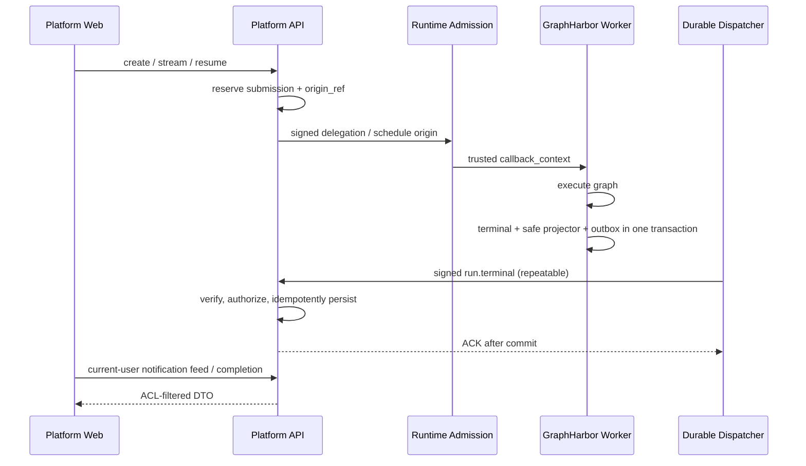

# Agent 运行完成通知与失败回调 - 整体方案

> 2026-10-09：用户已批准非前端实施与双包直接发布；GraphHarbor post44/Runtime/API非前端实现与文档收尾已完成，源码完整链路/正式最短链路通过。正式native完整矩阵P3.3资源blocked，等用户通知资源可用；专项整体partial。本文保留选型依据，实际契约见04，唯一进度见tasks；前端P4由同事完成。

## 背景和验收目标

当前已有在线 error/timeout 展示、模型分类/重试、预算与停止报告，但没有经过生产故障验证的持久 completion 投递和当前用户跨会话失败通知。详细代码证据见 [open-swe 对照](01-gap-analysis.md)。

本期验收目标：

- 所有受管 Run 已确认执行结束的终态能可靠投递到 Platform API；引擎重启、网络失败和重复投递不丢事件。
- error/timeout 形成安全摘要，发起者在平台内任何页面可发现自己的失败；关闭浏览器后下次登录可补看。
- 临时模型失败恢复、HITL、用户 Stop、旧 Run 晚到、回调早于启动响应和定时 Run 都不能误报或串租户。
- 前端同事可以只依照 [前端交接](05-frontend-handoff.md) 实现，不接触 secret、引擎 SQL 或第二套 Run 状态机。

## 三层职责和是否需要

| 层 | 是否需要 | 实施内容 | 边界 |
| --- | --- | --- | --- |
| Platform Web | 需要，同事完成 | 当前用户失败 feed、已读、跳转会话、历史 Run 摘要、竞态和去重 | 继续用官方 SDK 在线状态；不持有 secret、不裁决 Run |
| Platform API | 需要 | 受理来源、回调验签/幂等、私有 completion、feed/read、当前 ACL、审计 | 不执行 Agent、不直接查改引擎 SQL、不广播私有失败为公告 |
| Runtime Service | 需要 | 已验签来源接入、安全终态 projector、可选最终模型细分类、部署配置和包升级 | 不生成产品文案、不发用户通知、不依赖 Langfuse 送达 |
| GraphHarbor | 必需配套 | 原生 Run/Cron webhook、配置/认证头/字段过滤/URL 策略；本期可靠模式再补原子 Outbox、恢复与正式包 | 对标完整 Server，可有通用 auth/身份/扩展；不硬编码平台项目政策、provider 文案或业务渠道 |

这不是单服务改动，而是跨服务契约、密钥、持久化和外部执行引擎的治理改动。GraphHarbor 配套必须纳入同一发布门禁。

## 官方兼容与本期增强

[官方边界核对](07-langgraph-server-boundary.md) 已通过 MCP/OpenAPI 及 `langgraph-api 0.15.4` 发布包确认：Server 在 Run 完成后发送 POST，支持静态认证头、目标限制、顶层字段白名单和有界 HTTP 重试。通用错误序列化和 webhook 安全策略均可在 GraphHarbor 实现；模型分类与用户通知仍由应用负责。

本期的原子 Outbox、正文 HMAC、严格 body ACK、可信 origin 和 terminal projector 是为本平台目标提出的扩展，不能当成官方既有契约。标准 webhook 与平台受管 `run.terminal` 使用显式 profile，共用一套投递设施；不把平台专用 envelope、固定目标或严格 ACK 强加给普通 SDK webhook。

P1 先核对已有安全 code/event 与私有 principal 的复用；需要 projector 时才新增最小通用 hook。公开 inmem callback 是进程内 task，官方 PG queue 未取得，本期不能援引官方文档保证 kill/reaper/删除后耐重启投递。

## 方案比较与推荐

| 方案 | 优点 | 缺口 / 成本 | 判断 |
| --- | --- | --- | --- |
| Agent after_agent/Middleware/Tool 发通知 | 局部代码少 | 覆盖不到 kill、factory、排队、reaper；进程退出即丢 | 只能做诊断，不能满足目标 |
| 原生 webhook + 查询 Run 状态 | 官方协议接入成本低 | 当前生产 Worker 的普通发送也缺待验证的接线；原生 HTTP 重试未证明耐进程重启 | 应先补齐的兼容基线；单独不足以满足本期可靠性目标 |
| Engine durable callback → Runtime relay/outbox → API | 边界清晰 | 两跳、两套租约/恢复和投递观测 | 只有需要异步 enrich 时才选 |
| Engine durable callback + Runtime pure projector → API | 发送 Outbox 只有一套；每层边界清楚 | 需要引擎通用 hook、可信上下文和原子 Outbox | **推荐** |

Runtime projector 是纯适配函数，由引擎启动配置引用；它不能把 Platform tenant/ACL/provider 分类复制进 Engine。这个具体 hook 不是官方标准，P1 优先核对既有安全事件出口是否足够；若外部维护者不接受必要的通用 hook，完成受控接口 spike 后回到人工评审，不静默降级为 best-effort。

## 推荐链路

现有 SSE 继续处理在线结果，不为 completion 再建立第二条实时流。站内失败发现采用有界轮询的持久 feed；delivered 只表示 API 已持久接收，不表示用户在线或已读。

## 终态语义

| Engine status / reason | completion | 失败通知 | 原则 |
| --- | --- | --- | --- |
| success / completed | 记录 | 不产生失败 feed | retry/fallback 后成功不误报 |
| error / business_error 或 infrastructure_error | 记录安全原因 | 发起者可见，当前 ACL 再过滤 | infrastructure retry 中的 pending 不是完成 |
| timeout / timeout | 记录 `runtime_run_timeout` | 发起者可见 | 与 `provider_timeout` 区分 |
| interrupted / hitl_interrupt | 记录 | 不通知失败 | 继续现有审批 UI |
| interrupted / cancel_requested | 停止确认后记录 | 不通知失败 | Stop accepted/lease 未释放不是完成 |
| interrupted / rollback | 正式提交后记录 | 抑制失败 feed | 不恢复已删除对象 |
| pending / retry、shutdown_requeue | 不发 terminal callback | 不通知 | 恢复中的 attempt 不是最终失败 |

当前引擎协议没有 `cancelled` 状态。前端可以在本地显示取消文案，但 completion wire enum 使用 `success/error/timeout/interrupted`。sequence 只用于同一事件/线程事实核对，不能用两个不同 Run 的到达顺序覆盖当前回答。

既有 `stopped_event()` 对取消/rollback要求明确execution_stopped证据，reaper的lease_fenced不足以证明graph task已停止。此时completion保持pending、不得发送停止完成；之后确认事务才原子建立delivery。completion只证明graph执行结束，不证明外部副作用撤销或资源全部回收，仍复用现有Stop/Workspace报告。无法取得停止证据时保持可观测的unconfirmed，不编造completion来追求“全覆盖”。

## 可信关联

API 在 dispatch 前持久化最小 `origin_ref`：

- 普通、Protocol、stream、resume、manual：与已有 RunRequest reservation 同一事务保存来源；先 commit 再 dispatch。相同幂等 key 复用 origin；一份普通 origin 只绑定一个 Run。
- 原生 scheduled fresh/reuse：cron 创建前保存 schedule origin；一份 schedule origin 可以产生多个 Run，每个 Run 以 Engine 实际受理的 run/thread 绑定。
- 浏览器 context/config/metadata/header 不可信。origin 通过新增可选 delegation claim 或受签 task marker进入 Runtime，再写入 Engine 私有 trusted context；不出现在 Prompt、State、tool input、公开 kwargs 或 SSE。
- 回调早于启动响应时，API 用 precommitted origin + Engine signed run_id 先接收；随后 mark() 只允许相同 run_id 的 compare-and-set。通知失败不能取消已受理 Run。
- cron 新 thread 在 factory 前失败也能关联 schedule owner；已删除 thread 的 tombstone、跨项目 thread 和当前 revoked principal 不得通过“补注册”越权。

JWT 仅在 admission 校验。晚到 completion 依据已受理 origin，不因为启动 JWT 过期而丢失；撤权后历史数据按当前 ACL 隐藏。

## 私有通知和数据生命周期

初期只通知运行发起用户或定时任务 owner。service-account Run 记录 completion/审计，不广播给任意人；共享 Thread 的其他有读取权限者可查历史 completion，但不进入他人私有 feed。

已读是 `(actor_id,event_id)` receipt，不是事件表上的共享布尔值。点击、明确关闭或“已读”才写 receipt；在线 SSE 展示不等于跨设备已读。

Engine 负责 Outbox 的尝试、dead-letter、重放和保留期；Platform 负责 origin、收件箱、feed、receipt 和审计。Run/thread 删除不能通过外键级联静默删除 pending delivery；发送快照须脱离 Run 生命周期，已删除对象的合法事件只能持久接收并 suppress，不能复活对象。

## 契约草案

- 内网：`POST /api/runtime/internal/run-completion`。固定服务端 URL；HMAC 绑定 timestamp、key id、method、path、raw body。每次重试重新生成 timestamp/signature，event_id/body 不变。
- 历史：`GET /api/langgraph/threads/{thread_id}/runs/{run_id}/completion`，明确 `available/pending/unsupported/expired`。
- Feed：`GET /api/runtime/run-notifications`，按当前 actor/project ACL 过滤，使用 keyset cursor，不接受 recipient 参数。
- Read：`POST /api/runtime/run-notifications/{event_id}/read`，只更新当前 actor receipt，幂等。
- 错误、request_id 和 trace 复用当前 active error-envelope/trace 标准；批准后再增加跨服务标准文件。

完整 JSON、错误状态和字段上限见 [API 草案](04-platform-api-contract.md)。

## 可靠性与安全底线

1. terminal event、发送 body snapshot 和 Outbox 在同一 Engine 事务提交；HTTP 发送不阻塞模型循环，失败不重跑 Agent。
2. dispatcher 用数据库 lease、有限并发、指数退避和 jitter；不持有 SQL 锁等待 HTTP。远端已提交而本地 crash 可重发，由 API 唯一键吸收。
3. API 验签、严格 schema、可信 origin 和唯一键完成后才 ACK；DB 不可用返回 503，不能返回 200 + 内部 error。
4. 相同 event_id + 相同 digest 是幂等；相同 event_id + 不同 body 或同一 Run 第二个 terminal 是冲突，报警且不以后到覆盖。
5. 不发送或保存 raw error、messages、values、kwargs、traceback、token、secret、provider body、绝对路径；project/recipient 来自 API origin，不信任 callback 自报。
6. callback 目标固定、HTTPS/批准内网 CA、域名/端口 allowlist、不跟随 redirect；不得复用 ACL standalone `verify=False`。
7. 送达保证表述为“保留期内至少一次尝试直到 API ACK；超过期限转 dead-letter 并告警”，不承诺跨网络 exactly-once 或无限期不丢。
8. 指标至少覆盖 terminal_created、outbox_pending、delivery_attempt、delivery_ack、delivery_retry、dead_letter、inbox_duplicate、inbox_conflict、feed_visible、receipt_written。

## 实施顺序和完成定义

1. P0：本轮规划与文档检查。
2. P1：人工评审、正式版本基线、最小 hook spike；冻结 origin claim、v1 DTO、保留期和 SLO。
3. P2：API origin/schema、Runtime projector、Engine Outbox/全终态覆盖并行开发；通过双端契约测试。
4. P3：API callback/feed/read 和网关全入口完成；执行真实 PG、多 Worker、网络故障、撤权和 cron 测试。
5. P4：前端同事完成交接实现与浏览器验收。
6. P5：正式源包冷安装、灰度、回滚演练、Final 验证和文档同步。生产部署另需明确发布授权。

`done` 要求 P0-P5 全部证据齐全；代码测试通过但缺正式 Worker/跨服务 E2E 只能是 `partial`，不得接入现役。

## 风险

| 风险 | 应对 |
| --- | --- |
| 外部 dirty 源码与正式包不一致 | 使用正式 post44 wheel/sdist 冷安装并记录 hash；新能力使用批准版本 |
| origin claim 与旧 strict parser 不兼容 | 旧 token 继续执行且明确 unsupported；新能力按版本门禁启用 |
| projector 未加载/抛错 | 启动校验；安全基础终态仍可生成，细分类降级 |
| 中间失败误报终态 | 只有根 Run terminal 且 execution_stopped 才发 |
| cron、快速响应、旧 Run 晚到 | precommitted origin + CAS + tombstone + sequence/digest |
| 撤权或共享 Thread 泄漏 | 发起者固定、当前 ACL、actor 隔离缓存、撤权测试 |
