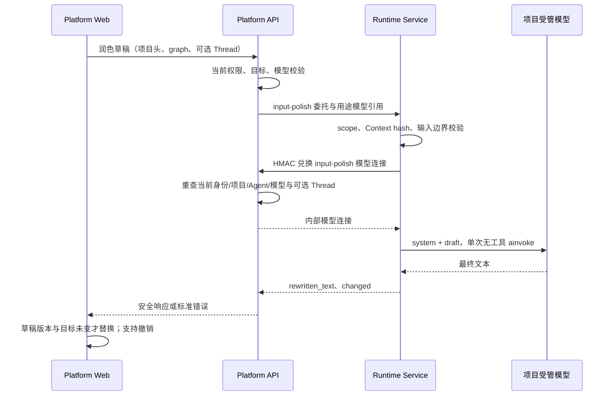

# F11 整体方案（待评审）

> 2026-10-10 用户已确认暂缓（`deferred`）。本文保留为未来实施备选，不是已批准契约；没有实施排期。重新投入、用途授权及开启边界见 [人工评审](review.md)，未重新决定投入并批准前不改业务代码或生效标准。

## 背景与目标

用户主动要求时，将本地纯文本草稿改写得更清楚；不回答问题、不执行任务、不自动提交。复用当前三层范式，不依赖 `dearflow_agent` 的业务属性，也不将通用能力塞入某个图的工具或 middleware。

已决定暂缓开发；若未来评审决定投入，V1 必须同时支持首条消息无 Thread 与已有 Thread，保留原意、原文和当前发送能力。仅在已有 Thread 上可用不能冒充完整 F11。

## 三层职责

| 层 | 需要补充 | 复用 | 不承担 |
|---|---|---|---|
| platform-web（同事） | 图标动作、配置/API 封装、草稿请求状态、取消/撤销和防过期回写 | ChatComposer、ChatSession 的 draft、统一 HTTP/错误处理、现有权限/可见性 | 模型密钥、Runtime JWT、权限判定、自动发送、第二套 Run 状态机 |
| platform-api | 两个公开端点、项目/Agent/Thread/模型授权、精确委托、用途模型引用、审计定位 | ActorContext、IamPolicyEngine、runtime_gateway、catalog/BYOK、短事务、HTTP adapter | 初始化 ChatModel、Prompt 编排、Agent 执行、持久化草稿 |
| runtime-service | 独立内部端点、受管模型公共准备段、通用改写提示与输出检查 | authenticate、Context v6 hash、resolver、fetch_model_connection、build_model、标准 ainvoke | Agent 图、工具/MCP、Workspace 准备、Memory/Skill 后处理、消息/Run/checkpoint |
| GraphHarbor | 无 | 原生引擎保持现有职责 | 新业务表、旁路模型调用、润色状态 |



整条链只消耗一次模型推理。若输入属于明确的 V1 原样保留类别，可以在授权后直接返回原文、不调用 provider。所谓“无任务副作用”不包括免费：调用仍会把草稿发给用户当前受管模型的供应商并可能计费。

## 公开契约

沿用 `/api/langgraph` 和 `x-project-id`，不另设 `/api/input-polish` 兼容别名。前端只访问平台地址。

### GET /api/langgraph/input-polish/config

认证与项目读取授权后返回：

```json
{"enabled": false, "max_input_chars": 4000}
```

- `enabled` 来自 API Settings；这是环境能力开关，不代表用户获得执行权限。
- UI 再结合代码当前 `project.runtime.execute`、Agent target 和已有 Thread comment ACL 决定是否可用。
- 成功配置缓存按登录身份/项目保存，切身份清空；短 TTL 后刷新，不永久缓存失败。GET 失败时当前入口隐藏，普通输入/发送继续。
- 不新增平台配置表、管理页面或 `features.input_polish` 全局体系。

### POST /api/langgraph/input-polish

```json
{
  "text": "请优化报表输出，保留现有字段，暂时不要修改数据库",
  "graph_id": "showcase_demo",
  "thread_id": "可选的已有线程 ID",
  "model_id": "可选的项目可用模型 catalog UUID",
  "locale": "zh-CN"
}
```

| 字段 | V1 规则 |
|---|---|
| `text` | 严格字符串，原始 Unicode code point 长度 1～4000，`strip()` 后不能为空；模型看到去首尾空白版本，撤销保留浏览器原始字符串 |
| `graph_id` | 必填非空 ≤128 字符；它是已选 Agent 的执行 graph key，不是数据库 `agent.id`，沿现有 gateway assistant_id 语义转换 |
| `thread_id` | 可省略/null；提供时必须属于当前项目、有 comment ACL，且 Thread graph 与 graph_id 一致；不读取历史正文 |
| `model_id` | 可省略/null；选中模型 → Agent 默认 → 项目默认，全部经当前项目策略验证。没有受管模型则失败，不回退环境凭据 |
| `locale` | 可省略/null，非空时 ≤32 字符；只作为自然语言提示，不能覆盖原文语言或充当 system instruction |

DTO `extra=forbid`，严格拒绝 `user_id`、`project_id`、API Key、base_url、任意 system prompt、context/config、工具、预算或执行模式。附件不上传、不读取、不删除；只润色 text，附件仍归现有草稿。

```json
{
  "rewritten_text": "请改进报表输出的可读性，保留所有现有字段，并且不要修改数据库。",
  "changed": true
}
```

- 合法响应文本非空且 ≤6000 Unicode code points。`changed` 由服务端对**原始请求 text**逐字比较；不能使用模型自报布尔值。
- 不需要改写/属于保守原样保留类别时返回原始 text 与 `changed=false`。
- 不创建 Thread/Run、不写消息、不发 SSE；前端只有在用户另行点击发送后走现有链路。
- API 再校验 Runtime DTO、长度和 changed 一致性；无效上游不能落入成功分支。

### 失败契约

沿 [当前错误 Envelope](../../standards/error-envelope.md)，不抛 provider 原始正文给浏览器，不把失败伪装成 `changed=false`。

| 情况 | 拟议公开状态/行为 |
|---|---|
| 未登录、项目/Thread/Graph/模型拒绝 | 现有 401/403/资源错误；调用前拒绝，不能吞掉 |
| 项目头缺失 | 400 `project_id_required` |
| 类型、空白、长度、未知字段 | 422 `validation_failed`；必要用例业务校验仍按现有 400 |
| 功能关闭 | 404 `input_polish_disabled`，合法授权后返回；UI 隐藏入口，原文可发送 |
| 受管连接/委托缺失 | 现有 503 配置错误；禁止环境模型兜底 |
| Runtime JWT 拒绝 | 按现有映射 502 `runtime_delegation_rejected` |
| Provider/Runtime 调用失败、非法/空输出、保护校验失败 | Runtime 固定 503 原因；API 按现有映射公开 502 `input_polish_failed`，新增精确安全码登记 |
| 总调用预算超时 | Runtime 固定 504；API 504 `input_polish_timeout`，不得复用 Agent Run 超时码 |
| 请求取消 | 传播取消并释放本请求资源；前端取消不等于 provider 已取消或不计费 |

用户手动点击的失败需要局部反馈。502/503/504/网络异常不清登录、不清草稿；真实 403 沿现有作用域复核。401 保留统一 HTTP client 的认证刷新，润色不加业务重试。

## 授权与模型引用（必须人工评审）

### Platform API

1. 加载可信 ActorContext 和 `x-project-id`，使用代码当前 `PermissionCode.PROJECT_RUNTIME_EXECUTE`（值为 `project.runtime.execute`），不新增 DeerFlow 的 `runs:create` 权限体系。现有权限标准把网关权限概括为read/write，未说明execute；差异已列review G6，实施前由人确认，不在本轮改权限映射。
2. 复用 `_prepare_project_scope(write=True)`、`_assert_runtime_target_allowed()` 和项目模型策略；不能用“有角色”代替权限判定。
3. 有 Thread 时复用 `_load_thread(write=True, action="comment")`，核对 graph；无 Thread 时只检查项目、可执行 Agent 和模型，不建空 Thread。
4. 仅从服务端建立 minimal Context（模型及润色固定生成参数），计算当前 v6 hash。浏览器不能注入 Context、plan_execution_id 或私有预算。
5. 签发 `scope.operation=input-polish`，绑定 tenant/project/assistant 与可选 thread，tool_overrides 为空。不能借用 `read`、`run-create` 或 `suggestions-generate`。

### 模型引用的最小扩展

现有 `RuntimeCatalogService._authorize_model_reference()` 总是要求 Thread comment/approve；只新增 route 无法支持首条消息。拟议在现有引用机制增加**用途标识**，不另建凭据接口：

- `create_model_reference()` 支持服务端 `purpose="input-polish"`；现有省略 purpose 的引用按内部值 `execution` 解释，原 Run/suggestions 语义保留。不把purpose设置权交给浏览器。
- `_authorize_model_reference()` 新分支只在签名用途明确为 input-polish 时允许 thread_id=None；仍重查当前用户/服务账号凭据、项目执行权限、Agent active、Graph policy、模型 enabled/BYOK 归属。
- input-polish 有 Thread 时仍要求 comment，不能用该用途取得 approve 或绕过 ACL；其他用途缺 Thread 继续拒绝。未知 purpose、shape 错误均拒绝。
- `fetch_model_connection()`/`fetch_model_bundle()` 增加最小可选 `expected_purpose` 参数，默认现有用途；新请求携带用途头，且 HMAC 同时签 timestamp/project/reference/**purpose**。旧用途沿旧签名格式，新用途必须完整签名。
- Catalog 的 `/api/runtime/internal/model-config` 核对签名、请求用途与引用用途一致；input-polish 必须来自受信 Runtime，不能只用裸引用兑换。默认调用者不能兑换 input-polish 引用；F11 也不能兑换普通 Run/suggestions 引用。
- API 不信任客户端用途头。Runtime 新端点在 scope 校验后才允许调用 `expected_purpose="input-polish"`；原有消费者不传该值。所有路径保留兑换时撤权检查。
- 润色路径不保存模型连接、引用、JWT 或草稿到 checkpoint、浏览器或审计。引用保留v1编码，新用途为可选签名字段；省略仅对应execution，未知用途拒绝。旧消费端不认识用途字段，故必须先升级Runtime的兑换签名，再部署API新签发路径；双端兼容由测试证明，不能靠忽略未知字段放宽。

这是**新增设计**，不是当前行为。上线按 Runtime 先部署并完成关闭态验证、API 再接入、最后前端和开关；仅部署一端时保持功能关闭。不能自行批准或悄悄修改 `delegation-jwt.md` 的生效意图。

### Runtime

`POST /internal/input-polish` 的内部 DTO 沿现有 suggestions 的受管 payload 形状，额外字段全部拒绝：

| 字段 | API 构建 / Runtime 校验 |
|---|---|
| `assistant_id` | 从已授权 `graph_id` 转换，非空且 ≤128 字符；不是数据库 Agent ID |
| `thread_id` | 已校验 Thread ID 或 null；与签名 scope 精确一致 |
| `text`、`locale` | 保留公开请求原串；同样的严格类型、空白和长度边界；不携带历史 |
| `timeout_seconds` | API Settings 提供，严格有限数值且 (0, 30]；不接受浏览器预算 |
| `context` | 只允许已选 catalog `model_id`、固定 `temperature=0.2`、`max_tokens=2048`，使用现有 v6 hash；这些数值仍待模型质量评审 |
| `config` | 只允许 `configurable.runtime_model_ref`，非空且用途为 input-polish；不转发任意 `platform_runtime`、工具、执行/访问/计划参数 |

复用 `_inject_project_default_model()` 时，它还会合并 Agent 的其它生成/执行默认值；新路径在选定并校验模型后重建上述 minimal Context/config，再计算 hash 和签发引用，不能把 `dearflow_agent` 的 execution_mode 或任意 Agent 参数带入润色。API 与 Runtime 固定生成参数必须一致；不匹配直接拒绝。

`http/input_polish.py:_authorize_scope()` 检查 authenticate 结果的 operation、assistant/thread 与内部 DTO 一致，tenant/project 与可信 principal 一致；thread=None 也必须精确一致。`services/input_polish.py` 再核对 Context hash、model allowlist、引用存在及用途；缺任何受管事实明确拒绝，不回退 `build_model(connection=None)`。内部响应沿公开的 `{rewritten_text, changed}`，Runtime 与 API 都验证输出边界。

input-polish 委托无法访问原生 Thread/Run、workspace、Stop、usage、title、suggestions、memory/skills 或 MCP。`auth/platform.py` 的原生 operation 白名单不增加 input-polish。当前 `http/title_summary.py` 和 `webapp.py` 两个capabilities入口仅明确拒绝usage-read，拟议补入input-polish拒绝，防止新token进入既有宽入口；其余自定义资源逐个做隔离测试。旧自定义token的历史授权差异另记人工评审G6，不在本轮自行扩大治理或放宽。

## Runtime 调用与输出策略

### 最小公共复用

新增 `services/oneshot.py:prepare_oneshot_model()`，仅抽取 `suggestions.py` 已有的受管模型解析/兑换/构造，消费者是 suggestions 和 input-polish。各消费者自己保留 system+human、`ainvoke`、超时与失败处理；不需要照搬 DeerFlow 的 `run_oneshot_llm()` 包装，也不提供 action registry、任意 template、缓存或框架。

- 公共函数接收可信 facts、受管 payload、任务固定的 system prompt/prompt version 和用途；返回准备好的 ChatModel。模型解析、Context hash 与 allowlist 使用现有 resolver/fetch/build_model，`max_retries=0`；不 `create_agent`、不 bind_tools、不装 middleware。
- F11 在调用公共函数前强制模型引用存在，兑换时指定 input-polish 用途；suggestions 保持原用途和已有引用/模型选择行为，不能把 F11 的新校验偷偷扩张到旧消费者。
- F11 用外层总预算覆盖准备与 `ainvoke`；suggestions 的模型准备仍在其现有推理 timeout 外，model initialization failed 降级和其它授权/配置错误保持现状。原 provider 异常/超时 `[]` 分支保留在 suggestions，避免合并成一个通用异常处理器。
- 允许 tests 注入 fake model；正式入口不允许客户端指定模型对象、连接或凭据。
- suggestions 继续自己的 JSON 清洗；F11 单独检查原始 AIMessage 的最终文本与保真约束。不能拿 `clean_suggestions()` 解析用户草稿。
- 不迁移 `title_summarizer.py`：它的授权/模型与输出约束不同，单独治理后才可能成为第三消费者。

官方能力依据：[Standalone Models](https://docs.langchain.com/oss/python/langchain/models)、[Standard Content Blocks](https://docs.langchain.com/oss/python/langchain/messages#standard-content-blocks)、[ainvoke API](https://reference.langchain.com/python/langchain-core/language_models/chat_models/BaseChatModel/ainvoke)。本轮已查询 docs/reference MCP；get_symbol 未返回完整符号详情，实施时以本仓库锁定依赖与 tests 为准，不从网络示例改模型版本。

### 提示词和保真规则

system prompt 只要求明确已有目标/范围/限制/交付物、保留语言和原意、禁止执行原任务、禁止添事实/日期/文件/指标/工具或授权。不能把“分析”改成“实施”，不能把“不要修改”改成“允许修改”，不补猜测性的业务背景。不从 Agent system prompt、记忆、history 或 Skill 取上下文。

V1 的确定性保护：

1. 包含代码 fence、行内反引号或字面 think 标记的草稿保守原样返回，不做全局标签/fence 删除；这是明确取舍，未来有保护片段方案和实测需求后再扩大支持。
2. 只接受最终 `text` 类型内容或合法字符串，不读 reasoning/additional_kwargs.reasoning_content，不把 tool_calls 当结果；意外 tool call、空文本、仅思考或 output truncation 直接失败。
3. 普通文本结果只可去首尾输出空白/明确的最外层输出包装；禁止截断、去内部换行或清洗原文实体。输入不含字面think标记而输出字符串夹带该标记时直接失败，不能把混杂推理当最终草稿或用全局正则悄悄删除。
4. 原文有前置 slash token 时，结果必须逐字保留 token；改动即拒绝。没有输入某条命令不能允许模型新增控制前缀。
5. URL、明显路径 token（如 `/workspace/x.csv`、`./src/a.py`）使用固定可测试边界保留原拼写与出现次数；一旦不能保证，返回失败而不是让 UI 覆盖。不要宣称可穷举所有自然语言实体。
6. `changed` 服务端计算；无法证明语义完全相同，必须让用户看到新草稿、可编辑、可撤销后再自主发送。

不采用二次 LLM 评审，避免一键触发两次费用和额外延迟；语义保真靠质量样例门禁和用户确认，而不是假装规则能证明意图一致。

## 配置、性能与成本

采用 API 现有 Pydantic Settings/环境变量，拒绝新增 DeerFlow YAML 或前端编译开关：

| 拟议配置 | 默认/边界 |
|---|---|
| `PLATFORM_API_INPUT_POLISH_ENABLED` | false |
| `PLATFORM_API_INPUT_POLISH_MAX_INPUT_CHARS` | 4000，1～4000 |
| `PLATFORM_API_INPUT_POLISH_TIMEOUT_SECONDS` | 8 秒，(0, 30]；Runtime 使用服务端转发值并再约束 |

输出字符硬限 6000、单次生成预算建议 2048 tokens、temperature 建议 0.2，作为 V1 服务端固定策略，不建立专用模型或参数编辑页面。模型不支持某参数/推理模式时按现有 provider 能力处理，不能对所有 provider 硬塞 `thinking_enabled=False`。输出达到预算/finish_reason=length 时失败，不裁切后发送。

前端请求超时应大于预算并留兑换/HTTP开销，建议本次动作 15 秒；API→Runtime HTTP 总超时必须大于 8 秒，整体上界保留实测。不开自动重试/fallback；SDK 关闭重试，用户失败后可以主动再点一次，不承诺“一次点击严格只产生一次供应商账单”。

当前源码未见可直接复用的通用付费 HTTP 限流；按钮单飞不是服务端限制。**广泛开启门禁：** 部署入口按可信身份/项目限频和并发、有 body 上限，供应商具备费用/额度控制，并留直接 HTTP 测试证据。未具备时只用于受控本地试验或保持关闭，不为 F11 临时建立第二套 Redis/费用治理平台。若产品要求全平台生产可用，再评审共享旁路模型配额治理项目，不把它藏在本期。

`observability/usage.py:EXCLUDED_OPERATIONS` 增加 `input_polish`，更新相关测试/fixture，使 Run Usage 如实声明排除。无 native Run 不造 run_id、不消耗历史 Run 额度；供应商总账/全平台预算不在 V1 范围。

可观测性复用请求/trace关联和日志，记录 operation、受信 scope、model_id、耗时、长度、changed、固定 outcome/reason。审计 metadata 当前是白名单，新增安全数值字段需要明确登记和测试。不要直接给 one-shot 挂会捕获 prompt/output 的通用 Langfuse callback；原文/结果/凭据/异常正文不能进入审计或默认 trace。模型供应商接收草稿是实际隐私边界。

## 拟议代码落点

以下“新增”均是将来待实施文件；现有文件只改 F11 必需接线。

| 路径 | 拟议符号/改动 |
|---|---|
| `apps/platform-api/src/platform_api/config.py`、`apps/platform-api/.env.example` | 三项 Settings/示例，默认关闭；不改私有配置 |
| `apps/platform-api/src/platform_api/modules/runtime_gateway/presentation/http.py` | `InputPolishRequestBody/ResponseBody`、GET/POST、DI、delegation factory 的无工具 operation |
| `apps/platform-api/src/platform_api/modules/runtime_gateway/application/input_polish.py`（新增） | `prepare_input_polish()`：纯校验/规则，避免再扩张巨大 service.py |
| 同模块 `application/service.py` | `input_polish_config()`、`polish_input()`；显式复用已有项目/Thread/模型 helpers，HTTP 等待离开 DB 事务 |
| 同模块 `application/ports.py` | 增加具体 `polish_input(payload)` 方法，不造通用 action port |
| `apps/platform-api/src/platform_api/adapters/langgraph/runtime_gateway_upstream.py` | `polish_input()` 转发 `/internal/input-polish`，用现有 `_http.require_json` |
| `apps/platform-api/src/platform_api/core/security/tokens.py`；Runtime `runtime/auth.py` | 签发/校验枚举增加唯一 `input-polish` operation |
| `apps/platform-api/src/platform_api/modules/runtime_catalog/application/model_connection.py` | 引用 purpose 字段及严格解析 |
| 同模块 `application/service.py`、`presentation/http.py` | 用途/签名一致检查、无 Thread 专属分支、撤权重查；保持其他用途 ACL |
| `apps/runtime-service/src/runtime_service/runtime/modeling.py` | fetch helper 的 expected_purpose 参数、签名；不改 provider 构造体系 |
| `apps/platform-api/src/platform_api/modules/audit/http_resolution.py` | action `runtime.input_polish.requested` / 配置读取定位，安全 metadata 白名单 |
| `apps/platform-api/src/platform_api/adapters/langgraph/sdk_client.py:create_runtime_upstream_error()`；gateway adapter | 现有5xx统一502，拟议精确补充F11失败/超时映射与固定消息；HTTP transport timeout也转成本动作超时，保留来源状态；不能只登记码就声称会透传 |
| `apps/runtime-service/src/runtime_service/services/oneshot.py`（新增） | `prepare_oneshot_model()`，两消费者共用受管模型准备段 |
| `apps/runtime-service/src/runtime_service/services/suggestions.py` | 仅改模型准备接线，保留 ainvoke、clean_suggestions、`[]` 降级和当前超时行为 |
| `apps/runtime-service/src/runtime_service/http/input_polish.py`（新增） | `InputPolishRequest/Response`、`_authorize_scope()`、`input_polish_endpoint()` |
| `apps/runtime-service/src/runtime_service/services/input_polish.py`（新增） | `polish_input()`、`build_input_polish_messages()`、`validate_rewrite()` |
| `apps/runtime-service/src/runtime_service/webapp.py`、`http/title_summary.py` | include router；既有title/capabilities入口拒绝新增input-polish token，不增加图注册 |
| `apps/runtime-service/src/runtime_service/observability/usage.py` | 明确 input_polish 排除项，同步 fixtures/消费者测试 |
| `apps/platform-web/src/modules/chat/input-polish/{api,types}.ts`（新增，同事） | 公共 HTTP、配置/响应校验、AbortSignal |
| `apps/platform-web/src/modules/chat/composables/useInputPolish.ts`（新增，同事） | 草稿 single-flight、generation、revision、取消和撤销 |
| `apps/platform-web/src/modules/chat/components/ChatComposer.vue`、`ChatSession.vue`（同事） | 图标与少量协调接线；不把状态逻辑摊进 ChatSession |
| `apps/platform-api/tests/test_runtime_gateway_input_polish.py`（新增） | 公开 HTTP/service 验证、默认关闭和事务边界 |
| `apps/runtime-service/tests/http/test_input_polish.py`、`tests/services/test_input_polish.py`、`tests/services/test_oneshot.py`（新增） | 内部 scope、保真、预算、取消、两消费者回归 |

`__init__.py` 不建立级联导出；调用者从定义文件导入。测试 doubles、ports、fixture、operation 名称集合和打包 router 导入必须随新增具体接口同步；不做无关格式化。

## 文档与标准影响

实施获批后更新 `docs/standards/delegation-jwt.md` 的 operation/隔离说明、健康表验证日期、错误专项 `error-catalog.md` 与 error-envelope 相关说明；审计标准、API 网关标准、配置矩阵及必要 compose 字段同步。当前 draft JWT 的其他缺口未解决，不因 F11 完成自动毕业。

SSE/Context v6 字段、Agent graph catalog、模型 catalog schema、数据库表和 GraphHarbor 依赖不变。实施时新增/更新 FEATURES、CONTEXT 和 CHANGELOG 的用户可见条目；本轮只有“规划中”记录，不写功能已发布。

## 实施阶段与回退

1. 当前用户已决定 deferred；未来有需求与收益证据后，重新由人决定投入及批准安全/成本边界。
2. API/Runtime 授权和调用接线，先开关关闭；完成定向与真实 HTTP 隔离测试。
3. 后端交付冻结 DTO/错误样例；同事做前端并行接入，先 mock 再真实联调。
4. 真实三服务、保真样例、浏览器竞态、性能和关闭回退全部通过，再决定受控开启。

回退先关闭 API 开关，等待已受理旁路 HTTP 完成/超时，再移除前端入口或恢复配套源码；不回退普通 Run/suggestions 授权，不删对话或表。Runtime 先部署可识别新 operation、API 后部署；关闭后 API 停止签发，短期在途请求允许有界结束。关闭不保证供应商已经在途的请求免计费。
