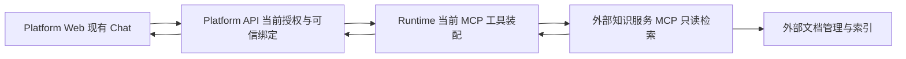

# F17 项目知识检索 - 评估与条件方案

## 1. 范围依据与决定

本轮只规划，不写业务代码。用户补充“当前没有企业知识检索服务，改动大就不做，后续倾向 MCP”，并于 2026-10-10 明确要求合入“不开发”结论及前端交接。因此确定 **F17 本期不开发自建知识库，功能延期；未来知识检索优先作为一个受管只读 MCP 工具接入。**

项目级私有文档检索确实是当前缺口，但它不是所有 Agent 达到工程或生产级的共同前提。只有任务需要跨会话访问持续维护的私有资料时，才有明确收益。附件读取、网页研究或个人偏好记忆任务不必先建设它。

检索提供依据，不保证回答正确，也不保证 Agent 一定调用检索。需要业务文档、标注问题和无答案样本来证明效果；不能把“减少幻觉”写成自动兑现的验收指标。

## 2. 取样与证据边界

- 当前平台：HEAD `2f08c5462571cd0244a7181e5d0d1388341b79c4`，开始盘点时工作树干净。
- `D`：用户提供的 DeerFlow 参考工作树，HEAD `cc664451f03140b376611f329ae400c313530bdb`，取样时有本地修改；结论针对这棵工作树，不代表最新公开发行版。
- `S`：用户提供的 Open SWE 参考工作树，HEAD `ad417d64d91cc349d63d832c7b643637dc1774cf`；只读研究，未修改参考仓库。
- `H`：`D/backend/packages/harness/deerflow/`。下表给出仓库内完整位置或相对 `H` 的位置，关键文件摘要见 [验证文档](verification.md)。
- 当前“已有”表示读到装配与测试代码，不代表本轮重跑了测试、配置了真实知识服务或通过生产认证。

## 3. DeerFlow 实际做了什么

| 能力 | 代码依据 | 实际职责与可借鉴点 |
| --- | --- | --- |
| 知识目录 API | `D/backend/app/gateway/routers/knowledge.py` → `list_retrieval_catalog_datasets()` / `list_retrieval_catalog_documents()` | 只有两个 GET 目录接口；校验工具支持、可访问集合、文档可检索状态和分页，屏蔽供应商错误 |
| RAGFlow 工具 | `H/community/ragflow/tools.py` → `knowledge_search()` / `knowledge_search_tool` | 工具名是 `knowledge_search`，不是同事示例的 `search_knowledge`；通过外部 API 检索，返回模型文本与可选 artifact，并非简单三元组列表 |
| 检索客户端 | `H/community/ragflow/client.py` → `RAGFlowClient.retrieve()` | 向外部 `/retrieval` 发起带明确 dataset 列表的请求；DeerFlow 不持有这个接口背后的索引实现 |
| 检索范围 | `H/knowledge_scope.py` → `KnowledgeScope` / `execution_scope()` | 每消息 `all/selected/disabled`；严格校验 ID、数量和字节上限；display 仅供历史展示，不进入执行范围 |
| 执行门禁 | `H/agents/middlewares/knowledge_scope_middleware.py` → `KnowledgeScopeMiddleware` | 移除模型输入中的选择元数据；disabled 同时裁剪可见工具和拦截实际工具调用；不从任意旧消息猜当前范围 |
| 范围与检索质量 | `H/community/ragflow/tools.py` → `_resolve_datasets()` / `_validate_document_filters()` / `_merge_group_results()` | 校验选定资源，不可用不扩大范围；按 Embedding 模型分组，有界并发；不同向量空间分数不直接比较 |
| 引用快照 | `H/community/ragflow/formatting.py` → `format_retrieval_sources()` | 输出带引用的有界片段及同一片段的 artifact；ID 每次调用唯一，页码有来源才展示，不把全文塞入历史 |
| 前端选择 | `D/frontend/src/components/workspace/knowledge-scope-selector.tsx` | 选择本次知识范围；选择不是授权。目录不等于知识库管理产品 |
| 前端引用 | `D/frontend/src/components/workspace/citations/knowledge-source.tsx` | 查看检索时片段、文档名和可用页码；记录缺失显示不可用，不猜下载链接 |
| LightRAG 备选 | `H/community/lightrag/tools.py` / `client.py` | 通过数据检索接口读取已建索引的 workspace；不是引入 LightRAG 内部生成器或自建索引；与 RAGFlow 同名工具互选 |
| 线程上传 | `D/backend/app/gateway/routers/uploads.py` | 线程文件上传及可选文档转换；文件流分块不是 RAG 切片，Markdown 转换不是 Embedding 入库 |

`D/README.md` 的 Private Knowledge Retrieval 明确说明：创建、上传、解析、删除知识文档在 **RAGFlow 中完成**，没有独立知识管理页。`D/config.example.yaml` 的知识配置默认关闭，RAGFlow / LightRAG 是同一工具的可选接入，不应同时配成重复工具。

**同事方案的三个前提需要修正：**

1. `deerflow/knowledge_scope.py` 的当前完整位置在 harness 包，且它负责选择范围，不负责向量存储。
2. “文档向量化 + 向量数据库 + 项目 namespace”不是所列 DeerFlow 文件的实现；其运营方 allowlist/供应商可访问集也不等于本平台的 tenant/project 授权。
3. 不能从线程上传的 MarkItDown 转换推导出 PDF/Markdown/URL 的项目级知识入库流水线已经存在。

## 4. 当前项目与 Open SWE 的重合和缺口

| 当前能力 | 代码依据 | 与 F17 的关系 |
| --- | --- | --- |
| 受管 Agent 工具装配 | `apps/runtime-service/src/runtime_service/services/dearflow_agent/agent.py` → `_build_agent()`；`runtime/tool_access.py` | 已有组合根与工具策略；复用，不再复制 DeerFlow factory、Agent 循环或 Tool Registry |
| 官方 MCP Adapter | `apps/runtime-service/src/runtime_service/services/dearflow_agent/tools/mcp.py` → `load_mcp_tools()` | 已有 `MultiServerMCPClient`，仅绑定 `streamable_http`、声明且实际存在的只读工具；解决传输和装配，不等于知识库已接入 |
| MCP 名称声明 | `apps/runtime-service/src/runtime_service/services/dearflow_agent/capabilities.py` → `configured_mcp_names()` | 从服务端连接配置收集 `mcp_` 名称；重复名称拒绝，未支持任意外部工具名透明接入 |
| 资源作用域 | `apps/runtime-service/src/runtime_service/runtime/resource_bindings.py` → `resolve_resource_binding()` / `thread_resource_metadata()` | 校验 tenant/project/thread 与绑定字段；还需验证谁有权签发该绑定及资源本身属于哪个项目 |
| 当前权限与网关 | `apps/platform-api/src/platform_api/modules/iam/application/policies.py`；`modules/runtime_gateway/application/thread_access.py` | 已有 IAM、Thread ACL、委托和审计；不另建 RAG 权限体系或第二份 Run 状态 |
| 文档解析 | `apps/runtime-service/src/runtime_service/tools/documents.py` → `build_document_tools()`；`middlewares/documents.py` → `DocumentToolsMiddleware` | 读取线程 PDF/TXT/Markdown 等，有范围与输出限制；不是跨线程可维护的项目知识检索 |
| 个人长期记忆 | `apps/runtime-service/src/runtime_service/services/dearflow_agent/memory.py` → `MemoryStorage.context()`；`memory_access.py` → `memory_allowed()` | 本人×项目的事实/偏好，词法召回且共享受限；不能改名为团队知识库，也不为 F17 向量化记忆 |
| 引用/工具回放 | `apps/platform-web/src/modules/chat/transcript.ts`；`components/ToolResult.vue` → `evidenceSources` | 已保留 tool artifact，已有 sources 展示；知识 MCP 实际 artifact 和历史可用性需验，不立即新增专用引用系统 |
| 公开网关投影 | `apps/platform-api/src/platform_api/adapters/langgraph/sdk_client.py` → `redact_runtime_private_fields()` | 已有私有字段清理；新 provider payload 仍需防 URL/token/正文泄漏，不把 artifact 当自动安全 |
| PostgreSQL 镜像 | `deploy/docker-compose.stack.yml`；`apps/runtime-service/deploy/docker-compose.runtime-service.yml` | 使用 pgvector 镜像不代表已有向量表、Embedding pipeline 或知识接口；镜像不是功能证据 |
| 旧知识库退役 | `docs/projects/20260910-platform-api-refactor/README.md` 及 `implementation/01-retire-knowledge-testcase.md` | 旧 `project_knowledge`、交互数据 Adapter 和前端知识入口已退役；未来不得原样恢复 |

`S/agent/server.py` 的 `_mcp_tools_for()`、`get_agent()` 已通过 MCP 和 Notion 等工具访问外部资料。对其 `agent/`、依赖与 README 的检索未发现上述 F17 的知识库、Embedding、PgVector 或范围契约实现。结论是 **MCP 工具访问这一机制有重合，F17 产品本身没有因此自动完成**；该搜索不宣称审计了参考仓库所有可选集成。

当前 DearFlow 根图装 MCP，研究子 Agent 仅显式获得研究/读文件工具，不自动获得根图 MCP。通用能力不意味着给全部图或子 Agent 自动扩权。后续先从一个真实调用点验证；第二个真实生产调用点需要共享 loader 时再提取现有实现，不复制一套，也不让业务导入 demo 私有代码。

## 5. 对同事六项建议的逐项决定

| 同事建议 | 必要性与代价 | 本期决定 / 后续归属 |
| --- | --- | --- |
| PgVector 与现有 PG 共用 | 自建索引才需要；还有 Embedding 维度/版本、索引性能、备份和负载隔离，不能仅凭已有 PG 选定 | 不选型；外部知识服务自行决定存储 |
| 上传 → 切片 → Embedding → 存储 | 是独立持久 ingestion 能力；需失败恢复、重复上传、版本激活、删除传播、解析资源限制和索引一致性 | 不开发；交给未来知识服务 |
| `search_knowledge` | 私有资料任务有价值，但当前无可检索 corpus；现有 MCP 可以承载查询 | 不新增原生工具；未来只接一个实际 MCP 检索工具 |
| 知识库 CRUD API | 是文档管理产品，不是 Agent 工程能力的普遍前提 | 不恢复旧接口、不新增 API；用知识服务已有管理入口 |
| 项目 namespace 隔离 | 必须具备，但字符串 namespace 不是权限边界，模型可传 project_id 也不构成授权 | 未来接入必须证明服务端强制项目范围；无此能力就不接 |
| 项目设置知识库 Tab | 只有平台承担资料管理/绑定管理时才有产品价值 | 当前不做；未来最小工具接入仍不必有 Tab |

不采用“2–3 周”作为承诺。粗略工作包已至少包含 ingestion 与版本/任务恢复、检索与质量评估、权限/凭据/引用留存、管理 API 与前端、部署备份回退；复用 PG 只能减少存储部署工作，不能消除这些包。没有数据规模、格式质量、Embedding 供应商、ACL 或 SLO，不能给出可靠总工期。相对于用户当前目标，该范围已经足够大，延期更合适。

## 6. 三层职责和最小未来形态

| 层 | 现在需要做什么 | 有真实知识 MCP 后的最小职责 |
| --- | --- | --- |
| platform-web | 无代码任务；按前端交接不增加知识入口 | 复用 Chat 工具卡和来源展示；只有真实返回无法展示时再补一个小适配。无独立知识状态机、上传页或选择器 |
| platform-api | 无代码任务、无新表或路由 | 继续 IAM/Thread/执行授权；若真实路径缺少项目到 MCP resource 的可信绑定，再补最小签发/撤销与审计。凭据不下发浏览器 |
| runtime-service | 无代码任务、无新 tool/middleware | 复用现有 MCP loader、资源校验和工具错误处理，按允许列表接一个已证明只读的查询工具。工具正文是资料，不是指令 |
| 外部知识服务 | 当前不存在，不在本期部署 | 管文档、格式解析、OCR（如需）、切片、Embedding、索引、更新/删除、检索和数据隔离；提供 MCP 查询端点 |
| GraphHarbor | 无任务 | 继续 Thread/Run/checkpoint/stream 生命周期，不加入 RAG 业务表或新引擎循环 |

图仅描述未来条件方案，不表示当前知识链路已存在。外部知识服务管理界面是文档管理员入口，平台先只消费片段，避免维护两个文档目录和两套索引。

## 7. 后续接入前必须核实的缺口

### 7.1 MCP 兼容性

- 当前要求 `streamable_http`，不是支持任何 MCP transport；工具实际名称要匹配 `mcp_` 声明，`tool_name_prefix=False` 不会自动帮外部工具改名。
- 目标工具必须 `readOnlyHint=true`；该 hint 是服务声明，仍需查工具实现、凭据权限和允许的操作。
- 当前 Thread 解析一个 `mcp` resource，连接声明的工具名在全局不能重复。多项目多凭据若同名工具重复，会在 `configured_mcp_names()` 失败；不提前承诺多连接管理能力。
- 当前 Plan Mode 默认不允许 MCP。第一期保留该限制；未来确有规划阶段检索需求，再审查真实只读工具实例并显式接入。

### 7.2 可信项目绑定

检索条件必须来自当前可信身份和项目授权，不能由模型参数、前端 metadata 或 prompt 指定“允许访问哪个项目”。项目边界也不能只在检索结果返回后过滤，否则非本项目内容可能已发送给 provider/日志。

`resolve_resource_binding()` 能检查字段与身份相等，但本次未找到 Platform 调用 `thread_resource_metadata()` 签发项目 MCP 的闭环；现有测试直接构造绑定。`RuntimeGatewayService.create_thread()` / `thread_access.initial_metadata()` 是未来必须核验的 public metadata 入口，**不能将“存在 Thread metadata”当成绑定有权签发的证明**。这是待验证的接入条件，不是本轮已复现的生产越权结论。

优先选择凭据/服务端固定项目范围的端点，或由 MCP 服务验证可信运行身份并强制范围。若只有一个可读全部项目的 Key 和一个模型可任意传的 namespace，拒绝接入；不要用 wrapper 伪装隔离已经解决。

### 7.3 返回值、引用和留存

最小返回应区分成功无命中、服务失败和不可访问；包含有界片段、真实文档/来源标识，页码仅在 provider 提供时存在。score 表示检索排序信号，不是回答可信度。

优先用实际 MCP 返回的文本/structured content 和已有 ToolMessage artifact。DeerFlow 的引用快照/裁剪一致性值得借鉴，但先验当前 Adapter、网关、checkpoint 和前端实际格式，再决定是否有一处小适配；不为未来兼容先定义另一套 `knowledge_sources` 契约。

项目共享资料的片段会进入受控对话历史；撤销检索服务权限不等于清除已经生成的回答/快照。第一期只接对目标项目读者统一可见的资料，明确 Thread 分享和历史留存范围。细粒度用户/文档 ACL、删除后强制清除历史、跨项目资料共享须另做治理评审，不能靠前端隐藏完成。

### 7.4 资料与运维

检索文档可能包含提示词注入；资料只能作为不可信数据，不能提升工具权限或替代审批。provider 地址/凭据、完整私有文档和问题正文不应进入公开日志/前端错误；依照既有错误、追踪与审计规范记录安全摘要。

MCP 不提供文档入库质量、索引更新一致性或服务可用性的承诺。要明确知识服务负责人、数据存放地点、调用费用、超时与恢复办法；数据发送到哪个实际外部服务必须随服务选型明确。

## 8. 条件代码落点

下表是未来核验发现问题时的候选改动点，**不是当前要创建的文件清单**。

| 触发条件 | 实际位置 / 符号 | 最小补充和验证 |
| --- | --- | --- |
| 目标 MCP 已完全兼容且有可信绑定 | Runtime 私有配置 `RUNTIME_MCP_CONNECTIONS_JSON`；`services/dearflow_agent/tools/mcp.py:load_mcp_tools()` | 只改部署配置并验证；不写 Python 包装工具，不改依赖核心版本 |
| 平台缺可信绑定签发 | API `modules/runtime_gateway/application/service.py:RuntimeGatewayService.create_thread()`；`application/thread_access.py:initial_metadata()`；Runtime `runtime/resource_bindings.py` | 拦截伪造绑定，服务端从授权资源映射生成/撤销；映射的持久位置待实际服务数量和生命周期确定，不先建表 |
| 实际名称/只读声明不兼容 | Runtime `services/dearflow_agent/capabilities.py:configured_mcp_names()`；`tools/mcp.py:load_mcp_tools()` | 优先调整 MCP 服务暴露契约；确实需要 runtime 适配则只改共享入口并补冲突/拒绝测试，不并存 native 检索 |
| 工具发现/权限接线不足 | Runtime `runtime/capabilities.py:graph_tools()`；`services/dearflow_agent/agent.py:_build_agent()`；API `modules/runtime_policies/application/service.py` | 同步目录、策略和真实组合根；不把接入根图等同于子图自动接入 |
| 回放来源丢失/公开字段泄漏 | API `adapters/langgraph/sdk_client.py:redact_runtime_private_fields()`；Web `modules/chat/transcript.ts` / `components/ToolResult.vue` | 在现有链路做唯一格式投影，真实流/历史一起验；避免新 SSE 类型或第二份来源库 |
| 合法来源存在但无法展示 | Web `src/services/`、`modules/chat/components/ToolResult.vue` 及对应 `.spec.ts` | 由前端同事按 [交接](frontend-handoff.md) 补小适配；无管理页、无选库菜单 |

固定项目范围的首期方案无需新增 Runtime Context 字段、逐消息 scope 或 Delegation operation。若真实需求触发这些变化，必须重新更新精确契约和所有消费者后评审，不能把 DeerFlow 消息 metadata 原样塞进当前 `runtime-context/v6`。

## 9. 实施顺序与回退

1. 当前：完成评估、文档与旧 A31 入口同步，功能保持延期。
2. 具备服务时：`M01` 检查实际 MCP、资料质量和可信绑定，先形成需要改动的证据；无价值或改动超出可接受范围就继续延期。
3. 人工批准最小范围后：`M02–M04` 仅补被证明需要的配置/接线/展示；不存在问题的层不修改。
4. `M05` 验证真实查询、隔离、撤权、错误、恢复及关闭接入后的普通 Chat 回归；记录 Phase 和 Final 各自证据。

未来回退先禁用被接入的工具/资源映射并阻止新检索，再保留既有 Thread/checkpoint。没有知识业务表就没有本平台向量迁移/删除式 downgrade。如何关闭未知供应商的索引和凭据，留到实际服务选择后由该服务负责人制定；本评估不涉及知识服务启停或知识数据删除。文档提交、合入、推送及当前 Worktree 清理由用户另行明确授权。
